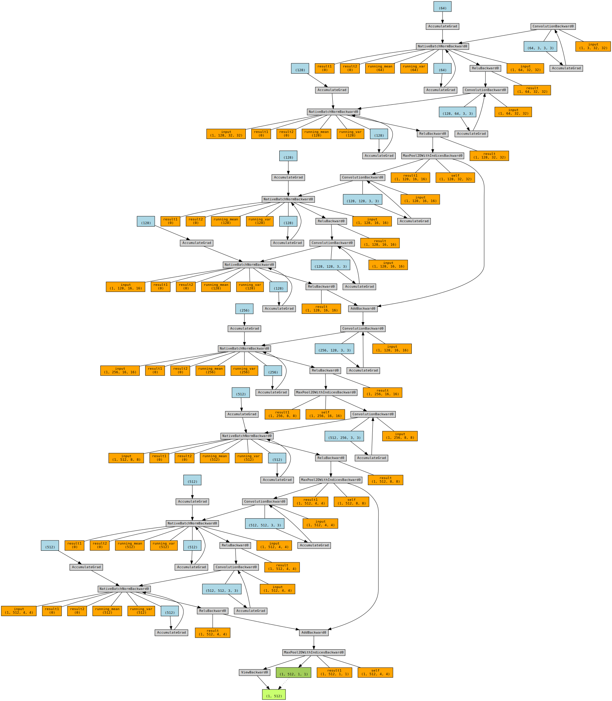

# Session 10

## <ins>Problem</ins>

- Attain 90% validation accuracy on CIFAR10 dataset with
- Collect results and prepare documentation for results.

### Navigating the source code
The code structure has no modifications from the last sessions and further details of the structure is available [here](../session_5_split_code_to_files/README.md)

### Added bit more modularization with
- `datasets.py` - Modified to accomodate Albumentations

### Key code snippets
> [Model Architecture](model_david_net_90_acc.py)
```
class Net(nn.Module):

    '''
    This class implements the neural network model

    Usage:
    >>> device = ...
    >>> model = Net().to('cpu')
    '''

    #This defines the structure of the NN.
    def __init__(self):
        super(Net, self).__init__()

        # Prep Layer
        self.prep = self.conv3x3_bn_dropout(3, 64, padding=1)

        # Layer 1
        self.conv_bn_pool_1 = self.conv3x3_maxpool(64, 128)
        # Layer 1 - residual
        self.res_1 = self.conv3x3_bn_dropout(128, 128, padding=1)
        self.res_2 = self.conv3x3_bn_dropout(128, 128, padding=1)
        self.downsample_1 = self.conv1x1(128, 128)

        # Layer 2
        self.conv_bn_pool_2 = self.conv3x3_maxpool(128, 256)

        # Layer 3
        self.conv_bn_pool_3 = self.conv3x3_maxpool(256, 512)
        # Layer 3 - residual
        self.res_3 = self.conv3x3_bn_dropout(512, 512, padding=1)
        self.res_4 = self.conv3x3_bn_dropout(512, 512, padding=1)
        self.downsample_2 = self.conv1x1(512, 512)

        # Pool
        self.pool = nn.MaxPool2d(4)

        # Linear
        self.linear = nn.Linear(512, 10)

    def conv3x3_maxpool(self, in_channels, out_channels):
        layers = [self.conv3x3_bn_dropout(in_channels, out_channels, padding=1),
                  nn.MaxPool2d(2)]

        return nn.Sequential(
                    *layers
                )

    def conv3x3_bn_dropout(self, in_channels, out_channels, kernel_size=3, stride=1, padding=0, dilation=1, groups=1, bias=False, dropout=None, is_relu_bn=True):

          if is_relu_bn:
            layers = [
                  self.conv3x3(in_channels, out_channels, kernel_size, stride, padding, dilation, groups, bias),
                  nn.BatchNorm2d(out_channels),
                  nn.ReLU(),
            ]
          else:
            layers = [
                  self.conv3x3(in_channels, out_channels, kernel_size, stride, padding, dilation, groups, bias)
            ]

          if dropout:
            return nn.Sequential(
                    *layers,
                    nn.Dropout(dropout)
                )
          else:
            return nn.Sequential(
                    *layers
                )

    def conv3x3(self, in_channels, out_channels, kernel_size=3, stride=1, padding=0, dilation=1, groups=1, bias=False):
          return nn.Conv2d(in_channels,
                    out_channels,
                    kernel_size=kernel_size,
                    stride=stride,
                    padding=padding,
                    dilation=dilation,
                    groups=groups,
                    bias=bias)

    def conv1x1(self, in_channels, out_channels, kernel_size=1, stride=1, padding=0, bias=False):
          return nn.Conv2d(in_channels,
                    out_channels,
                    kernel_size=kernel_size,
                    stride=stride,
                    padding=padding,
                    bias=bias)


    def forward(self, x):
        
        # Prep Layer
        x = self.prep(x)

        # Layer 1
        x = self.conv_bn_pool_1(x)
        # Layer 1 - residual
        i = x
        x = self.res_1(x)
        x = self.res_2(x)
        x = x + i

        # Layer 2
        x = self.conv_bn_pool_2(x)

        # Layer 3
        x = self.conv_bn_pool_3(x)
        # Layer 3 - residual
        i = x
        x = self.res_3(x)
        x = self.res_4(x)
        x = x + i

        # Pool
        x = self.pool(x)

        # Flatten
        x = x.view(-1, 512)

        # Linear
        self.linear(x)

        # return F.log_softmax(x, dim=1)

        return x
```

### Model summary

> Model summary
```
----------------------------------------------------------------
        Layer (type)               Output Shape         Param #
================================================================
            Conv2d-1          [512, 64, 32, 32]           1,728
       BatchNorm2d-2          [512, 64, 32, 32]             128
              ReLU-3          [512, 64, 32, 32]               0
            Conv2d-4         [512, 128, 32, 32]          73,728
       BatchNorm2d-5         [512, 128, 32, 32]             256
              ReLU-6         [512, 128, 32, 32]               0
         MaxPool2d-7         [512, 128, 16, 16]               0
            Conv2d-8         [512, 128, 16, 16]         147,456
       BatchNorm2d-9         [512, 128, 16, 16]             256
             ReLU-10         [512, 128, 16, 16]               0
           Conv2d-11         [512, 128, 16, 16]         147,456
      BatchNorm2d-12         [512, 128, 16, 16]             256
             ReLU-13         [512, 128, 16, 16]               0
           Conv2d-14         [512, 256, 16, 16]         294,912
      BatchNorm2d-15         [512, 256, 16, 16]             512
             ReLU-16         [512, 256, 16, 16]               0
        MaxPool2d-17           [512, 256, 8, 8]               0
           Conv2d-18           [512, 512, 8, 8]       1,179,648
      BatchNorm2d-19           [512, 512, 8, 8]           1,024
             ReLU-20           [512, 512, 8, 8]               0
        MaxPool2d-21           [512, 512, 4, 4]               0
           Conv2d-22           [512, 512, 4, 4]       2,359,296
      BatchNorm2d-23           [512, 512, 4, 4]           1,024
             ReLU-24           [512, 512, 4, 4]               0
           Conv2d-25           [512, 512, 4, 4]       2,359,296
      BatchNorm2d-26           [512, 512, 4, 4]           1,024
             ReLU-27           [512, 512, 4, 4]               0
        MaxPool2d-28           [512, 512, 1, 1]               0
           Linear-29                  [512, 10]           5,130
================================================================
Total params: 6,573,130
Trainable params: 6,573,130
Non-trainable params: 0
----------------------------------------------------------------
Input size (MB): 6.00
Forward/backward pass size (MB): 4642.04
Params size (MB): 25.07
Estimated Total Size (MB): 4673.11
----------------------------------------------------------------
```

### Model architecture



> Training logs

```
Epoch 1
Train: Loss=1.9506 Batch_id=97 Accuracy=25.10: 100%|██████████| 98/98 [00:21<00:00,  4.63it/s]
              precision    recall  f1-score   support

           0       0.45      0.61      0.52      1000
           1       0.63      0.52      0.57      1000
           2       0.43      0.23      0.30      1000
           3       0.30      0.30      0.30      1000
           4       0.38      0.35      0.37      1000
           5       0.34      0.44      0.38      1000
           6       0.52      0.55      0.53      1000
           7       0.40      0.59      0.48      1000
           8       0.57      0.46      0.51      1000
           9       0.58      0.42      0.49      1000

    accuracy                           0.45     10000
   macro avg       0.46      0.45      0.44     10000
weighted avg       0.46      0.45      0.44     10000

Test set: Average loss: 1.9074, Accuracy: 4469/10000 (44.69%)

Epoch 2
Train: Loss=1.6276 Batch_id=97 Accuracy=43.75: 100%|██████████| 98/98 [00:21<00:00,  4.56it/s]
              precision    recall  f1-score   support

           0       0.64      0.60      0.62      1000
           1       0.72      0.68      0.70      1000
           2       0.43      0.47      0.45      1000
           3       0.43      0.28      0.34      1000
           4       0.47      0.39      0.43      1000
           5       0.48      0.42      0.45      1000
           6       0.61      0.70      0.66      1000
           7       0.52      0.71      0.60      1000
           8       0.65      0.69      0.67      1000
           9       0.61      0.67      0.64      1000

    accuracy                           0.56     10000
   macro avg       0.56      0.56      0.55     10000
weighted avg       0.56      0.56      0.55     10000

Test set: Average loss: 1.3822, Accuracy: 5614/10000 (56.14%)

Epoch 3
Train: Loss=1.4347 Batch_id=97 Accuracy=51.21: 100%|██████████| 98/98 [00:21<00:00,  4.64it/s]
              precision    recall  f1-score   support

           0       0.65      0.68      0.66      1000
           1       0.60      0.86      0.71      1000
           2       0.42      0.56      0.48      1000
           3       0.44      0.34      0.38      1000
           4       0.59      0.40      0.48      1000
           5       0.55      0.35      0.43      1000
           6       0.62      0.77      0.68      1000
           7       0.73      0.63      0.67      1000
           8       0.65      0.80      0.72      1000
           9       0.72      0.58      0.64      1000

    accuracy                           0.60     10000
   macro avg       0.60      0.60      0.59     10000
weighted avg       0.60      0.60      0.59     10000

Test set: Average loss: 1.2276, Accuracy: 5953/10000 (59.53%)

Epoch 4
Train: Loss=1.0378 Batch_id=97 Accuracy=56.10: 100%|██████████| 98/98 [00:21<00:00,  4.65it/s]
              precision    recall  f1-score   support

           0       0.73      0.64      0.68      1000
           1       0.65      0.84      0.74      1000
           2       0.40      0.65      0.49      1000
           3       0.49      0.30      0.37      1000
           4       0.78      0.28      0.42      1000
           5       0.66      0.42      0.51      1000
           6       0.56      0.86      0.68      1000
           7       0.74      0.68      0.71      1000
           8       0.84      0.64      0.72      1000
           9       0.61      0.84      0.70      1000

    accuracy                           0.61     10000
   macro avg       0.65      0.61      0.60     10000
weighted avg       0.65      0.61      0.60     10000

Test set: Average loss: 1.1671, Accuracy: 6148/10000 (61.48%)

Epoch 5
Train: Loss=1.1221 Batch_id=97 Accuracy=60.08: 100%|██████████| 98/98 [00:21<00:00,  4.63it/s]
              precision    recall  f1-score   support

           0       0.79      0.62      0.70      1000
           1       0.84      0.78      0.81      1000
           2       0.63      0.50      0.56      1000
           3       0.36      0.69      0.47      1000
           4       0.67      0.59      0.63      1000
           5       0.49      0.57      0.53      1000
           6       0.82      0.61      0.70      1000
           7       0.86      0.60      0.71      1000
           8       0.80      0.75      0.78      1000
           9       0.72      0.83      0.77      1000

    accuracy                           0.65     10000
   macro avg       0.70      0.65      0.66     10000
weighted avg       0.70      0.65      0.66     10000

Test set: Average loss: 1.0131, Accuracy: 6537/10000 (65.37%)

Epoch 6
Train: Loss=1.1560 Batch_id=97 Accuracy=62.44: 100%|██████████| 98/98 [00:21<00:00,  4.61it/s]
              precision    recall  f1-score   support

           0       0.61      0.87      0.72      1000
           1       0.74      0.91      0.81      1000
           2       0.62      0.54      0.58      1000
           3       0.56      0.49      0.52      1000
           4       0.63      0.69      0.66      1000
           5       0.60      0.64      0.62      1000
           6       0.70      0.84      0.76      1000
           7       0.87      0.67      0.76      1000
           8       0.92      0.62      0.74      1000
           9       0.89      0.71      0.79      1000

    accuracy                           0.70     10000
   macro avg       0.71      0.70      0.70     10000
weighted avg       0.71      0.70      0.70     10000

Test set: Average loss: 0.8902, Accuracy: 6977/10000 (69.77%)

Epoch 7
Train: Loss=0.9762 Batch_id=97 Accuracy=64.98: 100%|██████████| 98/98 [00:21<00:00,  4.65it/s]
              precision    recall  f1-score   support

           0       0.77      0.73      0.75      1000
           1       0.86      0.77      0.81      1000
           2       0.63      0.60      0.61      1000
           3       0.58      0.47      0.52      1000
           4       0.77      0.61      0.68      1000
           5       0.56      0.74      0.64      1000
           6       0.81      0.74      0.78      1000
           7       0.79      0.77      0.78      1000
           8       0.79      0.85      0.82      1000
           9       0.68      0.89      0.77      1000

    accuracy                           0.72     10000
   macro avg       0.72      0.72      0.71     10000
weighted avg       0.72      0.72      0.71     10000

Test set: Average loss: 0.8460, Accuracy: 7166/10000 (71.66%)

Epoch 8
Train: Loss=1.0595 Batch_id=97 Accuracy=66.88: 100%|██████████| 98/98 [00:21<00:00,  4.65it/s]
              precision    recall  f1-score   support

           0       0.79      0.73      0.76      1000
           1       0.92      0.81      0.86      1000
           2       0.57      0.71      0.63      1000
           3       0.58      0.59      0.58      1000
           4       0.82      0.56      0.66      1000
           5       0.61      0.65      0.63      1000
           6       0.73      0.86      0.79      1000
           7       0.85      0.74      0.79      1000
           8       0.75      0.91      0.82      1000
           9       0.87      0.82      0.84      1000

    accuracy                           0.74     10000
   macro avg       0.75      0.74      0.74     10000
weighted avg       0.75      0.74      0.74     10000

Test set: Average loss: 0.7770, Accuracy: 7360/10000 (73.60%)

Epoch 9
Train: Loss=0.8040 Batch_id=97 Accuracy=68.82: 100%|██████████| 98/98 [00:21<00:00,  4.62it/s]
              precision    recall  f1-score   support

           0       0.84      0.64      0.73      1000
           1       0.92      0.79      0.85      1000
           2       0.78      0.52      0.62      1000
           3       0.49      0.69      0.57      1000
           4       0.61      0.81      0.70      1000
           5       0.83      0.35      0.49      1000
           6       0.64      0.90      0.75      1000
           7       0.79      0.79      0.79      1000
           8       0.70      0.93      0.80      1000
           9       0.91      0.72      0.80      1000

    accuracy                           0.72     10000
   macro avg       0.75      0.72      0.71     10000
weighted avg       0.75      0.72      0.71     10000

Test set: Average loss: 0.8478, Accuracy: 7156/10000 (71.56%)

Epoch 10
Train: Loss=0.8091 Batch_id=97 Accuracy=70.52: 100%|██████████| 98/98 [00:21<00:00,  4.62it/s]
              precision    recall  f1-score   support

           0       0.84      0.68      0.75      1000
           1       0.88      0.87      0.88      1000
           2       0.59      0.75      0.66      1000
           3       0.55      0.62      0.58      1000
           4       0.89      0.46      0.60      1000
           5       0.60      0.72      0.66      1000
           6       0.84      0.76      0.80      1000
           7       0.82      0.81      0.81      1000
           8       0.82      0.88      0.85      1000
           9       0.79      0.88      0.83      1000

    accuracy                           0.74     10000
   macro avg       0.76      0.74      0.74     10000
weighted avg       0.76      0.74      0.74     10000

Test set: Average loss: 0.7771, Accuracy: 7436/10000 (74.36%)

Epoch 11
Train: Loss=0.7594 Batch_id=97 Accuracy=71.79: 100%|██████████| 98/98 [00:21<00:00,  4.61it/s]
              precision    recall  f1-score   support

           0       0.81      0.82      0.81      1000
           1       0.90      0.90      0.90      1000
           2       0.67      0.75      0.71      1000
           3       0.64      0.59      0.62      1000
           4       0.68      0.87      0.76      1000
           5       0.73      0.65      0.68      1000
           6       0.84      0.84      0.84      1000
           7       0.88      0.78      0.82      1000
           8       0.92      0.83      0.87      1000
           9       0.88      0.86      0.87      1000

    accuracy                           0.79     10000
   macro avg       0.79      0.79      0.79     10000
weighted avg       0.79      0.79      0.79     10000

Test set: Average loss: 0.6303, Accuracy: 7881/10000 (78.81%)

Epoch 12
Train: Loss=0.7302 Batch_id=97 Accuracy=73.33: 100%|██████████| 98/98 [00:21<00:00,  4.63it/s]
              precision    recall  f1-score   support

           0       0.83      0.79      0.81      1000
           1       0.89      0.91      0.90      1000
           2       0.52      0.82      0.64      1000
           3       0.74      0.51      0.60      1000
           4       0.83      0.62      0.71      1000
           5       0.68      0.77      0.72      1000
           6       0.85      0.81      0.83      1000
           7       0.88      0.78      0.82      1000
           8       0.84      0.91      0.88      1000
           9       0.90      0.86      0.88      1000

    accuracy                           0.78     10000
   macro avg       0.80      0.78      0.78     10000
weighted avg       0.80      0.78      0.78     10000

Test set: Average loss: 0.6676, Accuracy: 7779/10000 (77.79%)

Epoch 13
Train: Loss=0.6516 Batch_id=97 Accuracy=74.21: 100%|██████████| 98/98 [00:21<00:00,  4.63it/s]
              precision    recall  f1-score   support

           0       0.68      0.91      0.77      1000
           1       0.86      0.92      0.89      1000
           2       0.51      0.82      0.63      1000
           3       0.55      0.69      0.61      1000
           4       0.89      0.58      0.70      1000
           5       0.92      0.36      0.52      1000
           6       0.88      0.78      0.82      1000
           7       0.85      0.79      0.82      1000
           8       0.88      0.85      0.87      1000
           9       0.92      0.84      0.88      1000

    accuracy                           0.75     10000
   macro avg       0.79      0.75      0.75     10000
weighted avg       0.79      0.75      0.75     10000

Test set: Average loss: 0.7223, Accuracy: 7525/10000 (75.25%)

Epoch 14
Train: Loss=0.6669 Batch_id=97 Accuracy=75.28: 100%|██████████| 98/98 [00:21<00:00,  4.63it/s]
              precision    recall  f1-score   support

           0       0.77      0.86      0.81      1000
           1       0.92      0.88      0.90      1000
           2       0.64      0.77      0.70      1000
           3       0.62      0.63      0.62      1000
           4       0.89      0.67      0.77      1000
           5       0.71      0.71      0.71      1000
           6       0.93      0.74      0.83      1000
           7       0.83      0.87      0.85      1000
           8       0.89      0.86      0.87      1000
           9       0.80      0.93      0.86      1000

    accuracy                           0.79     10000
   macro avg       0.80      0.79      0.79     10000
weighted avg       0.80      0.79      0.79     10000

Test set: Average loss: 0.6149, Accuracy: 7914/10000 (79.14%)

Epoch 15
Train: Loss=0.7253 Batch_id=97 Accuracy=76.11: 100%|██████████| 98/98 [00:21<00:00,  4.65it/s]
              precision    recall  f1-score   support

           0       0.94      0.67      0.79      1000
           1       0.92      0.89      0.90      1000
           2       0.76      0.68      0.72      1000
           3       0.55      0.77      0.64      1000
           4       0.66      0.88      0.75      1000
           5       0.84      0.59      0.69      1000
           6       0.89      0.82      0.85      1000
           7       0.86      0.85      0.85      1000
           8       0.91      0.89      0.90      1000
           9       0.83      0.91      0.87      1000

    accuracy                           0.79     10000
   macro avg       0.81      0.79      0.80     10000
weighted avg       0.81      0.79      0.80     10000

Test set: Average loss: 0.6161, Accuracy: 7943/10000 (79.43%)

Epoch 16
Train: Loss=0.7238 Batch_id=97 Accuracy=76.95: 100%|██████████| 98/98 [00:21<00:00,  4.64it/s]
              precision    recall  f1-score   support

           0       0.83      0.84      0.84      1000
           1       0.93      0.86      0.90      1000
           2       0.60      0.81      0.69      1000
           3       0.60      0.70      0.65      1000
           4       0.71      0.85      0.77      1000
           5       0.72      0.68      0.70      1000
           6       0.97      0.70      0.81      1000
           7       0.96      0.68      0.80      1000
           8       0.93      0.87      0.90      1000
           9       0.88      0.90      0.89      1000

    accuracy                           0.79     10000
   macro avg       0.81      0.79      0.79     10000
weighted avg       0.81      0.79      0.79     10000

Test set: Average loss: 0.6340, Accuracy: 7901/10000 (79.01%)

Epoch 17
Train: Loss=0.6811 Batch_id=97 Accuracy=77.67: 100%|██████████| 98/98 [00:21<00:00,  4.64it/s]
              precision    recall  f1-score   support

           0       0.81      0.83      0.82      1000
           1       0.97      0.83      0.89      1000
           2       0.57      0.85      0.68      1000
           3       0.66      0.66      0.66      1000
           4       0.80      0.79      0.79      1000
           5       0.79      0.65      0.71      1000
           6       0.87      0.85      0.86      1000
           7       0.90      0.81      0.85      1000
           8       0.88      0.88      0.88      1000
           9       0.91      0.84      0.88      1000

    accuracy                           0.80     10000
   macro avg       0.82      0.80      0.80     10000
weighted avg       0.82      0.80      0.80     10000

Test set: Average loss: 0.5935, Accuracy: 7991/10000 (79.91%)

Epoch 18
Train: Loss=0.6262 Batch_id=97 Accuracy=78.32: 100%|██████████| 98/98 [00:21<00:00,  4.62it/s]
              precision    recall  f1-score   support

           0       0.77      0.87      0.81      1000
           1       0.89      0.92      0.90      1000
           2       0.75      0.74      0.74      1000
           3       0.81      0.42      0.56      1000
           4       0.89      0.67      0.76      1000
           5       0.68      0.78      0.73      1000
           6       0.78      0.91      0.84      1000
           7       0.72      0.94      0.82      1000
           8       0.93      0.83      0.88      1000
           9       0.84      0.91      0.87      1000

    accuracy                           0.80     10000
   macro avg       0.81      0.80      0.79     10000
weighted avg       0.81      0.80      0.79     10000

Test set: Average loss: 0.5999, Accuracy: 7984/10000 (79.84%)

Epoch 19
Train: Loss=0.6061 Batch_id=97 Accuracy=78.96: 100%|██████████| 98/98 [00:21<00:00,  4.63it/s]
              precision    recall  f1-score   support

           0       0.73      0.92      0.82      1000
           1       0.88      0.92      0.90      1000
           2       0.68      0.83      0.75      1000
           3       0.72      0.64      0.68      1000
           4       0.92      0.64      0.75      1000
           5       0.80      0.74      0.77      1000
           6       0.85      0.88      0.87      1000
           7       0.74      0.92      0.82      1000
           8       0.97      0.80      0.88      1000
           9       0.94      0.82      0.88      1000

    accuracy                           0.81     10000
   macro avg       0.82      0.81      0.81     10000
weighted avg       0.82      0.81      0.81     10000

Test set: Average loss: 0.5686, Accuracy: 8103/10000 (81.03%)

Epoch 20
Train: Loss=0.6173 Batch_id=97 Accuracy=80.00: 100%|██████████| 98/98 [00:21<00:00,  4.62it/s]
              precision    recall  f1-score   support

           0       0.85      0.87      0.86      1000
           1       0.89      0.94      0.91      1000
           2       0.80      0.71      0.75      1000
           3       0.71      0.62      0.66      1000
           4       0.92      0.68      0.78      1000
           5       0.54      0.89      0.67      1000
           6       0.93      0.82      0.87      1000
           7       0.89      0.82      0.86      1000
           8       0.91      0.91      0.91      1000
           9       0.91      0.88      0.89      1000

    accuracy                           0.81     10000
   macro avg       0.83      0.81      0.82     10000
weighted avg       0.83      0.81      0.82     10000

Test set: Average loss: 0.5619, Accuracy: 8134/10000 (81.34%)

Epoch 21
Train: Loss=0.5318 Batch_id=97 Accuracy=80.90: 100%|██████████| 98/98 [00:21<00:00,  4.62it/s]
              precision    recall  f1-score   support

           0       0.83      0.88      0.86      1000
           1       0.95      0.89      0.91      1000
           2       0.82      0.72      0.77      1000
           3       0.68      0.70      0.69      1000
           4       0.82      0.86      0.84      1000
           5       0.69      0.83      0.75      1000
           6       0.93      0.83      0.88      1000
           7       0.92      0.85      0.88      1000
           8       0.88      0.93      0.90      1000
           9       0.92      0.89      0.90      1000

    accuracy                           0.84     10000
   macro avg       0.84      0.84      0.84     10000
weighted avg       0.84      0.84      0.84     10000

Test set: Average loss: 0.4858, Accuracy: 8375/10000 (83.75%)

Epoch 22
Train: Loss=0.5791 Batch_id=97 Accuracy=81.73: 100%|██████████| 98/98 [00:21<00:00,  4.64it/s]
              precision    recall  f1-score   support

           0       0.85      0.84      0.85      1000
           1       0.86      0.96      0.91      1000
           2       0.61      0.86      0.72      1000
           3       0.77      0.63      0.69      1000
           4       0.74      0.90      0.81      1000
           5       0.84      0.71      0.77      1000
           6       0.94      0.84      0.89      1000
           7       0.94      0.79      0.86      1000
           8       0.89      0.93      0.91      1000
           9       0.97      0.81      0.88      1000

    accuracy                           0.83     10000
   macro avg       0.84      0.83      0.83     10000
weighted avg       0.84      0.83      0.83     10000

Test set: Average loss: 0.5209, Accuracy: 8263/10000 (82.63%)

Epoch 23
Train: Loss=0.5422 Batch_id=97 Accuracy=82.69: 100%|██████████| 98/98 [00:21<00:00,  4.62it/s]
              precision    recall  f1-score   support

           0       0.88      0.84      0.86      1000
           1       0.86      0.96      0.91      1000
           2       0.75      0.81      0.78      1000
           3       0.63      0.78      0.69      1000
           4       0.91      0.73      0.81      1000
           5       0.82      0.74      0.78      1000
           6       0.87      0.92      0.89      1000
           7       0.90      0.86      0.88      1000
           8       0.91      0.90      0.91      1000
           9       0.95      0.87      0.91      1000

    accuracy                           0.84     10000
   macro avg       0.85      0.84      0.84     10000
weighted avg       0.85      0.84      0.84     10000

Test set: Average loss: 0.4723, Accuracy: 8402/10000 (84.02%)

Epoch 24
Train: Loss=0.4048 Batch_id=97 Accuracy=83.54: 100%|██████████| 98/98 [00:21<00:00,  4.63it/s]
              precision    recall  f1-score   support

           0       0.91      0.77      0.84      1000
           1       0.90      0.93      0.91      1000
           2       0.58      0.90      0.70      1000
           3       0.64      0.74      0.68      1000
           4       0.86      0.79      0.82      1000
           5       0.76      0.75      0.76      1000
           6       0.92      0.82      0.87      1000
           7       0.93      0.81      0.87      1000
           8       0.96      0.84      0.90      1000
           9       0.95      0.84      0.89      1000

    accuracy                           0.82     10000
   macro avg       0.84      0.82      0.82     10000
weighted avg       0.84      0.82      0.82     10000

Test set: Average loss: 0.5475, Accuracy: 8183/10000 (81.83%)

Epoch 25
Train: Loss=0.5390 Batch_id=97 Accuracy=83.78: 100%|██████████| 98/98 [00:21<00:00,  4.62it/s]
              precision    recall  f1-score   support

           0       0.85      0.89      0.87      1000
           1       0.93      0.91      0.92      1000
           2       0.90      0.72      0.80      1000
           3       0.65      0.79      0.71      1000
           4       0.89      0.81      0.85      1000
           5       0.78      0.77      0.78      1000
           6       0.90      0.91      0.90      1000
           7       0.87      0.91      0.89      1000
           8       0.83      0.95      0.88      1000
           9       0.97      0.84      0.90      1000

    accuracy                           0.85     10000
   macro avg       0.86      0.85      0.85     10000
weighted avg       0.86      0.85      0.85     10000

Test set: Average loss: 0.4640, Accuracy: 8494/10000 (84.94%)

Epoch 26
Train: Loss=0.4857 Batch_id=97 Accuracy=84.73: 100%|██████████| 98/98 [00:21<00:00,  4.60it/s]
              precision    recall  f1-score   support

           0       0.84      0.89      0.86      1000
           1       0.89      0.95      0.92      1000
           2       0.89      0.75      0.81      1000
           3       0.74      0.62      0.68      1000
           4       0.90      0.82      0.86      1000
           5       0.56      0.92      0.69      1000
           6       0.96      0.80      0.87      1000
           7       0.97      0.81      0.89      1000
           8       0.92      0.91      0.91      1000
           9       0.92      0.89      0.91      1000

    accuracy                           0.84     10000
   macro avg       0.86      0.84      0.84     10000
weighted avg       0.86      0.84      0.84     10000

Test set: Average loss: 0.5058, Accuracy: 8357/10000 (83.57%)

Epoch 27
Train: Loss=0.4432 Batch_id=97 Accuracy=85.40: 100%|██████████| 98/98 [00:21<00:00,  4.61it/s]
              precision    recall  f1-score   support

           0       0.83      0.90      0.86      1000
           1       0.90      0.94      0.92      1000
           2       0.82      0.82      0.82      1000
           3       0.79      0.64      0.71      1000
           4       0.85      0.85      0.85      1000
           5       0.84      0.73      0.78      1000
           6       0.88      0.92      0.90      1000
           7       0.80      0.94      0.86      1000
           8       0.96      0.87      0.91      1000
           9       0.88      0.93      0.91      1000

    accuracy                           0.85     10000
   macro avg       0.85      0.85      0.85     10000
weighted avg       0.85      0.85      0.85     10000

Test set: Average loss: 0.4388, Accuracy: 8546/10000 (85.46%)

Epoch 28
Train: Loss=0.4492 Batch_id=97 Accuracy=86.02: 100%|██████████| 98/98 [00:21<00:00,  4.63it/s]
              precision    recall  f1-score   support

           0       0.79      0.94      0.86      1000
           1       0.91      0.96      0.93      1000
           2       0.84      0.79      0.81      1000
           3       0.67      0.81      0.73      1000
           4       0.90      0.82      0.86      1000
           5       0.88      0.67      0.76      1000
           6       0.90      0.91      0.90      1000
           7       0.84      0.93      0.88      1000
           8       0.95      0.87      0.91      1000
           9       0.95      0.88      0.91      1000

    accuracy                           0.86     10000
   macro avg       0.86      0.86      0.86     10000
weighted avg       0.86      0.86      0.86     10000

Test set: Average loss: 0.4488, Accuracy: 8562/10000 (85.62%)

Epoch 29
Train: Loss=0.3873 Batch_id=97 Accuracy=86.39: 100%|██████████| 98/98 [00:21<00:00,  4.62it/s]
              precision    recall  f1-score   support

           0       0.83      0.91      0.87      1000
           1       0.93      0.93      0.93      1000
           2       0.88      0.76      0.82      1000
           3       0.81      0.59      0.68      1000
           4       0.88      0.85      0.87      1000
           5       0.63      0.89      0.74      1000
           6       0.91      0.90      0.91      1000
           7       0.94      0.87      0.90      1000
           8       0.97      0.85      0.91      1000
           9       0.86      0.96      0.91      1000

    accuracy                           0.85     10000
   macro avg       0.86      0.85      0.85     10000
weighted avg       0.86      0.85      0.85     10000

Test set: Average loss: 0.4595, Accuracy: 8518/10000 (85.18%)

Epoch 30
Train: Loss=0.3553 Batch_id=97 Accuracy=86.85: 100%|██████████| 98/98 [00:21<00:00,  4.63it/s]
              precision    recall  f1-score   support

           0       0.83      0.91      0.87      1000
           1       0.93      0.94      0.94      1000
           2       0.91      0.73      0.81      1000
           3       0.65      0.80      0.72      1000
           4       0.81      0.89      0.85      1000
           5       0.82      0.76      0.79      1000
           6       0.91      0.89      0.90      1000
           7       0.88      0.91      0.89      1000
           8       0.97      0.84      0.90      1000
           9       0.95      0.89      0.92      1000

    accuracy                           0.86     10000
   macro avg       0.87      0.86      0.86     10000
weighted avg       0.87      0.86      0.86     10000

Test set: Average loss: 0.4412, Accuracy: 8574/10000 (85.74%)

Epoch 31
Train: Loss=0.4169 Batch_id=97 Accuracy=87.52: 100%|██████████| 98/98 [00:21<00:00,  4.62it/s]
              precision    recall  f1-score   support

           0       0.89      0.86      0.88      1000
           1       0.94      0.93      0.93      1000
           2       0.86      0.82      0.84      1000
           3       0.71      0.80      0.75      1000
           4       0.85      0.90      0.87      1000
           5       0.87      0.74      0.80      1000
           6       0.92      0.89      0.90      1000
           7       0.91      0.88      0.90      1000
           8       0.90      0.94      0.92      1000
           9       0.88      0.95      0.91      1000

    accuracy                           0.87     10000
   macro avg       0.87      0.87      0.87     10000
weighted avg       0.87      0.87      0.87     10000

Test set: Average loss: 0.3973, Accuracy: 8704/10000 (87.04%)

Epoch 32
Train: Loss=0.3794 Batch_id=97 Accuracy=88.15: 100%|██████████| 98/98 [00:21<00:00,  4.63it/s]
              precision    recall  f1-score   support

           0       0.90      0.87      0.89      1000
           1       0.97      0.88      0.92      1000
           2       0.78      0.85      0.81      1000
           3       0.67      0.82      0.73      1000
           4       0.91      0.81      0.85      1000
           5       0.88      0.64      0.74      1000
           6       0.89      0.93      0.91      1000
           7       0.91      0.91      0.91      1000
           8       0.92      0.93      0.93      1000
           9       0.85      0.96      0.90      1000

    accuracy                           0.86     10000
   macro avg       0.87      0.86      0.86     10000
weighted avg       0.87      0.86      0.86     10000

Test set: Average loss: 0.4337, Accuracy: 8603/10000 (86.03%)

Epoch 33
Train: Loss=0.2879 Batch_id=97 Accuracy=88.15: 100%|██████████| 98/98 [00:21<00:00,  4.63it/s]
              precision    recall  f1-score   support

           0       0.90      0.81      0.85      1000
           1       0.95      0.92      0.93      1000
           2       0.86      0.75      0.80      1000
           3       0.73      0.67      0.70      1000
           4       0.89      0.77      0.83      1000
           5       0.47      0.95      0.63      1000
           6       0.94      0.85      0.89      1000
           7       0.98      0.72      0.83      1000
           8       0.97      0.86      0.91      1000
           9       0.95      0.88      0.91      1000

    accuracy                           0.82     10000
   macro avg       0.86      0.82      0.83     10000
weighted avg       0.86      0.82      0.83     10000

Test set: Average loss: 0.5739, Accuracy: 8191/10000 (81.91%)

Epoch 34
Train: Loss=0.3697 Batch_id=97 Accuracy=88.95: 100%|██████████| 98/98 [00:21<00:00,  4.62it/s]
              precision    recall  f1-score   support

           0       0.86      0.90      0.87      1000
           1       0.95      0.94      0.94      1000
           2       0.89      0.78      0.83      1000
           3       0.75      0.76      0.76      1000
           4       0.85      0.88      0.86      1000
           5       0.80      0.82      0.81      1000
           6       0.89      0.95      0.92      1000
           7       0.92      0.90      0.91      1000
           8       0.91      0.93      0.92      1000
           9       0.95      0.90      0.92      1000

    accuracy                           0.88     10000
   macro avg       0.88      0.88      0.88     10000
weighted avg       0.88      0.88      0.88     10000

Test set: Average loss: 0.3890, Accuracy: 8754/10000 (87.54%)

Epoch 35
Train: Loss=0.3737 Batch_id=97 Accuracy=89.36: 100%|██████████| 98/98 [00:21<00:00,  4.63it/s]
              precision    recall  f1-score   support

           0       0.84      0.93      0.88      1000
           1       0.96      0.90      0.93      1000
           2       0.91      0.80      0.85      1000
           3       0.78      0.75      0.76      1000
           4       0.85      0.90      0.87      1000
           5       0.80      0.83      0.81      1000
           6       0.92      0.93      0.93      1000
           7       0.93      0.90      0.91      1000
           8       0.95      0.90      0.93      1000
           9       0.86      0.95      0.90      1000

    accuracy                           0.88     10000
   macro avg       0.88      0.88      0.88     10000
weighted avg       0.88      0.88      0.88     10000

Test set: Average loss: 0.3834, Accuracy: 8781/10000 (87.81%)

Epoch 36
Train: Loss=0.3127 Batch_id=97 Accuracy=89.69: 100%|██████████| 98/98 [00:21<00:00,  4.62it/s]
              precision    recall  f1-score   support

           0       0.88      0.89      0.88      1000
           1       0.97      0.90      0.93      1000
           2       0.85      0.82      0.84      1000
           3       0.76      0.77      0.76      1000
           4       0.86      0.88      0.87      1000
           5       0.82      0.81      0.81      1000
           6       0.93      0.91      0.92      1000
           7       0.87      0.93      0.90      1000
           8       0.93      0.91      0.92      1000
           9       0.92      0.93      0.93      1000

    accuracy                           0.88     10000
   macro avg       0.88      0.88      0.88     10000
weighted avg       0.88      0.88      0.88     10000

Test set: Average loss: 0.3774, Accuracy: 8764/10000 (87.64%)

Epoch 37
Train: Loss=0.2768 Batch_id=97 Accuracy=90.24: 100%|██████████| 98/98 [00:21<00:00,  4.64it/s]
              precision    recall  f1-score   support

           0       0.91      0.85      0.88      1000
           1       0.97      0.91      0.94      1000
           2       0.91      0.78      0.84      1000
           3       0.68      0.82      0.74      1000
           4       0.71      0.95      0.81      1000
           5       0.87      0.74      0.80      1000
           6       0.95      0.87      0.91      1000
           7       0.91      0.88      0.89      1000
           8       0.92      0.94      0.93      1000
           9       0.94      0.92      0.93      1000

    accuracy                           0.87     10000
   macro avg       0.88      0.87      0.87     10000
weighted avg       0.88      0.87      0.87     10000

Test set: Average loss: 0.4305, Accuracy: 8654/10000 (86.54%)

Epoch 38
Train: Loss=0.2631 Batch_id=97 Accuracy=90.50: 100%|██████████| 98/98 [00:21<00:00,  4.62it/s]
              precision    recall  f1-score   support

           0       0.85      0.90      0.88      1000
           1       0.95      0.92      0.93      1000
           2       0.79      0.87      0.83      1000
           3       0.69      0.81      0.74      1000
           4       0.87      0.87      0.87      1000
           5       0.90      0.71      0.79      1000
           6       0.95      0.89      0.92      1000
           7       0.96      0.86      0.91      1000
           8       0.85      0.97      0.90      1000
           9       0.95      0.90      0.93      1000

    accuracy                           0.87     10000
   macro avg       0.88      0.87      0.87     10000
weighted avg       0.88      0.87      0.87     10000

Test set: Average loss: 0.4090, Accuracy: 8693/10000 (86.93%)

Epoch 39
Train: Loss=0.3004 Batch_id=97 Accuracy=90.53: 100%|██████████| 98/98 [00:21<00:00,  4.62it/s]
              precision    recall  f1-score   support

           0       0.83      0.92      0.87      1000
           1       0.94      0.94      0.94      1000
           2       0.87      0.79      0.83      1000
           3       0.74      0.75      0.75      1000
           4       0.92      0.78      0.85      1000
           5       0.74      0.84      0.79      1000
           6       0.79      0.96      0.86      1000
           7       0.95      0.86      0.91      1000
           8       0.97      0.87      0.92      1000
           9       0.95      0.91      0.93      1000

    accuracy                           0.86     10000
   macro avg       0.87      0.86      0.86     10000
weighted avg       0.87      0.86      0.86     10000

Test set: Average loss: 0.4280, Accuracy: 8633/10000 (86.33%)

Epoch 40
Train: Loss=0.3149 Batch_id=97 Accuracy=90.88: 100%|██████████| 98/98 [00:21<00:00,  4.63it/s]
              precision    recall  f1-score   support

           0       0.88      0.90      0.89      1000
           1       0.96      0.93      0.94      1000
           2       0.82      0.85      0.83      1000
           3       0.73      0.81      0.77      1000
           4       0.86      0.90      0.88      1000
           5       0.86      0.74      0.80      1000
           6       0.95      0.88      0.91      1000
           7       0.91      0.91      0.91      1000
           8       0.95      0.92      0.94      1000
           9       0.90      0.95      0.92      1000

    accuracy                           0.88     10000
   macro avg       0.88      0.88      0.88     10000
weighted avg       0.88      0.88      0.88     10000

Test set: Average loss: 0.3759, Accuracy: 8788/10000 (87.88%)

Epoch 41
Train: Loss=0.2165 Batch_id=97 Accuracy=91.24: 100%|██████████| 98/98 [00:21<00:00,  4.62it/s]
              precision    recall  f1-score   support

           0       0.91      0.83      0.87      1000
           1       0.91      0.95      0.93      1000
           2       0.93      0.75      0.83      1000
           3       0.73      0.81      0.77      1000
           4       0.82      0.90      0.86      1000
           5       0.85      0.80      0.82      1000
           6       0.93      0.91      0.92      1000
           7       0.90      0.92      0.91      1000
           8       0.87      0.96      0.91      1000
           9       0.93      0.92      0.92      1000

    accuracy                           0.87     10000
   macro avg       0.88      0.87      0.87     10000
weighted avg       0.88      0.87      0.87     10000

Test set: Average loss: 0.3937, Accuracy: 8748/10000 (87.48%)

Epoch 42
Train: Loss=0.2109 Batch_id=97 Accuracy=91.86: 100%|██████████| 98/98 [00:21<00:00,  4.61it/s]
              precision    recall  f1-score   support

           0       0.84      0.93      0.88      1000
           1       0.95      0.93      0.94      1000
           2       0.92      0.77      0.84      1000
           3       0.68      0.85      0.75      1000
           4       0.90      0.86      0.88      1000
           5       0.85      0.76      0.80      1000
           6       0.88      0.95      0.91      1000
           7       0.93      0.90      0.91      1000
           8       0.96      0.88      0.92      1000
           9       0.92      0.93      0.93      1000

    accuracy                           0.88     10000
   macro avg       0.88      0.88      0.88     10000
weighted avg       0.88      0.88      0.88     10000

Test set: Average loss: 0.3934, Accuracy: 8762/10000 (87.62%)

Epoch 43
Train: Loss=0.2579 Batch_id=97 Accuracy=91.92: 100%|██████████| 98/98 [00:21<00:00,  4.62it/s]
              precision    recall  f1-score   support

           0       0.91      0.89      0.90      1000
           1       0.96      0.93      0.94      1000
           2       0.82      0.89      0.85      1000
           3       0.70      0.84      0.77      1000
           4       0.89      0.88      0.89      1000
           5       0.92      0.72      0.81      1000
           6       0.95      0.90      0.93      1000
           7       0.93      0.92      0.93      1000
           8       0.92      0.95      0.94      1000
           9       0.92      0.95      0.93      1000

    accuracy                           0.89     10000
   macro avg       0.89      0.89      0.89     10000
weighted avg       0.89      0.89      0.89     10000

Test set: Average loss: 0.3668, Accuracy: 8880/10000 (88.80%)

Epoch 44
Train: Loss=0.2233 Batch_id=97 Accuracy=92.47: 100%|██████████| 98/98 [00:21<00:00,  4.63it/s]
              precision    recall  f1-score   support

           0       0.88      0.92      0.90      1000
           1       0.94      0.95      0.94      1000
           2       0.85      0.85      0.85      1000
           3       0.73      0.80      0.77      1000
           4       0.86      0.90      0.88      1000
           5       0.87      0.75      0.80      1000
           6       0.94      0.92      0.93      1000
           7       0.91      0.93      0.92      1000
           8       0.94      0.92      0.93      1000
           9       0.94      0.92      0.93      1000

    accuracy                           0.89     10000
   macro avg       0.89      0.89      0.89     10000
weighted avg       0.89      0.89      0.89     10000

Test set: Average loss: 0.3597, Accuracy: 8855/10000 (88.55%)

Epoch 45
Train: Loss=0.2025 Batch_id=97 Accuracy=92.63: 100%|██████████| 98/98 [00:21<00:00,  4.62it/s]
              precision    recall  f1-score   support

           0       0.82      0.94      0.88      1000
           1       0.95      0.93      0.94      1000
           2       0.86      0.84      0.85      1000
           3       0.75      0.79      0.77      1000
           4       0.89      0.89      0.89      1000
           5       0.85      0.79      0.82      1000
           6       0.95      0.89      0.92      1000
           7       0.92      0.91      0.92      1000
           8       0.94      0.92      0.93      1000
           9       0.93      0.93      0.93      1000

    accuracy                           0.88     10000
   macro avg       0.89      0.88      0.88     10000
weighted avg       0.89      0.88      0.88     10000

Test set: Average loss: 0.3668, Accuracy: 8839/10000 (88.39%)

Epoch 46
Train: Loss=0.2028 Batch_id=97 Accuracy=92.82: 100%|██████████| 98/98 [00:21<00:00,  4.64it/s]
              precision    recall  f1-score   support

           0       0.91      0.88      0.90      1000
           1       0.95      0.95      0.95      1000
           2       0.86      0.82      0.84      1000
           3       0.79      0.77      0.78      1000
           4       0.82      0.92      0.87      1000
           5       0.81      0.83      0.82      1000
           6       0.94      0.91      0.93      1000
           7       0.91      0.92      0.91      1000
           8       0.95      0.93      0.94      1000
           9       0.93      0.94      0.93      1000

    accuracy                           0.89     10000
   macro avg       0.89      0.89      0.89     10000
weighted avg       0.89      0.89      0.89     10000

Test set: Average loss: 0.3622, Accuracy: 8865/10000 (88.65%)

Epoch 47
Train: Loss=0.2307 Batch_id=97 Accuracy=93.31: 100%|██████████| 98/98 [00:21<00:00,  4.65it/s]
              precision    recall  f1-score   support

           0       0.86      0.92      0.89      1000
           1       0.96      0.92      0.94      1000
           2       0.91      0.78      0.84      1000
           3       0.75      0.78      0.77      1000
           4       0.86      0.91      0.89      1000
           5       0.86      0.80      0.83      1000
           6       0.91      0.94      0.93      1000
           7       0.93      0.91      0.92      1000
           8       0.92      0.94      0.93      1000
           9       0.92      0.95      0.94      1000

    accuracy                           0.89     10000
   macro avg       0.89      0.89      0.89     10000
weighted avg       0.89      0.89      0.89     10000

Test set: Average loss: 0.3693, Accuracy: 8879/10000 (88.79%)

Epoch 48
Train: Loss=0.2104 Batch_id=97 Accuracy=93.44: 100%|██████████| 98/98 [00:21<00:00,  4.64it/s]
              precision    recall  f1-score   support

           0       0.87      0.94      0.90      1000
           1       0.94      0.95      0.94      1000
           2       0.84      0.86      0.85      1000
           3       0.77      0.80      0.79      1000
           4       0.90      0.86      0.88      1000
           5       0.86      0.81      0.83      1000
           6       0.93      0.92      0.93      1000
           7       0.91      0.92      0.92      1000
           8       0.95      0.92      0.93      1000
           9       0.94      0.93      0.93      1000

    accuracy                           0.89     10000
   macro avg       0.89      0.89      0.89     10000
weighted avg       0.89      0.89      0.89     10000

Test set: Average loss: 0.3525, Accuracy: 8897/10000 (88.97%)

Epoch 49
Train: Loss=0.1776 Batch_id=97 Accuracy=93.66: 100%|██████████| 98/98 [00:21<00:00,  4.62it/s]
              precision    recall  f1-score   support

           0       0.91      0.91      0.91      1000
           1       0.95      0.94      0.94      1000
           2       0.83      0.87      0.85      1000
           3       0.87      0.66      0.75      1000
           4       0.88      0.89      0.88      1000
           5       0.76      0.90      0.82      1000
           6       0.95      0.92      0.93      1000
           7       0.91      0.92      0.92      1000
           8       0.92      0.95      0.93      1000
           9       0.95      0.92      0.94      1000

    accuracy                           0.89     10000
   macro avg       0.89      0.89      0.89     10000
weighted avg       0.89      0.89      0.89     10000

Test set: Average loss: 0.3566, Accuracy: 8888/10000 (88.88%)

Epoch 50
Train: Loss=0.2168 Batch_id=97 Accuracy=93.79: 100%|██████████| 98/98 [00:21<00:00,  4.64it/s]
              precision    recall  f1-score   support

           0       0.91      0.89      0.90      1000
           1       0.97      0.91      0.94      1000
           2       0.91      0.81      0.86      1000
           3       0.76      0.81      0.79      1000
           4       0.89      0.89      0.89      1000
           5       0.85      0.82      0.83      1000
           6       0.93      0.94      0.93      1000
           7       0.90      0.94      0.92      1000
           8       0.92      0.95      0.93      1000
           9       0.90      0.95      0.93      1000

    accuracy                           0.89     10000
   macro avg       0.89      0.89      0.89     10000
weighted avg       0.89      0.89      0.89     10000

Test set: Average loss: 0.3414, Accuracy: 8918/10000 (89.18%)

Epoch 51
Train: Loss=0.2053 Batch_id=97 Accuracy=94.22: 100%|██████████| 98/98 [00:21<00:00,  4.64it/s]
              precision    recall  f1-score   support

           0       0.86      0.94      0.90      1000
           1       0.94      0.94      0.94      1000
           2       0.89      0.82      0.86      1000
           3       0.83      0.74      0.78      1000
           4       0.88      0.90      0.89      1000
           5       0.78      0.88      0.83      1000
           6       0.93      0.94      0.93      1000
           7       0.95      0.90      0.93      1000
           8       0.96      0.92      0.94      1000
           9       0.92      0.94      0.93      1000

    accuracy                           0.89     10000
   macro avg       0.89      0.89      0.89     10000
weighted avg       0.89      0.89      0.89     10000

Test set: Average loss: 0.3482, Accuracy: 8916/10000 (89.16%)

Epoch 52
Train: Loss=0.1452 Batch_id=97 Accuracy=94.47: 100%|██████████| 98/98 [00:21<00:00,  4.62it/s]
              precision    recall  f1-score   support

           0       0.90      0.91      0.91      1000
           1       0.92      0.97      0.94      1000
           2       0.89      0.84      0.86      1000
           3       0.80      0.78      0.79      1000
           4       0.88      0.89      0.88      1000
           5       0.80      0.87      0.83      1000
           6       0.94      0.93      0.93      1000
           7       0.92      0.92      0.92      1000
           8       0.97      0.91      0.94      1000
           9       0.94      0.93      0.93      1000

    accuracy                           0.89     10000
   macro avg       0.89      0.89      0.89     10000
weighted avg       0.89      0.89      0.89     10000

Test set: Average loss: 0.3383, Accuracy: 8941/10000 (89.41%)

Epoch 53
Train: Loss=0.1070 Batch_id=97 Accuracy=94.87: 100%|██████████| 98/98 [00:21<00:00,  4.62it/s]
              precision    recall  f1-score   support

           0       0.92      0.89      0.90      1000
           1       0.96      0.95      0.95      1000
           2       0.86      0.86      0.86      1000
           3       0.80      0.80      0.80      1000
           4       0.89      0.89      0.89      1000
           5       0.82      0.86      0.84      1000
           6       0.93      0.94      0.94      1000
           7       0.95      0.92      0.93      1000
           8       0.95      0.93      0.94      1000
           9       0.92      0.95      0.93      1000

    accuracy                           0.90     10000
   macro avg       0.90      0.90      0.90     10000
weighted avg       0.90      0.90      0.90     10000

Test set: Average loss: 0.3296, Accuracy: 8991/10000 (89.91%)

Epoch 54
Train: Loss=0.1295 Batch_id=97 Accuracy=94.96: 100%|██████████| 98/98 [00:21<00:00,  4.63it/s]
              precision    recall  f1-score   support

           0       0.91      0.92      0.91      1000
           1       0.95      0.95      0.95      1000
           2       0.85      0.86      0.86      1000
           3       0.84      0.72      0.78      1000
           4       0.89      0.89      0.89      1000
           5       0.80      0.88      0.84      1000
           6       0.91      0.96      0.93      1000
           7       0.95      0.91      0.93      1000
           8       0.95      0.95      0.95      1000
           9       0.92      0.94      0.93      1000

    accuracy                           0.90     10000
   macro avg       0.90      0.90      0.90     10000
weighted avg       0.90      0.90      0.90     10000

Test set: Average loss: 0.3380, Accuracy: 8967/10000 (89.67%)

Epoch 55
Train: Loss=0.1546 Batch_id=97 Accuracy=95.21: 100%|██████████| 98/98 [00:21<00:00,  4.62it/s]
              precision    recall  f1-score   support

           0       0.89      0.92      0.91      1000
           1       0.95      0.96      0.95      1000
           2       0.90      0.83      0.86      1000
           3       0.77      0.81      0.79      1000
           4       0.89      0.90      0.90      1000
           5       0.84      0.84      0.84      1000
           6       0.93      0.94      0.93      1000
           7       0.93      0.93      0.93      1000
           8       0.96      0.94      0.95      1000
           9       0.95      0.93      0.94      1000

    accuracy                           0.90     10000
   macro avg       0.90      0.90      0.90     10000
weighted avg       0.90      0.90      0.90     10000

Test set: Average loss: 0.3273, Accuracy: 8990/10000 (89.90%)

Epoch 56
Train: Loss=0.1394 Batch_id=97 Accuracy=95.49: 100%|██████████| 98/98 [00:21<00:00,  4.62it/s]
              precision    recall  f1-score   support

           0       0.89      0.92      0.91      1000
           1       0.94      0.95      0.95      1000
           2       0.88      0.84      0.86      1000
           3       0.80      0.78      0.79      1000
           4       0.89      0.90      0.89      1000
           5       0.84      0.84      0.84      1000
           6       0.91      0.95      0.93      1000
           7       0.94      0.92      0.93      1000
           8       0.95      0.94      0.94      1000
           9       0.94      0.94      0.94      1000

    accuracy                           0.90     10000
   macro avg       0.90      0.90      0.90     10000
weighted avg       0.90      0.90      0.90     10000

Test set: Average loss: 0.3245, Accuracy: 8985/10000 (89.85%)

Epoch 57
Train: Loss=0.1405 Batch_id=97 Accuracy=95.66: 100%|██████████| 98/98 [00:21<00:00,  4.61it/s]
              precision    recall  f1-score   support

           0       0.90      0.92      0.91      1000
           1       0.95      0.95      0.95      1000
           2       0.91      0.82      0.86      1000
           3       0.78      0.81      0.80      1000
           4       0.90      0.90      0.90      1000
           5       0.82      0.85      0.84      1000
           6       0.93      0.95      0.94      1000
           7       0.94      0.92      0.93      1000
           8       0.95      0.93      0.94      1000
           9       0.93      0.94      0.93      1000

    accuracy                           0.90     10000
   macro avg       0.90      0.90      0.90     10000
weighted avg       0.90      0.90      0.90     10000

Test set: Average loss: 0.3253, Accuracy: 8993/10000 (89.93%)

Epoch 58
Train: Loss=0.1465 Batch_id=97 Accuracy=95.75: 100%|██████████| 98/98 [00:21<00:00,  4.63it/s]
              precision    recall  f1-score   support

           0       0.90      0.92      0.91      1000
           1       0.95      0.96      0.95      1000
           2       0.89      0.84      0.87      1000
           3       0.80      0.79      0.79      1000
           4       0.87      0.91      0.89      1000
           5       0.85      0.85      0.85      1000
           6       0.93      0.94      0.94      1000
           7       0.93      0.92      0.93      1000
           8       0.95      0.94      0.94      1000
           9       0.94      0.94      0.94      1000

    accuracy                           0.90     10000
   macro avg       0.90      0.90      0.90     10000
weighted avg       0.90      0.90      0.90     10000

Test set: Average loss: 0.3205, Accuracy: 9010/10000 (90.10%)

Epoch 59
Train: Loss=0.1423 Batch_id=97 Accuracy=96.02: 100%|██████████| 98/98 [00:21<00:00,  4.62it/s]
              precision    recall  f1-score   support

           0       0.90      0.92      0.91      1000
           1       0.95      0.95      0.95      1000
           2       0.89      0.84      0.86      1000
           3       0.80      0.79      0.80      1000
           4       0.87      0.91      0.89      1000
           5       0.85      0.85      0.85      1000
           6       0.94      0.94      0.94      1000
           7       0.93      0.92      0.92      1000
           8       0.95      0.94      0.95      1000
           9       0.94      0.94      0.94      1000

    accuracy                           0.90     10000
   macro avg       0.90      0.90      0.90     10000
weighted avg       0.90      0.90      0.90     10000

Test set: Average loss: 0.3177, Accuracy: 9016/10000 (90.16%)

Epoch 60
Train: Loss=0.1257 Batch_id=97 Accuracy=96.09: 100%|██████████| 98/98 [00:21<00:00,  4.62it/s]
              precision    recall  f1-score   support

           0       0.90      0.92      0.91      1000
           1       0.96      0.95      0.95      1000
           2       0.90      0.84      0.87      1000
           3       0.80      0.79      0.80      1000
           4       0.87      0.91      0.89      1000
           5       0.84      0.86      0.85      1000
           6       0.94      0.94      0.94      1000
           7       0.93      0.92      0.93      1000
           8       0.95      0.94      0.95      1000
           9       0.93      0.94      0.94      1000

    accuracy                           0.90     10000
   macro avg       0.90      0.90      0.90     10000
weighted avg       0.90      0.90      0.90     10000

Test set: Average loss: 0.3168, Accuracy: 9018/10000 (90.18%)

```


### Conclusion
CIFAR10 dataset was sucessfully trained with the model architecture discussed upto 90% accuracy
