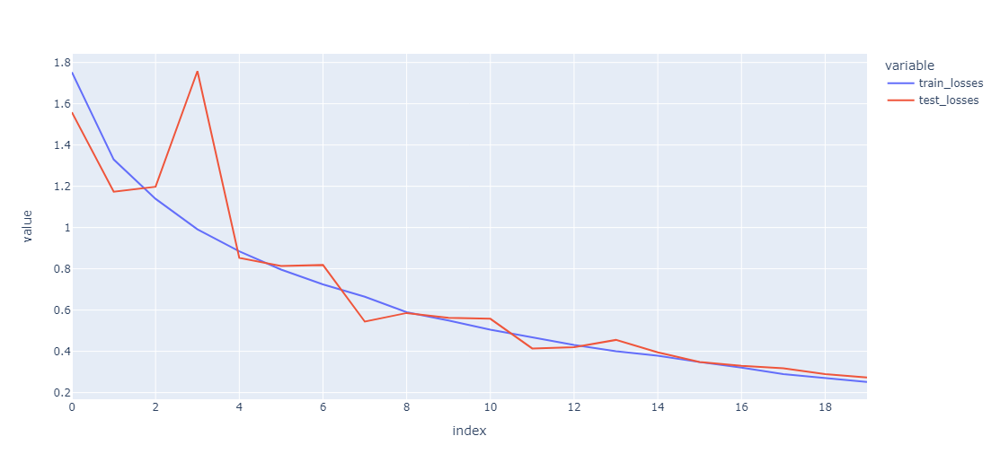
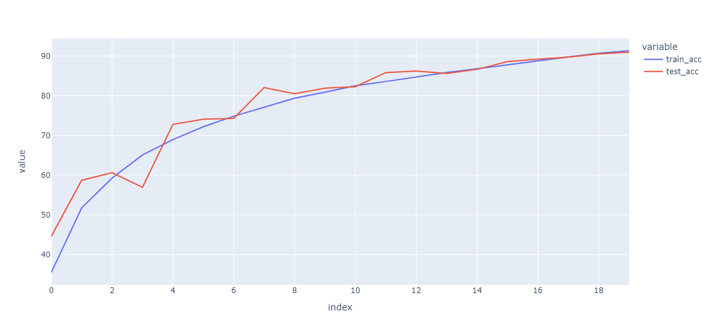
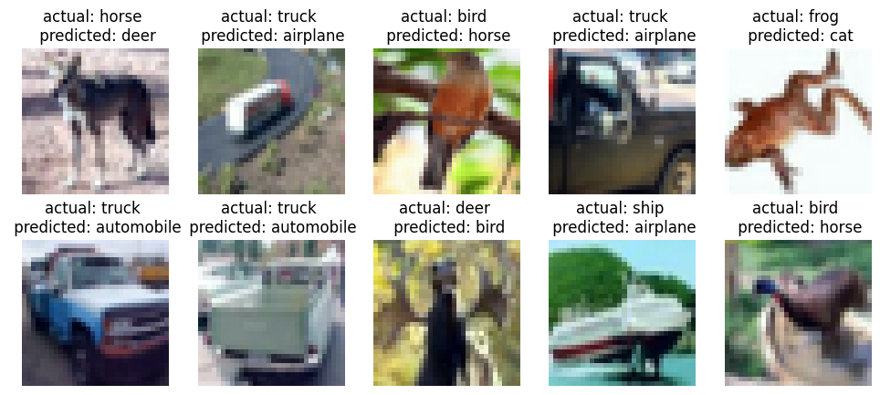
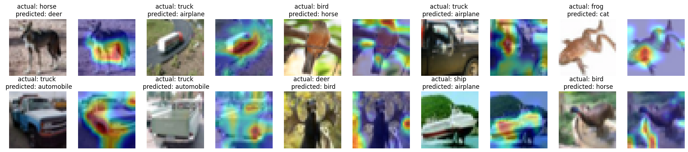

# Session 11

## <ins>Problem</ins>

- Implement Gradcam on Resnet with CIFAR10 dataset
- Modularize the model code
- Collect results and prepare documentation for results.

### Navigating the source code
The code structure has no modifications from the last sessions and further details of the structure is available [here](../session_5_split_code_to_files/README.md)

### Added bit more modularization with
- Folder `models` - all models moved to models folder
- Added Resnet model with `resnet.py` in models folder

### Key code snippets
> [Model Architecture](model/resnet.py)
```
class ResNet(nn.Module):
    def __init__(self, block, num_blocks, num_classes=10):
        super(ResNet, self).__init__()
        self.in_planes = 64

        self.conv1 = nn.Conv2d(3, 64, kernel_size=3,
                               stride=1, padding=1, bias=False)
        self.bn1 = nn.BatchNorm2d(64)
        self.layer1 = self._make_layer(block, 64, num_blocks[0], stride=1)
        self.layer2 = self._make_layer(block, 128, num_blocks[1], stride=2)
        self.layer3 = self._make_layer(block, 256, num_blocks[2], stride=2)
        self.layer4 = self._make_layer(block, 512, num_blocks[3], stride=2)
        self.linear = nn.Linear(512*block.expansion, num_classes)

    def _make_layer(self, block, planes, num_blocks, stride):
        strides = [stride] + [1]*(num_blocks-1)
        layers = []
        for stride in strides:
            layers.append(block(self.in_planes, planes, stride))
            self.in_planes = planes * block.expansion
        return nn.Sequential(*layers)

    def forward(self, x):
        out = F.relu(self.bn1(self.conv1(x)))
        out = self.layer1(out)
        out = self.layer2(out)
        out = self.layer3(out)
        out = self.layer4(out)
        out = F.avg_pool2d(out, 4)
        out = out.view(out.size(0), -1)
        out = self.linear(out)
        return out


def ResNet18():
    return ResNet(BasicBlock, [2, 2, 2, 2])
```

### Model summary

> Model summary
```
----------------------------------------------------------------
        Layer (type)               Output Shape         Param #
================================================================
            Conv2d-1          [512, 64, 32, 32]           1,728
       BatchNorm2d-2          [512, 64, 32, 32]             128
            Conv2d-3          [512, 64, 32, 32]          36,864
       BatchNorm2d-4          [512, 64, 32, 32]             128
            Conv2d-5          [512, 64, 32, 32]          36,864
       BatchNorm2d-6          [512, 64, 32, 32]             128
        BasicBlock-7          [512, 64, 32, 32]               0
            Conv2d-8          [512, 64, 32, 32]          36,864
       BatchNorm2d-9          [512, 64, 32, 32]             128
           Conv2d-10          [512, 64, 32, 32]          36,864
      BatchNorm2d-11          [512, 64, 32, 32]             128
       BasicBlock-12          [512, 64, 32, 32]               0
           Conv2d-13         [512, 128, 16, 16]          73,728
      BatchNorm2d-14         [512, 128, 16, 16]             256
           Conv2d-15         [512, 128, 16, 16]         147,456
      BatchNorm2d-16         [512, 128, 16, 16]             256
           Conv2d-17         [512, 128, 16, 16]           8,192
      BatchNorm2d-18         [512, 128, 16, 16]             256
       BasicBlock-19         [512, 128, 16, 16]               0
           Conv2d-20         [512, 128, 16, 16]         147,456
      BatchNorm2d-21         [512, 128, 16, 16]             256
           Conv2d-22         [512, 128, 16, 16]         147,456
      BatchNorm2d-23         [512, 128, 16, 16]             256
       BasicBlock-24         [512, 128, 16, 16]               0
           Conv2d-25           [512, 256, 8, 8]         294,912
      BatchNorm2d-26           [512, 256, 8, 8]             512
           Conv2d-27           [512, 256, 8, 8]         589,824
      BatchNorm2d-28           [512, 256, 8, 8]             512
           Conv2d-29           [512, 256, 8, 8]          32,768
      BatchNorm2d-30           [512, 256, 8, 8]             512
       BasicBlock-31           [512, 256, 8, 8]               0
           Conv2d-32           [512, 256, 8, 8]         589,824
      BatchNorm2d-33           [512, 256, 8, 8]             512
           Conv2d-34           [512, 256, 8, 8]         589,824
      BatchNorm2d-35           [512, 256, 8, 8]             512
       BasicBlock-36           [512, 256, 8, 8]               0
           Conv2d-37           [512, 512, 4, 4]       1,179,648
      BatchNorm2d-38           [512, 512, 4, 4]           1,024
           Conv2d-39           [512, 512, 4, 4]       2,359,296
      BatchNorm2d-40           [512, 512, 4, 4]           1,024
           Conv2d-41           [512, 512, 4, 4]         131,072
      BatchNorm2d-42           [512, 512, 4, 4]           1,024
       BasicBlock-43           [512, 512, 4, 4]               0
           Conv2d-44           [512, 512, 4, 4]       2,359,296
      BatchNorm2d-45           [512, 512, 4, 4]           1,024
           Conv2d-46           [512, 512, 4, 4]       2,359,296
      BatchNorm2d-47           [512, 512, 4, 4]           1,024
       BasicBlock-48           [512, 512, 4, 4]               0
           Linear-49                  [512, 10]           5,130
================================================================
Total params: 11,173,962
Trainable params: 11,173,962
Non-trainable params: 0
----------------------------------------------------------------
Input size (MB): 6.00
Forward/backward pass size (MB): 5760.04
Params size (MB): 42.63
Estimated Total Size (MB): 5808.66
----------------------------------------------------------------
```

### Loss / Accuracy curves




### Failed predictions


### Gradcam


> Training logs

```
Epoch 1
Train: Loss=1.4316 Batch_id=97 Accuracy=35.71: 100%|██████████| 98/98 [00:42<00:00,  2.29it/s]
              precision    recall  f1-score   support

           0       0.56      0.57      0.57      1000
           1       0.71      0.62      0.66      1000
           2       0.45      0.32      0.38      1000
           3       0.36      0.17      0.23      1000
           4       0.50      0.35      0.41      1000
           5       0.40      0.45      0.43      1000
           6       0.83      0.37      0.51      1000
           7       0.31      0.88      0.46      1000
           8       0.68      0.56      0.62      1000
           9       0.57      0.59      0.58      1000

    accuracy                           0.49     10000
   macro avg       0.54      0.49      0.48     10000
weighted avg       0.54      0.49      0.48     10000

Test set: Average loss: 1.4244, Accuracy: 4874/10000 (48.74%)

Epoch 2
Train: Loss=1.1350 Batch_id=97 Accuracy=51.87: 100%|██████████| 98/98 [00:41<00:00,  2.36it/s]
              precision    recall  f1-score   support

           0       0.75      0.47      0.57      1000
           1       0.51      0.93      0.66      1000
           2       0.76      0.10      0.18      1000
           3       0.80      0.01      0.02      1000
           4       0.52      0.31      0.39      1000
           5       0.63      0.17      0.27      1000
           6       0.52      0.82      0.64      1000
           7       0.29      0.93      0.45      1000
           8       0.66      0.74      0.70      1000
           9       0.71      0.47      0.57      1000

    accuracy                           0.50     10000
   macro avg       0.62      0.50      0.44     10000
weighted avg       0.62      0.50      0.44     10000

Test set: Average loss: 1.8182, Accuracy: 4952/10000 (49.52%)

Epoch 3
Train: Loss=1.1916 Batch_id=97 Accuracy=60.91: 100%|██████████| 98/98 [00:41<00:00,  2.34it/s]
              precision    recall  f1-score   support

           0       0.73      0.62      0.67      1000
           1       0.59      0.94      0.73      1000
           2       0.39      0.74      0.51      1000
           3       0.62      0.19      0.30      1000
           4       0.83      0.19      0.31      1000
           5       0.75      0.33      0.46      1000
           6       0.91      0.36      0.52      1000
           7       0.62      0.56      0.59      1000
           8       0.80      0.74      0.77      1000
           9       0.34      0.83      0.48      1000

    accuracy                           0.55     10000
   macro avg       0.66      0.55      0.53     10000
weighted avg       0.66      0.55      0.53     10000

Test set: Average loss: 1.6301, Accuracy: 5524/10000 (55.24%)

Epoch 4
Train: Loss=0.9523 Batch_id=97 Accuracy=66.11: 100%|██████████| 98/98 [00:41<00:00,  2.35it/s]
              precision    recall  f1-score   support

           0       0.87      0.60      0.71      1000
           1       0.91      0.82      0.86      1000
           2       0.68      0.53      0.60      1000
           3       0.40      0.70      0.51      1000
           4       0.58      0.81      0.68      1000
           5       0.54      0.68      0.60      1000
           6       0.77      0.76      0.77      1000
           7       0.98      0.40      0.57      1000
           8       0.86      0.72      0.78      1000
           9       0.86      0.83      0.84      1000

    accuracy                           0.69     10000
   macro avg       0.75      0.69      0.69     10000
weighted avg       0.75      0.69      0.69     10000

Test set: Average loss: 0.9797, Accuracy: 6859/10000 (68.59%)

Epoch 5
Train: Loss=0.8689 Batch_id=97 Accuracy=70.20: 100%|██████████| 98/98 [00:41<00:00,  2.34it/s]
              precision    recall  f1-score   support

           0       0.81      0.71      0.76      1000
           1       0.86      0.92      0.89      1000
           2       0.74      0.59      0.66      1000
           3       0.42      0.79      0.55      1000
           4       0.70      0.80      0.74      1000
           5       0.87      0.35      0.50      1000
           6       0.93      0.63      0.75      1000
           7       0.88      0.76      0.82      1000
           8       0.75      0.94      0.83      1000
           9       0.80      0.84      0.82      1000

    accuracy                           0.73     10000
   macro avg       0.78      0.73      0.73     10000
weighted avg       0.78      0.73      0.73     10000

Test set: Average loss: 0.7731, Accuracy: 7326/10000 (73.26%)

Epoch 6
Train: Loss=0.6834 Batch_id=97 Accuracy=72.98: 100%|██████████| 98/98 [00:41<00:00,  2.35it/s]
              precision    recall  f1-score   support

           0       0.65      0.86      0.75      1000
           1       0.84      0.93      0.88      1000
           2       0.82      0.55      0.66      1000
           3       0.74      0.46      0.57      1000
           4       0.56      0.77      0.64      1000
           5       0.76      0.58      0.66      1000
           6       0.61      0.92      0.74      1000
           7       0.97      0.48      0.64      1000
           8       0.71      0.92      0.80      1000
           9       0.90      0.73      0.81      1000

    accuracy                           0.72     10000
   macro avg       0.76      0.72      0.71     10000
weighted avg       0.76      0.72      0.71     10000

Test set: Average loss: 0.9507, Accuracy: 7219/10000 (72.19%)

Epoch 7
Train: Loss=0.7085 Batch_id=97 Accuracy=74.67: 100%|██████████| 98/98 [00:41<00:00,  2.35it/s]
              precision    recall  f1-score   support

           0       0.90      0.52      0.66      1000
           1       0.83      0.94      0.88      1000
           2       0.95      0.38      0.54      1000
           3       0.48      0.82      0.61      1000
           4       0.59      0.89      0.71      1000
           5       0.74      0.66      0.70      1000
           6       0.94      0.69      0.80      1000
           7       0.93      0.76      0.83      1000
           8       0.85      0.91      0.88      1000
           9       0.78      0.91      0.84      1000

    accuracy                           0.75     10000
   macro avg       0.80      0.75      0.74     10000
weighted avg       0.80      0.75      0.74     10000

Test set: Average loss: 0.8414, Accuracy: 7479/10000 (74.79%)

Epoch 8
Train: Loss=0.6265 Batch_id=97 Accuracy=77.14: 100%|██████████| 98/98 [00:41<00:00,  2.35it/s]
              precision    recall  f1-score   support

           0       0.93      0.69      0.79      1000
           1       0.96      0.87      0.91      1000
           2       0.82      0.68      0.74      1000
           3       0.58      0.76      0.66      1000
           4       0.84      0.73      0.78      1000
           5       0.75      0.70      0.73      1000
           6       0.70      0.94      0.80      1000
           7       0.90      0.84      0.87      1000
           8       0.84      0.92      0.88      1000
           9       0.87      0.92      0.90      1000

    accuracy                           0.81     10000
   macro avg       0.82      0.81      0.81     10000
weighted avg       0.82      0.81      0.81     10000

Test set: Average loss: 0.5715, Accuracy: 8051/10000 (80.51%)

Epoch 9
Train: Loss=0.6717 Batch_id=97 Accuracy=79.34: 100%|██████████| 98/98 [00:41<00:00,  2.34it/s]
              precision    recall  f1-score   support

           0       0.84      0.89      0.86      1000
           1       0.89      0.96      0.93      1000
           2       0.64      0.87      0.74      1000
           3       0.83      0.48      0.61      1000
           4       0.84      0.81      0.82      1000
           5       0.62      0.85      0.72      1000
           6       0.96      0.69      0.81      1000
           7       0.89      0.87      0.88      1000
           8       0.95      0.87      0.91      1000
           9       0.91      0.89      0.90      1000

    accuracy                           0.82     10000
   macro avg       0.84      0.82      0.82     10000
weighted avg       0.84      0.82      0.82     10000

Test set: Average loss: 0.5513, Accuracy: 8187/10000 (81.87%)

Epoch 10
Train: Loss=0.5969 Batch_id=97 Accuracy=81.15: 100%|██████████| 98/98 [00:41<00:00,  2.34it/s]
              precision    recall  f1-score   support

           0       0.91      0.73      0.81      1000
           1       0.81      0.98      0.89      1000
           2       0.44      0.94      0.60      1000
           3       0.67      0.73      0.70      1000
           4       0.69      0.81      0.74      1000
           5       0.88      0.56      0.68      1000
           6       0.97      0.67      0.79      1000
           7       0.98      0.61      0.76      1000
           8       0.99      0.76      0.86      1000
           9       0.94      0.84      0.89      1000

    accuracy                           0.76     10000
   macro avg       0.83      0.76      0.77     10000
weighted avg       0.83      0.76      0.77     10000

Test set: Average loss: 0.7357, Accuracy: 7627/10000 (76.27%)

Epoch 11
Train: Loss=0.3959 Batch_id=97 Accuracy=82.46: 100%|██████████| 98/98 [00:41<00:00,  2.34it/s]
              precision    recall  f1-score   support

           0       0.86      0.86      0.86      1000
           1       0.87      0.97      0.92      1000
           2       0.93      0.63      0.75      1000
           3       0.79      0.65      0.71      1000
           4       0.80      0.87      0.83      1000
           5       0.82      0.77      0.79      1000
           6       0.70      0.97      0.81      1000
           7       0.89      0.90      0.90      1000
           8       0.94      0.90      0.92      1000
           9       0.91      0.91      0.91      1000

    accuracy                           0.84     10000
   macro avg       0.85      0.84      0.84     10000
weighted avg       0.85      0.84      0.84     10000

Test set: Average loss: 0.4854, Accuracy: 8425/10000 (84.25%)

Epoch 12
Train: Loss=0.4329 Batch_id=97 Accuracy=83.83: 100%|██████████| 98/98 [00:41<00:00,  2.34it/s]
              precision    recall  f1-score   support

           0       0.87      0.87      0.87      1000
           1       0.81      0.98      0.89      1000
           2       0.73      0.88      0.80      1000
           3       0.76      0.67      0.71      1000
           4       0.86      0.79      0.82      1000
           5       0.89      0.68      0.77      1000
           6       0.71      0.95      0.82      1000
           7       0.95      0.84      0.89      1000
           8       0.89      0.96      0.92      1000
           9       0.99      0.73      0.84      1000

    accuracy                           0.83     10000
   macro avg       0.85      0.83      0.83     10000
weighted avg       0.85      0.83      0.83     10000

Test set: Average loss: 0.5240, Accuracy: 8350/10000 (83.50%)

Epoch 13
Train: Loss=0.4218 Batch_id=97 Accuracy=84.91: 100%|██████████| 98/98 [00:41<00:00,  2.34it/s]
              precision    recall  f1-score   support

           0       0.90      0.87      0.89      1000
           1       0.95      0.93      0.94      1000
           2       0.90      0.78      0.83      1000
           3       0.73      0.76      0.74      1000
           4       0.83      0.90      0.87      1000
           5       0.77      0.85      0.81      1000
           6       0.94      0.86      0.90      1000
           7       0.92      0.88      0.90      1000
           8       0.94      0.94      0.94      1000
           9       0.89      0.96      0.92      1000

    accuracy                           0.87     10000
   macro avg       0.88      0.87      0.87     10000
weighted avg       0.88      0.87      0.87     10000

Test set: Average loss: 0.3818, Accuracy: 8737/10000 (87.37%)

Epoch 14
Train: Loss=0.3283 Batch_id=97 Accuracy=85.90: 100%|██████████| 98/98 [00:41<00:00,  2.35it/s]
              precision    recall  f1-score   support

           0       0.84      0.94      0.89      1000
           1       0.90      0.98      0.94      1000
           2       0.94      0.71      0.81      1000
           3       0.74      0.78      0.76      1000
           4       0.91      0.84      0.88      1000
           5       0.79      0.85      0.82      1000
           6       0.89      0.93      0.91      1000
           7       0.91      0.92      0.91      1000
           8       0.97      0.91      0.94      1000
           9       0.94      0.91      0.92      1000

    accuracy                           0.88     10000
   macro avg       0.88      0.88      0.88     10000
weighted avg       0.88      0.88      0.88     10000

Test set: Average loss: 0.3786, Accuracy: 8792/10000 (87.92%)

Epoch 15
Train: Loss=0.3209 Batch_id=97 Accuracy=87.09: 100%|██████████| 98/98 [00:41<00:00,  2.34it/s]
              precision    recall  f1-score   support

           0       0.80      0.94      0.86      1000
           1       0.90      0.98      0.94      1000
           2       0.84      0.82      0.83      1000
           3       0.86      0.65      0.74      1000
           4       0.88      0.87      0.88      1000
           5       0.90      0.72      0.80      1000
           6       0.88      0.94      0.91      1000
           7       0.81      0.95      0.88      1000
           8       0.96      0.89      0.92      1000
           9       0.89      0.92      0.90      1000

    accuracy                           0.87     10000
   macro avg       0.87      0.87      0.87     10000
weighted avg       0.87      0.87      0.87     10000

Test set: Average loss: 0.4196, Accuracy: 8677/10000 (86.77%)

Epoch 16
Train: Loss=0.3979 Batch_id=97 Accuracy=87.91: 100%|██████████| 98/98 [00:41<00:00,  2.34it/s]
              precision    recall  f1-score   support

           0       0.94      0.85      0.89      1000
           1       0.97      0.94      0.95      1000
           2       0.82      0.89      0.85      1000
           3       0.91      0.57      0.70      1000
           4       0.88      0.89      0.89      1000
           5       0.72      0.91      0.80      1000
           6       0.93      0.91      0.92      1000
           7       0.91      0.94      0.93      1000
           8       0.91      0.96      0.93      1000
           9       0.91      0.96      0.93      1000

    accuracy                           0.88     10000
   macro avg       0.89      0.88      0.88     10000
weighted avg       0.89      0.88      0.88     10000

Test set: Average loss: 0.3582, Accuracy: 8828/10000 (88.28%)

Epoch 17
Train: Loss=0.3277 Batch_id=97 Accuracy=88.89: 100%|██████████| 98/98 [00:41<00:00,  2.34it/s]
              precision    recall  f1-score   support

           0       0.89      0.93      0.91      1000
           1       0.97      0.94      0.95      1000
           2       0.81      0.90      0.85      1000
           3       0.86      0.71      0.78      1000
           4       0.92      0.87      0.89      1000
           5       0.77      0.90      0.83      1000
           6       0.93      0.93      0.93      1000
           7       0.93      0.92      0.93      1000
           8       0.96      0.92      0.94      1000
           9       0.94      0.94      0.94      1000

    accuracy                           0.90     10000
   macro avg       0.90      0.90      0.90     10000
weighted avg       0.90      0.90      0.90     10000

Test set: Average loss: 0.3201, Accuracy: 8955/10000 (89.55%)

Epoch 18
Train: Loss=0.2964 Batch_id=97 Accuracy=89.90: 100%|██████████| 98/98 [00:41<00:00,  2.34it/s]
              precision    recall  f1-score   support

           0       0.90      0.92      0.91      1000
           1       0.96      0.96      0.96      1000
           2       0.89      0.84      0.87      1000
           3       0.85      0.69      0.76      1000
           4       0.94      0.84      0.89      1000
           5       0.74      0.92      0.82      1000
           6       0.93      0.94      0.93      1000
           7       0.90      0.96      0.93      1000
           8       0.95      0.95      0.95      1000
           9       0.94      0.95      0.94      1000

    accuracy                           0.90     10000
   macro avg       0.90      0.90      0.90     10000
weighted avg       0.90      0.90      0.90     10000

Test set: Average loss: 0.3196, Accuracy: 8956/10000 (89.56%)

Epoch 19
Train: Loss=0.2188 Batch_id=97 Accuracy=90.61: 100%|██████████| 98/98 [00:41<00:00,  2.35it/s]
              precision    recall  f1-score   support

           0       0.92      0.91      0.91      1000
           1       0.96      0.96      0.96      1000
           2       0.87      0.88      0.88      1000
           3       0.84      0.80      0.82      1000
           4       0.89      0.92      0.91      1000
           5       0.87      0.85      0.86      1000
           6       0.92      0.95      0.93      1000
           7       0.94      0.93      0.94      1000
           8       0.96      0.94      0.95      1000
           9       0.93      0.96      0.95      1000

    accuracy                           0.91     10000
   macro avg       0.91      0.91      0.91     10000
weighted avg       0.91      0.91      0.91     10000

Test set: Average loss: 0.2845, Accuracy: 9098/10000 (90.98%)

Epoch 20
Train: Loss=0.2611 Batch_id=97 Accuracy=91.57: 100%|██████████| 98/98 [00:41<00:00,  2.34it/s]
              precision    recall  f1-score   support

           0       0.91      0.92      0.91      1000
           1       0.96      0.96      0.96      1000
           2       0.90      0.87      0.88      1000
           3       0.83      0.82      0.82      1000
           4       0.91      0.91      0.91      1000
           5       0.86      0.87      0.86      1000
           6       0.94      0.94      0.94      1000
           7       0.95      0.94      0.94      1000
           8       0.95      0.95      0.95      1000
           9       0.94      0.95      0.94      1000

    accuracy                           0.91     10000
   macro avg       0.91      0.91      0.91     10000
weighted avg       0.91      0.91      0.91     10000

Test set: Average loss: 0.2750, Accuracy: 9130/10000 (91.30%)

```


### Conclusion
CIFAR10 dataset was sucessfully trained with the model architecture discussed upto 90% accuracy
