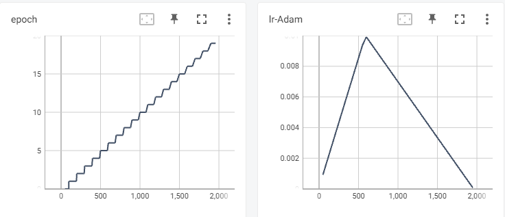
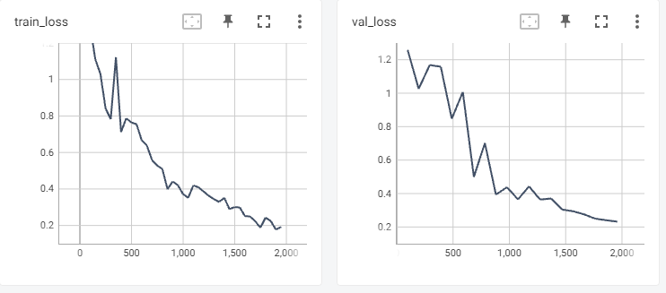
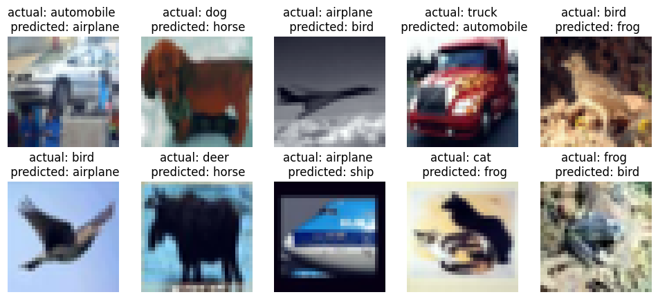
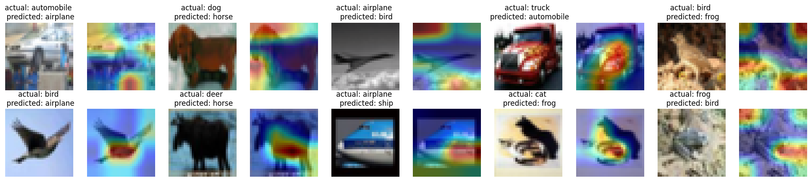

# Session 12

## <ins>Problem</ins>

- Implement Gradcam on Resnet with CIFAR10 dataset
- Modularize the model code
- Collect results and prepare documentation for results.
- Depoly with pytorch lightning and [huggingface spaces](https://huggingface.co/spaces/siva-sankar-a/erav1-session12-cifar10-davidnet)

### Navigating the source code
The code structure has no modifications from the last sessions and further details of the structure is available [here](../session_5_split_code_to_files/README.md)

### Added bit more modularization with
- Added Davidnet model with `davidnet.py` in models folder
- Added Davidnet pytorch lightning model with `davidnet_pl.py` in models folder

### Key code snippets
> [Model Architecture](model/davidnet.py)
```
class Net(nn.Module):

    '''
    This class implements the neural network model

    Usage:
    >>> device = ...
    >>> model = Net().to('cpu')
    '''

    #This defines the structure of the NN.
    def __init__(self):
        super(Net, self).__init__()

        # Prep Layer
        self.prep = self.conv3x3_bn_dropout(3, 64, padding=1)

        # Layer 1
        self.conv_bn_pool_1 = self.conv3x3_maxpool(64, 128)
        # Layer 1 - residual
        self.res_1 = self.conv3x3_bn_dropout(128, 128, padding=1)
        self.res_2 = self.conv3x3_bn_dropout(128, 128, padding=1)
        self.downsample_1 = self.conv1x1(128, 128)

        # Layer 2
        self.conv_bn_pool_2 = self.conv3x3_maxpool(128, 256)

        # Layer 3
        self.conv_bn_pool_3 = self.conv3x3_maxpool(256, 512)
        # Layer 3 - residual
        self.res_3 = self.conv3x3_bn_dropout(512, 512, padding=1)
        self.res_4 = self.conv3x3_bn_dropout(512, 512, padding=1)
        self.downsample_2 = self.conv1x1(512, 512)

        # Pool
        self.pool = nn.MaxPool2d(4)

        # Linear
        self.linear = nn.Linear(512, 10)

    def conv3x3_maxpool(self, in_channels, out_channels):
        layers = [self.conv3x3_bn_dropout(in_channels, out_channels, padding=1),
                  nn.MaxPool2d(2)]

        return nn.Sequential(
                    *layers
                )

    def conv3x3_bn_dropout(self, in_channels, out_channels, kernel_size=3, stride=1, padding=0, dilation=1, groups=1, bias=False, dropout=None, is_relu_bn=True):

          if is_relu_bn:
            layers = [
                  self.conv3x3(in_channels, out_channels, kernel_size, stride, padding, dilation, groups, bias),
                  nn.BatchNorm2d(out_channels),
                  nn.ReLU(),
            ]
          else:
            layers = [
                  self.conv3x3(in_channels, out_channels, kernel_size, stride, padding, dilation, groups, bias)
            ]

          if dropout:
            return nn.Sequential(
                    *layers,
                    nn.Dropout(dropout)
                )
          else:
            return nn.Sequential(
                    *layers
                )

    def conv3x3(self, in_channels, out_channels, kernel_size=3, stride=1, padding=0, dilation=1, groups=1, bias=False):
          return nn.Conv2d(in_channels,
                    out_channels,
                    kernel_size=kernel_size,
                    stride=stride,
                    padding=padding,
                    dilation=dilation,
                    groups=groups,
                    bias=bias)

    def conv1x1(self, in_channels, out_channels, kernel_size=1, stride=1, padding=0, bias=False):
          return nn.Conv2d(in_channels,
                    out_channels,
                    kernel_size=kernel_size,
                    stride=stride,
                    padding=padding,
                    bias=bias)


    def forward(self, x):

        # Prep Layer
        x = self.prep(x)

        # Layer 1
        x = self.conv_bn_pool_1(x)
        # Layer 1 - residual
        i = x
        x = self.res_1(x)
        x = self.res_2(x)
        x = x + i

        # Layer 2
        x = self.conv_bn_pool_2(x)

        # Layer 3
        x = self.conv_bn_pool_3(x)
        # Layer 3 - residual
        i = x
        x = self.res_3(x)
        x = self.res_4(x)
        x = x + i

        # Pool
        x = self.pool(x)

        # Flatten
        x = x.view(-1, 512)

        # Linear
        x = self.linear(x)

        return x
```


> [Pytorch Lightning](model/davidnet_pl.py)
```

class NetPL(pl.LightningModule):
    def __init__(self):
        super().__init__()
        self.model = Net()
        self.num_classes = 10
        self.accuracy = torchmetrics.classification.Accuracy(task="multiclass", num_classes=self.num_classes)

    def forward(self, x):
        embedding = self.model(x)
        return embedding

    def configure_optimizers(self):

        num_epochs = 20
        momentum = 0.9
        max_lr = 1E-02
        regularization = None
        epochs_up = 7
        base_momentum = 0.85
        div_factor = 100

        steps_per_epoch = len(train_dataloader)
        total_steps = num_epochs * steps_per_epoch
        pct_start = 0.3

        optimizer = optim.Adam(self.model.parameters(), lr=0.1)
        scheduler = optim.lr_scheduler.OneCycleLR(optimizer,
                                                max_lr=max_lr,
                                                total_steps=total_steps,
                                                epochs=num_epochs,
                                                steps_per_epoch=steps_per_epoch,
                                                pct_start=pct_start,
                                                anneal_strategy='linear',
                                                cycle_momentum=True,
                                                base_momentum=base_momentum,
                                                max_momentum=momentum,
                                                div_factor=div_factor,
                                                verbose=False)

        return [optimizer], [{'scheduler': scheduler, 'interval': 'step'}]

    def training_step(self, train_batch, batch_idx):
        cross_entropy_loss = torch.nn.CrossEntropyLoss(reduction='mean')
        data, target = train_batch

        output = self.model(data)

        logits = F.log_softmax(output, dim=1)
        pred = torch.argmax(logits, dim=1)

        self.accuracy(pred, target)
        loss = cross_entropy_loss(output, target)

        self.log('train_acc_step', self.accuracy, prog_bar=True, logger=True)
        self.log('train_loss', loss, prog_bar=True, logger=True)

        return loss

    def validation_step(self, val_batch, batch_idx):
        cross_entropy_loss = torch.nn.CrossEntropyLoss(reduction='mean')
        data, target = val_batch

        output = self.model(data)

        logits = F.log_softmax(output, dim=1)
        pred = torch.argmax(logits, dim=1)

        loss = cross_entropy_loss(output, target)

        self.accuracy(pred, target)
        self.log('val_acc_step', self.accuracy, prog_bar=True, logger=True)
        self.log('val_loss', loss, prog_bar=True, logger=True)

        return logits

```

### Model summary

> Model summary
```
----------------------------------------------------------------
        Layer (type)               Output Shape         Param #
================================================================
            Conv2d-1          [512, 64, 32, 32]           1,728
       BatchNorm2d-2          [512, 64, 32, 32]             128
              ReLU-3          [512, 64, 32, 32]               0
            Conv2d-4         [512, 128, 32, 32]          73,728
       BatchNorm2d-5         [512, 128, 32, 32]             256
              ReLU-6         [512, 128, 32, 32]               0
         MaxPool2d-7         [512, 128, 16, 16]               0
            Conv2d-8         [512, 128, 16, 16]         147,456
       BatchNorm2d-9         [512, 128, 16, 16]             256
             ReLU-10         [512, 128, 16, 16]               0
           Conv2d-11         [512, 128, 16, 16]         147,456
      BatchNorm2d-12         [512, 128, 16, 16]             256
             ReLU-13         [512, 128, 16, 16]               0
           Conv2d-14         [512, 256, 16, 16]         294,912
      BatchNorm2d-15         [512, 256, 16, 16]             512
             ReLU-16         [512, 256, 16, 16]               0
        MaxPool2d-17           [512, 256, 8, 8]               0
           Conv2d-18           [512, 512, 8, 8]       1,179,648
      BatchNorm2d-19           [512, 512, 8, 8]           1,024
             ReLU-20           [512, 512, 8, 8]               0
        MaxPool2d-21           [512, 512, 4, 4]               0
           Conv2d-22           [512, 512, 4, 4]       2,359,296
      BatchNorm2d-23           [512, 512, 4, 4]           1,024
             ReLU-24           [512, 512, 4, 4]               0
           Conv2d-25           [512, 512, 4, 4]       2,359,296
      BatchNorm2d-26           [512, 512, 4, 4]           1,024
             ReLU-27           [512, 512, 4, 4]               0
        MaxPool2d-28           [512, 512, 1, 1]               0
           Linear-29                  [512, 10]           5,130
================================================================
Total params: 6,573,130
Trainable params: 6,573,130
Non-trainable params: 0
----------------------------------------------------------------
Input size (MB): 6.00
Forward/backward pass size (MB): 4642.04
Params size (MB): 25.07
Estimated Total Size (MB): 4673.11
----------------------------------------------------------------
```

### Loss / Accuracy curves

#### Epochs and LR


#### Loss cover


#### Accuracy curve


### Failed predictions


### Gradcam


> Training logs

```
/usr/local/lib/python3.10/dist-packages/lightning_fabric/connector.py:554: UserWarning: 16 is supported for historical reasons but its usage is discouraged. Please set your precision to 16-mixed instead!
  rank_zero_warn(
INFO:pytorch_lightning.utilities.rank_zero:Using 16bit Automatic Mixed Precision (AMP)
INFO:pytorch_lightning.utilities.rank_zero:GPU available: True (cuda), used: True
INFO:pytorch_lightning.utilities.rank_zero:TPU available: False, using: 0 TPU cores
INFO:pytorch_lightning.utilities.rank_zero:IPU available: False, using: 0 IPUs
INFO:pytorch_lightning.utilities.rank_zero:HPU available: False, using: 0 HPUs
WARNING:pytorch_lightning.loggers.tensorboard:Missing logger folder: tb_logs/davidnet
INFO:pytorch_lightning.accelerators.cuda:LOCAL_RANK: 0 - CUDA_VISIBLE_DEVICES: [0]
INFO:pytorch_lightning.callbacks.model_summary:
  | Name     | Type               | Params
------------------------------------------------
0 | model    | Net                | 6.9 M 
1 | accuracy | MulticlassAccuracy | 0     
------------------------------------------------
6.9 M     Trainable params
0         Non-trainable params
6.9 M     Total params
27.407    Total estimated model params size (MB)
/usr/local/lib/python3.10/dist-packages/pytorch_lightning/trainer/connectors/data_connector.py:432: PossibleUserWarning: The dataloader, val_dataloader, does not have many workers which may be a bottleneck. Consider increasing the value of the `num_workers` argument` (try 4 which is the number of cpus on this machine) in the `DataLoader` init to improve performance.
  rank_zero_warn(
/usr/local/lib/python3.10/dist-packages/pytorch_lightning/trainer/connectors/data_connector.py:432: PossibleUserWarning: The dataloader, train_dataloader, does not have many workers which may be a bottleneck. Consider increasing the value of the `num_workers` argument` (try 4 which is the number of cpus on this machine) in the `DataLoader` init to improve performance.
  rank_zero_warn(
Epoch 19: 100%
98/98 [00:11<00:00, 8.25it/s, v_num=0, train_acc_step=0.929, train_loss=0.205, val_acc_step=0.932, val_loss=0.232]
INFO:pytorch_lightning.utilities.rank_zero:`Trainer.fit` stopped: `max_epochs=20` reached.

```
### Conclusion
CIFAR10 dataset was sucessfully trained with the model architecture discussed upto 93% accuracy
Pytorch lightning module for training was implemented
