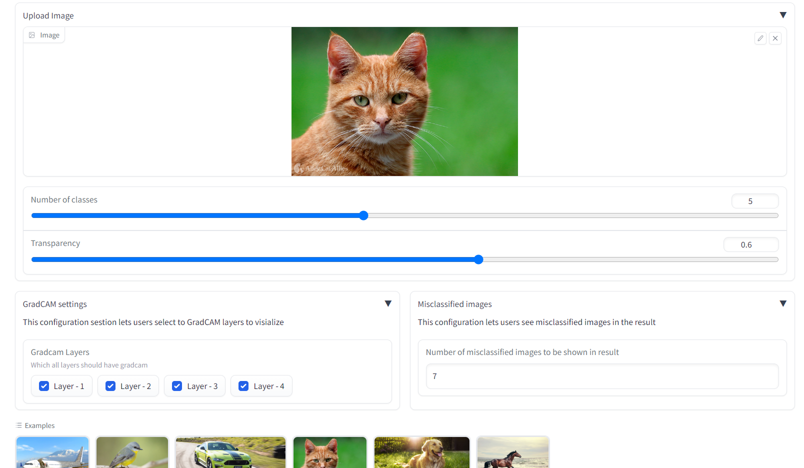
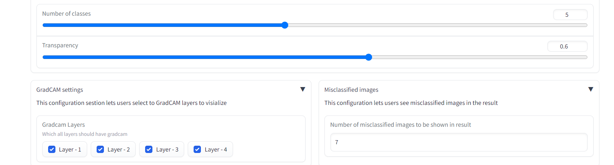
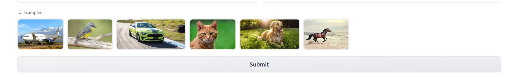
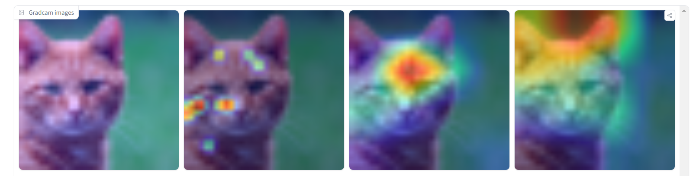
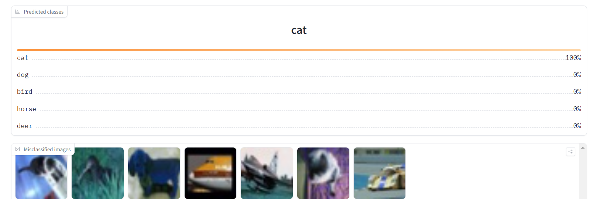

# CIDAR 10 Davidnet trained to 93% accuracy

## <ins>Inference API</ins>
Use this app to generate inferences on CIFAR10 classes for an input image

## CIFAR10 classes

| Label | Value |
| - | - |
0 | 'airplane'
1 | 'automobile'
2 | 'bird'
3 | 'cat'
4 | 'deer'
5 | 'dog'
6 | 'frog'
7 | 'horse'
8 | 'ship'
9 | 'truck'

## Components

There are 5 main controls for this inference API

### Controls

- Number of classes
    - Total number of clases that need to be displayed in final prediction
- Transparency
- Gradcam Settings
    Select the layers/blocks that need to run Gradcam on
    - Layer 1
        Initial block of DavidNet
    - Layer 2
        Second block of DavidNet
    - Layer 3
    - Layer 4
- Misclassified Images
    Count of how many misclassified images needs to be shown in the output

### Examples

- Selection of a set of images that can be used as input.
- Auto refresh for the app is not enabled. Select an example and click submit for results.

### Gradcam

- Displays the gradcam for uploaded image in the selected order

### Results

Results
- Predicted top-n labels based on settings
