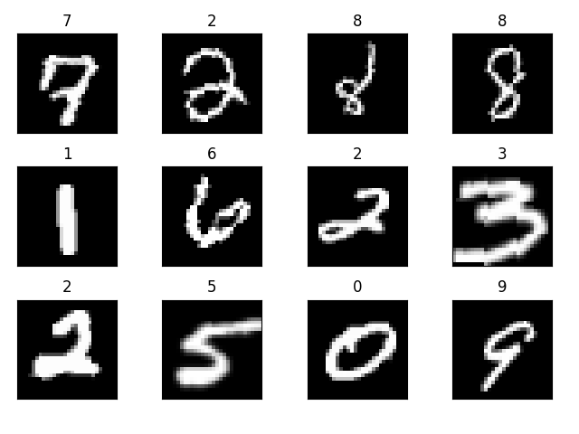
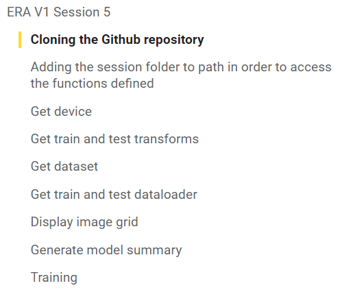

# Session 5

## <ins>Problem</ins>

- Creating working file structure for training.
- Use the created file structure to train MNIST dataset on Goolge Colab.
- Collect results and prepare documentation for results.

## <ins> Files added </ins>

- ### `utils.py`

    This file contains all the utility functions reqired to train and test a model

    -  ### <ins> `Functions, classes and code snipppets:` </ins>

    > `get_device` 
    - This function checks if the model can be trained on `CUDA` or on `CPU` and returns the current device.
        ``` 
        device = get_device()
        print(device)
        ```
    > `get_train_transforms`
     - This function loads the train transforms
        ``` 
        train_transforms = get_train_transforms()
        ```
    > `get_test_transforms`
     - This function loads the test transforms
        ```
        test_transforms = get_test_transforms()
        ```
    > `get_train_dataset`
     - This function loads the train dataset
        ```
        train_transforms = get_train_transforms()
        train_dataset = get_train_dataset(train_transforms)
        ```
    > `get_test_dataset`
     - This function loads the test dataset
        ```
        test_transforms = get_test_transforms()
        test_dataset = get_test_dataset(test_transforms)
        ```
    > `get_train_dataloader`
     - This function loads train dataloader
        ```
        train_transforms = get_train_transforms()
        train_dataset = get_train_dataset(train_transforms)
        train_dataloader = get_train_dataloader(train_dataset, **kwargs)
        ```
    > `get_test_dataloader`
     - This function loads test dataloader
        ```
        test_transforms = get_test_transforms()
        test_dataset = get_test_dataset(test_transforms)
        test_dataloader = get_test_dataloader(test_dataset, **kwargs)
        ```
    
    > `show_image_grid`
     - This function displays images from a data loader 
        ```
        dataloader = get_test_dataloader(test_dataset, **kwargs)
        ...
        show_image_grid(dataloader)
        ```
        

    > `show_summary`
     - This function displays the summary of a model structure
        ```
        device = ...
        model = Net().to('cpu')
        ...
        show_summary(model, -1, device.type)
        ```
    
    > `train`
     - This function trains the provided `model` on the `train_loader`
        ```
        metrics = { 'train_acc': [], 'train_losses': [],
                        'test_acc': [], 'test_losses': [] }
        ...
        model = ...
        device = ...
        train(model, device, train_dataloader, metrics)
        ``` 

    > `test`
     - This function trains the provided `model` on the `test_loader`
        ```
        metrics = { 'train_acc': [], 'train_losses': [],
                        'test_acc': [], 'test_losses': [] }
        ...
        model = ...
        device = ...
        test(model, device, train_dataloader, metrics)
        ``` 
    
- ### `model.py`
    This file contains the model implemeted for the session. 

    -  ### <ins> `Functions, classes and code snipppets:` </ins>

       > `class Net`

        This class inherits form `nn.Module` and implements 
        the neural network architecture mentioned in summary
        ```
            device = ...
            model = Net().to('cpu')
        ```
       The model architecture is similar to `AlexNet` but with just 4 covolutional blocks and 
       two fully connected layers in the end.
       
       

    ```
    ----------------------------------------------------------------
        Layer (type)               Output Shape         Param #
    ================================================================
                Conv2d-1           [-1, 32, 26, 26]             288
                Conv2d-2           [-1, 64, 24, 24]          18,432
                Conv2d-3          [-1, 128, 10, 10]          73,728
                Conv2d-4            [-1, 256, 8, 8]         294,912
                Linear-5                   [-1, 50]         204,800
                Linear-6                   [-1, 10]             500
    ================================================================
    Total params: 592,660
    Trainable params: 592,660
    Non-trainable params: 0
    ----------------------------------------------------------------
    Input size (MB): 0.00
    Forward/backward pass size (MB): 0.67
    Params size (MB): 2.26
    Estimated Total Size (MB): 2.93
    ----------------------------------------------------------------
    ```

    > `run`

    This function colates all the required components from `utils.py` and `model.py`
    in order to verify if all components can work together in the local environment

    A similar structure is implemented in the Coogle colab notebook in order to train and test the model.
    ```
    import utils as U

    device = U.get_device()
    print(device)

    batch_size = 512
    kwargs = {'batch_size': batch_size, 'shuffle': True, 'num_workers': 2, 'pin_memory': True}

    train_transforms = U.get_train_transforms()
    test_transforms = U.get_test_transforms()

    train_dataset = U.get_train_dataset(train_transforms)
    test_dataset = U.get_test_dataset(test_transforms)

    train_dataloader = U.get_train_dataloader(train_dataset, **kwargs)
    test_dataloader = U.get_test_dataloader(test_dataset, **kwargs)

    U.show_image_grid(train_dataloader)

    model = Net().to('cpu')

    U.show_summary(model, -1, device.type)

    optimizer = optim.SGD(model.parameters(), lr=0.01, momentum=0.9)
    scheduler = optim.lr_scheduler.StepLR(optimizer, step_size=15, gamma=0.1, verbose=True)
    num_epochs = 20

    metrics = { 'train_acc': [], 'train_losses': [],
                'test_acc': [], 'test_losses': [] }

    for epoch in range(1, num_epochs + 1):
        print(f'Epoch {epoch}')
        U.train(model, device, train_dataloader, optimizer, metrics)
        U.test(model, device, test_dataloader, metrics)
        scheduler.step()
    ```

- ## `S5.ipynb`

The Goolge Colab file is organized in the hierarchy shown in the snapshot



- ### Cloning the Github repository

This section clones the Github repository to be used in colab

```
!git clone https://github.com/siva-sankar-a/erav1.git
```

> Result

```
Cloning into 'erav1'...
remote: Enumerating objects: 17, done.
remote: Counting objects: 100% (17/17), done.
remote: Compressing objects: 100% (13/13), done.
remote: Total 17 (delta 1), reused 11 (delta 0), pack-reused 0
Unpacking objects: 100% (17/17), 162.02 KiB | 9.00 MiB/s, done.
```
- ### Adding the session folder to path in order to access the functions defined

This step is required for us to access the python modules that we have created inside colab. 
Since by default it is not loaded in the path we add it to load our modules by

```
sys.path.append('/content/erav1/session_5_split_code_to_files')
```

Modules that are creted are imported using the following statements

```
import utils as U
from model import Net
```

- ### Get device

This section gets the current device to run the colab notebook.
```
device = U.get_device()
print(device)
```

Result:
```
CUDA Available? True
cuda
````

- ### Get train and test transforms

Using the created `utils.py` module we load test and train transforms
```
train_transforms = U.get_train_transforms()
test_transforms = U.get_test_transforms()
```

- ### Get dataset
- ### Get train and test dataloader
- ### Display image grid
- ### Generate model summary
- ### Training

```
Adjusting learning rate of group 0 to 1.0000e-02.
Epoch 1
Train: Loss=0.3034 Batch_id=117 Accuracy=52.07: 100%|██████████| 118/118 [00:28<00:00,  4.09it/s]
Test set: Average loss: 0.2712, Accuracy: 9201/10000 (92.01%)

Adjusting learning rate of group 0 to 1.0000e-02.
Epoch 2
Train: Loss=0.2488 Batch_id=117 Accuracy=93.52: 100%|██████████| 118/118 [00:22<00:00,  5.14it/s]
Test set: Average loss: 0.0929, Accuracy: 9707/10000 (97.07%)

Adjusting learning rate of group 0 to 1.0000e-02.
Epoch 3
Train: Loss=0.0261 Batch_id=117 Accuracy=96.05: 100%|██████████| 118/118 [00:22<00:00,  5.19it/s]
Test set: Average loss: 0.0641, Accuracy: 9806/10000 (98.06%)

Adjusting learning rate of group 0 to 1.0000e-02.
Epoch 4
Train: Loss=0.0152 Batch_id=117 Accuracy=97.03: 100%|██████████| 118/118 [00:23<00:00,  5.13it/s]
Test set: Average loss: 0.0505, Accuracy: 9838/10000 (98.38%)

Adjusting learning rate of group 0 to 1.0000e-02.
Epoch 5
Train: Loss=0.0578 Batch_id=117 Accuracy=97.47: 100%|██████████| 118/118 [00:22<00:00,  5.18it/s]
Test set: Average loss: 0.0521, Accuracy: 9837/10000 (98.37%)

Adjusting learning rate of group 0 to 1.0000e-02.
Epoch 6
Train: Loss=0.0379 Batch_id=117 Accuracy=97.88: 100%|██████████| 118/118 [00:22<00:00,  5.15it/s]
Test set: Average loss: 0.0396, Accuracy: 9883/10000 (98.83%)

Adjusting learning rate of group 0 to 1.0000e-02.
Epoch 7
Train: Loss=0.0347 Batch_id=117 Accuracy=98.07: 100%|██████████| 118/118 [00:23<00:00,  5.10it/s]
Test set: Average loss: 0.0400, Accuracy: 9866/10000 (98.66%)

Adjusting learning rate of group 0 to 1.0000e-02.
Epoch 8
Train: Loss=0.0252 Batch_id=117 Accuracy=98.27: 100%|██████████| 118/118 [00:22<00:00,  5.20it/s]
Test set: Average loss: 0.0326, Accuracy: 9888/10000 (98.88%)

Adjusting learning rate of group 0 to 1.0000e-02.
Epoch 9
Train: Loss=0.0780 Batch_id=117 Accuracy=98.45: 100%|██████████| 118/118 [00:23<00:00,  5.12it/s]
Test set: Average loss: 0.0312, Accuracy: 9900/10000 (99.00%)

Adjusting learning rate of group 0 to 1.0000e-02.
Epoch 10
Train: Loss=0.0120 Batch_id=117 Accuracy=98.51: 100%|██████████| 118/118 [00:22<00:00,  5.18it/s]
Test set: Average loss: 0.0299, Accuracy: 9913/10000 (99.13%)

Adjusting learning rate of group 0 to 1.0000e-02.
Epoch 11
Train: Loss=0.0332 Batch_id=117 Accuracy=98.57: 100%|██████████| 118/118 [00:22<00:00,  5.23it/s]
Test set: Average loss: 0.0315, Accuracy: 9902/10000 (99.02%)

Adjusting learning rate of group 0 to 1.0000e-02.
Epoch 12
Train: Loss=0.0087 Batch_id=117 Accuracy=98.65: 100%|██████████| 118/118 [00:22<00:00,  5.30it/s]
Test set: Average loss: 0.0267, Accuracy: 9906/10000 (99.06%)

Adjusting learning rate of group 0 to 1.0000e-02.
Epoch 13
Train: Loss=0.0142 Batch_id=117 Accuracy=98.73: 100%|██████████| 118/118 [00:22<00:00,  5.29it/s]
Test set: Average loss: 0.0265, Accuracy: 9921/10000 (99.21%)

Adjusting learning rate of group 0 to 1.0000e-02.
Epoch 14
Train: Loss=0.0167 Batch_id=117 Accuracy=98.83: 100%|██████████| 118/118 [00:22<00:00,  5.36it/s]
Test set: Average loss: 0.0283, Accuracy: 9909/10000 (99.09%)

Adjusting learning rate of group 0 to 1.0000e-02.
Epoch 15
Train: Loss=0.0878 Batch_id=117 Accuracy=98.85: 100%|██████████| 118/118 [00:23<00:00,  5.09it/s]
Test set: Average loss: 0.0261, Accuracy: 9915/10000 (99.15%)

Adjusting learning rate of group 0 to 1.0000e-03.
Epoch 16
Train: Loss=0.0202 Batch_id=117 Accuracy=99.05: 100%|██████████| 118/118 [00:21<00:00,  5.47it/s]
Test set: Average loss: 0.0225, Accuracy: 9923/10000 (99.23%)

Adjusting learning rate of group 0 to 1.0000e-03.
Epoch 17
Train: Loss=0.0355 Batch_id=117 Accuracy=99.15: 100%|██████████| 118/118 [00:21<00:00,  5.56it/s]
Test set: Average loss: 0.0220, Accuracy: 9923/10000 (99.23%)

Adjusting learning rate of group 0 to 1.0000e-03.
Epoch 18
Train: Loss=0.0077 Batch_id=117 Accuracy=99.14: 100%|██████████| 118/118 [00:21<00:00,  5.41it/s]
Test set: Average loss: 0.0218, Accuracy: 9920/10000 (99.20%)

Adjusting learning rate of group 0 to 1.0000e-03.
Epoch 19
Train: Loss=0.0069 Batch_id=117 Accuracy=99.18: 100%|██████████| 118/118 [00:22<00:00,  5.21it/s]
Test set: Average loss: 0.0216, Accuracy: 9928/10000 (99.28%)

Adjusting learning rate of group 0 to 1.0000e-03.
Epoch 20
Train: Loss=0.0019 Batch_id=117 Accuracy=99.22: 100%|██████████| 118/118 [00:22<00:00,  5.21it/s]
Test set: Average loss: 0.0215, Accuracy: 9925/10000 (99.25%)

Adjusting learning rate of group 0 to 1.0000e-03.
```