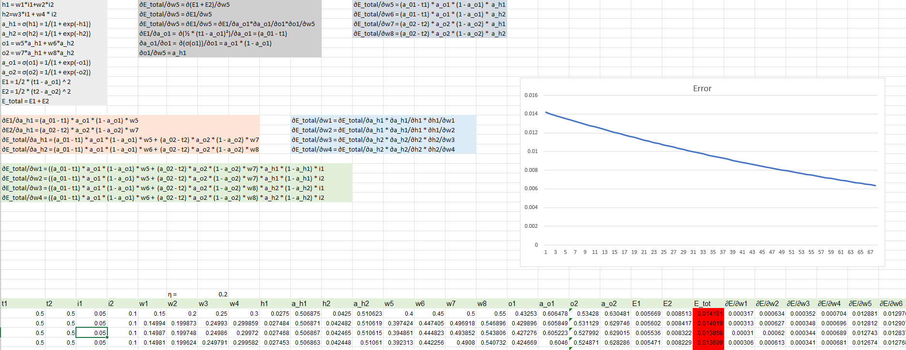
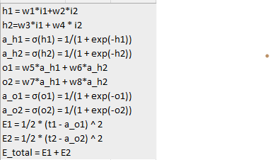
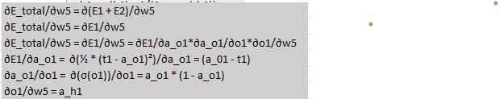
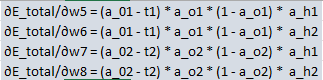
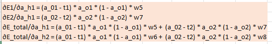
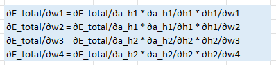
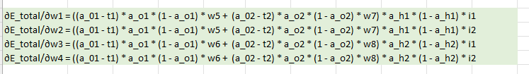
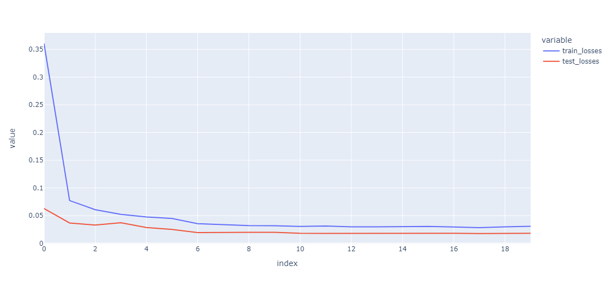
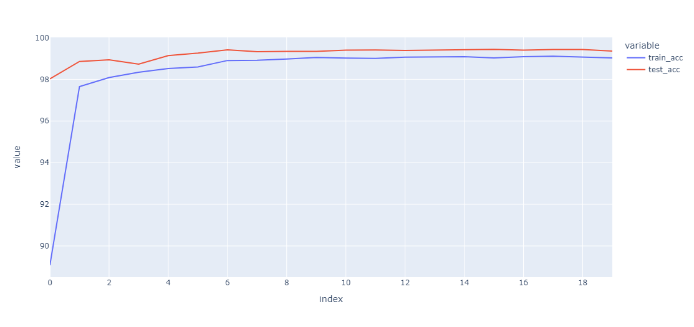

# Session 6

## <ins>Problem</ins>

### Part 1
Recreate the Excel sheet neural network
### Part 2
- Attain 99.4% validation accuracy on MNIST dataset with
    - Less than 20k parameters
    - Less than 20 epochs
- Collect results and prepare documentation for results.

## Part 1

The Excel sheet neural network discussed in class was recreated in 6 steps
Screen shot of the final result



### Steps
- Compute the formula for all the required outputs. They are:
    - Hidden layer
    $$
    h_1 = w_1*i_1+w_2*i_2 \\
    h_2 = w_3*i_1 + w_4 * i_2
    $$
    - Hidden layer activations
    $$
    a_{h_1} = σ(h_1) = \frac{1}{(1 + e^{-h_1})} \\
    a_{h_2} = σ(h_2) = \frac{1}{(1 + e^{-h_2})}
    $$
    - Output layer
    $$
    o_1 = w_5*a_{h_1} + w_6*a_{h_2}  \\
    o_2 = w_7*a_{h_1} + w_8*a_{h_2}
    $$
    - Output layer activations
    $$
    a_{o_1} = σ(o_1) = \frac{1}{(1 + e^{-o_1})} \\
    a_{o_2} = σ(o_2) = \frac{1}{(1 + e^{-o_2})}
    $$
    - Error
    $$
    E_1 = \frac{1}{2} * (t_1 - a_{o_1}) ^ 2 \\
    E_2 = \frac{1}{2} * (t_2 - a_{o_2}) ^ 2 \\
    E = E_1 + E_2
    $$
    
- Compute the gradient of a single weight in the output layer w.r.t the Error

- Repeat the previous step for all the output layer weights. After this step we will have all the gradients of output layer weights w.r.t the total error


- Compute error gradients w.r.t hidden layer activations

- Compute error gradients w.r.t input layer weights and substitute the result of last step to create the final formula in terms of inputs, target and activations

- Final result


## Part 2
## <ins> Experiment and navigating through the code </ins>

### Strategy to achieve 99.4% accuracy
- First step was to get a working model.
- Next we reduce the model size so that it doesn't overfit the data.
- Once the previous steps are stable, we add <b>Batch Normalization</b> to all previous layers
- Global average pooling layer is added to make the network fully convolutional thus reducing the number of parameters
- Next step was to tweak image augmentation strategies.
- Capacity of the model was increaded after this step to prevent underfitting
    - Prority was given to the last layers while increasing the capacity

### Navigating the source code
The code structure has no modifications from the last sessions and further details of the structure is available [here](../session_5_split_code_to_files/README.md)

### Key code snippets
> [Model Architecture](model.py)
```
    def __init__(self):
        super(Net, self).__init__()
        self.conv1 = nn.Sequential(
            self.conv3x3(1, 2, padding=0),
            nn.ReLU(),
            nn.BatchNorm2d(2),
            nn.Dropout(0.1)
        )
        self.conv2 = nn.Sequential(
            self.conv3x3(2, 2, padding=1),
            nn.ReLU(),
            nn.BatchNorm2d(2),
            nn.Dropout(0.1)
        )
        self.conv3 = nn.Sequential(
            self.conv3x3(2, 16, padding=0),
            nn.ReLU(),
            nn.BatchNorm2d(16),
            nn.Dropout(0.1)
        )
        self.maxpool1 = nn.MaxPool2d(kernel_size=2, stride=2)
        self.conv4 = nn.Sequential(
            self.conv3x3(16, 16, padding=0),
            nn.ReLU(),
            nn.BatchNorm2d(16),
            nn.Dropout(0.1)
        )
        self.conv5 = nn.Sequential(
            self.conv3x3(16, 16, padding=1),
            nn.ReLU(),
            nn.BatchNorm2d(16),
            nn.Dropout(0.1)
        )
        self.conv6 = nn.Sequential(
            self.conv3x3(16, 16, padding=0),
            nn.ReLU(),
            nn.BatchNorm2d(16),
            nn.Dropout(0.1)
        )
        self.maxpool2 = nn.MaxPool2d(kernel_size=2, stride=2)
        self.conv7 = nn.Sequential(
            self.conv3x3(16, 16, padding=0),
            nn.ReLU(),
            nn.BatchNorm2d(16),
            nn.Dropout(0.1)
        )
        self.conv8 = nn.Sequential(
            self.conv3x3(16, 16, padding=1),
            nn.ReLU(),
            nn.BatchNorm2d(16),
            nn.Dropout(0.1)
        )
        self.conv9 = nn.Sequential(
            self.conv3x3(16, 32, padding=0),
            nn.ReLU(),
            nn.BatchNorm2d(32),
            nn.Dropout(0.1)
        )
        self.gap = nn.AvgPool2d(4)
        self.mixer = nn.Sequential(
            self.conv1x1(32, 10),
        )


    def conv3x3(self, in_channels, out_channels, kernel_size=3, stride=1, padding=0, bias=False):
          return nn.Conv2d(in_channels, 
                    out_channels, 
                    kernel_size=kernel_size,
                    stride=stride,
                    padding=padding,
                    bias=bias)

    def conv1x1(self, in_channels, out_channels, kernel_size=1, stride=1, padding=0, bias=False):
          return nn.Conv2d(in_channels, 
                    out_channels, 
                    kernel_size=kernel_size,
                    stride=stride,
                    padding=padding,
                    bias=bias)


    def forward(self, x):
        x = self.conv1(x)
        x = self.conv2(x)
        x = self.conv3(x)
        x = self.maxpool1(x)
        x = self.conv4(x)
        x = self.conv5(x)
        x = self.conv6(x)
        # x = self.maxpool2(x)
        x = self.conv7(x)
        x = self.conv8(x)
        x = self.conv9(x)
        x = self.gap(x)
        x = self.mixer(x)
        x = x.view(-1, 10)
        return F.log_softmax(x, dim=1)
```

### Model summary

The final model has a total of 17,054 parameters. 
- This is well within the parameter limit of 20k parameters. 
- The majority of capaciy for the model comes from the last 3 X 3 convolution layers, namely  `conv7`, `conv8`, `conv9` in the last code snippet

> Model summary
```
----------------------------------------------------------------
        Layer (type)               Output Shape         Param #
================================================================
            Conv2d-1            [-1, 2, 26, 26]              18
              ReLU-2            [-1, 2, 26, 26]               0
       BatchNorm2d-3            [-1, 2, 26, 26]               4
           Dropout-4            [-1, 2, 26, 26]               0
            Conv2d-5            [-1, 2, 26, 26]              36
              ReLU-6            [-1, 2, 26, 26]               0
       BatchNorm2d-7            [-1, 2, 26, 26]               4
           Dropout-8            [-1, 2, 26, 26]               0
            Conv2d-9           [-1, 16, 24, 24]             288
             ReLU-10           [-1, 16, 24, 24]               0
      BatchNorm2d-11           [-1, 16, 24, 24]              32
          Dropout-12           [-1, 16, 24, 24]               0
        MaxPool2d-13           [-1, 16, 12, 12]               0
           Conv2d-14           [-1, 16, 10, 10]           2,304
             ReLU-15           [-1, 16, 10, 10]               0
      BatchNorm2d-16           [-1, 16, 10, 10]              32
          Dropout-17           [-1, 16, 10, 10]               0
           Conv2d-18           [-1, 16, 10, 10]           2,304
             ReLU-19           [-1, 16, 10, 10]               0
      BatchNorm2d-20           [-1, 16, 10, 10]              32
          Dropout-21           [-1, 16, 10, 10]               0
           Conv2d-22             [-1, 16, 8, 8]           2,304
             ReLU-23             [-1, 16, 8, 8]               0
      BatchNorm2d-24             [-1, 16, 8, 8]              32
          Dropout-25             [-1, 16, 8, 8]               0
           Conv2d-26             [-1, 16, 6, 6]           2,304
             ReLU-27             [-1, 16, 6, 6]               0
      BatchNorm2d-28             [-1, 16, 6, 6]              32
          Dropout-29             [-1, 16, 6, 6]               0
           Conv2d-30             [-1, 16, 6, 6]           2,304
             ReLU-31             [-1, 16, 6, 6]               0
      BatchNorm2d-32             [-1, 16, 6, 6]              32
          Dropout-33             [-1, 16, 6, 6]               0
           Conv2d-34             [-1, 32, 4, 4]           4,608
             ReLU-35             [-1, 32, 4, 4]               0
      BatchNorm2d-36             [-1, 32, 4, 4]              64
          Dropout-37             [-1, 32, 4, 4]               0
        AvgPool2d-38             [-1, 32, 1, 1]               0
           Conv2d-39             [-1, 10, 1, 1]             320
================================================================
Total params: 17,054
Trainable params: 17,054
Non-trainable params: 0
----------------------------------------------------------------
Input size (MB): 0.00
Forward/backward pass size (MB): 0.56
Params size (MB): 0.07
Estimated Total Size (MB): 0.63
----------------------------------------------------------------
```
> Training logs
```
Adjusting learning rate of group 0 to 1.0000e-01.
Epoch 1
Train: Loss=0.0651 Batch_id=117 Accuracy=89.08: 100%|██████████| 118/118 [00:19<00:00,  6.17it/s]
Test set: Average loss: 0.0628, Accuracy: 9802/10000 (98.02%)

Adjusting learning rate of group 0 to 1.0000e-01.
Epoch 2
Train: Loss=0.0556 Batch_id=117 Accuracy=97.65: 100%|██████████| 118/118 [00:19<00:00,  5.97it/s]
Test set: Average loss: 0.0367, Accuracy: 9886/10000 (98.86%)

Adjusting learning rate of group 0 to 1.0000e-01.
Epoch 3
Train: Loss=0.0030 Batch_id=117 Accuracy=98.08: 100%|██████████| 118/118 [00:19<00:00,  6.16it/s]
Test set: Average loss: 0.0329, Accuracy: 9894/10000 (98.94%)

Adjusting learning rate of group 0 to 1.0000e-01.
Epoch 4
Train: Loss=0.0246 Batch_id=117 Accuracy=98.34: 100%|██████████| 118/118 [00:19<00:00,  6.10it/s]
Test set: Average loss: 0.0373, Accuracy: 9873/10000 (98.73%)

Adjusting learning rate of group 0 to 1.0000e-01.
Epoch 5
Train: Loss=0.0700 Batch_id=117 Accuracy=98.52: 100%|██████████| 118/118 [00:19<00:00,  5.97it/s]
Test set: Average loss: 0.0286, Accuracy: 9914/10000 (99.14%)

Adjusting learning rate of group 0 to 1.0000e-01.
Epoch 6
Train: Loss=0.0340 Batch_id=117 Accuracy=98.59: 100%|██████████| 118/118 [00:19<00:00,  5.92it/s]
Test set: Average loss: 0.0251, Accuracy: 9926/10000 (99.26%)

Adjusting learning rate of group 0 to 1.0000e-02.
Epoch 7
Train: Loss=0.0577 Batch_id=117 Accuracy=98.91: 100%|██████████| 118/118 [00:18<00:00,  6.33it/s]
Test set: Average loss: 0.0195, Accuracy: 9942/10000 (99.42%)

Adjusting learning rate of group 0 to 1.0000e-02.
Epoch 8
Train: Loss=0.0260 Batch_id=117 Accuracy=98.91: 100%|██████████| 118/118 [00:19<00:00,  6.17it/s]
Test set: Average loss: 0.0201, Accuracy: 9933/10000 (99.33%)

Adjusting learning rate of group 0 to 1.0000e-02.
Epoch 9
Train: Loss=0.0070 Batch_id=117 Accuracy=98.98: 100%|██████████| 118/118 [00:19<00:00,  5.94it/s]
Test set: Average loss: 0.0199, Accuracy: 9934/10000 (99.34%)

Adjusting learning rate of group 0 to 1.0000e-02.
Epoch 10
Train: Loss=0.0999 Batch_id=117 Accuracy=99.05: 100%|██████████| 118/118 [00:19<00:00,  6.06it/s]
Test set: Average loss: 0.0200, Accuracy: 9934/10000 (99.34%)

Adjusting learning rate of group 0 to 1.0000e-02.
Epoch 11
Train: Loss=0.0178 Batch_id=117 Accuracy=99.02: 100%|██████████| 118/118 [00:19<00:00,  6.15it/s]
Test set: Average loss: 0.0181, Accuracy: 9940/10000 (99.40%)

Adjusting learning rate of group 0 to 1.0000e-02.
Epoch 12
Train: Loss=0.0495 Batch_id=117 Accuracy=99.01: 100%|██████████| 118/118 [00:19<00:00,  5.99it/s]
Test set: Average loss: 0.0179, Accuracy: 9941/10000 (99.41%)

Adjusting learning rate of group 0 to 1.0000e-03.
Epoch 13
Train: Loss=0.0609 Batch_id=117 Accuracy=99.06: 100%|██████████| 118/118 [00:19<00:00,  6.11it/s]
Test set: Average loss: 0.0179, Accuracy: 9939/10000 (99.39%)

Adjusting learning rate of group 0 to 1.0000e-03.
Epoch 14
Train: Loss=0.0477 Batch_id=117 Accuracy=99.07: 100%|██████████| 118/118 [00:19<00:00,  6.18it/s]
Test set: Average loss: 0.0185, Accuracy: 9940/10000 (99.40%)

Adjusting learning rate of group 0 to 1.0000e-03.
Epoch 15
Train: Loss=0.0128 Batch_id=117 Accuracy=99.09: 100%|██████████| 118/118 [00:19<00:00,  5.95it/s]
Test set: Average loss: 0.0180, Accuracy: 9942/10000 (99.42%)

Adjusting learning rate of group 0 to 1.0000e-03.
Epoch 16
Train: Loss=0.0730 Batch_id=117 Accuracy=99.03: 100%|██████████| 118/118 [00:19<00:00,  6.02it/s]
Test set: Average loss: 0.0178, Accuracy: 9944/10000 (99.44%)

Adjusting learning rate of group 0 to 1.0000e-03.
Epoch 17
Train: Loss=0.0360 Batch_id=117 Accuracy=99.09: 100%|██████████| 118/118 [00:18<00:00,  6.33it/s]
Test set: Average loss: 0.0181, Accuracy: 9940/10000 (99.40%)

Adjusting learning rate of group 0 to 1.0000e-03.
Epoch 18
Train: Loss=0.0133 Batch_id=117 Accuracy=99.11: 100%|██████████| 118/118 [00:19<00:00,  5.99it/s]
Test set: Average loss: 0.0177, Accuracy: 9943/10000 (99.43%)

Adjusting learning rate of group 0 to 1.0000e-04.
Epoch 19
Train: Loss=0.0600 Batch_id=117 Accuracy=99.06: 100%|██████████| 118/118 [00:19<00:00,  6.08it/s]
Test set: Average loss: 0.0178, Accuracy: 9943/10000 (99.43%)

Adjusting learning rate of group 0 to 1.0000e-04.
Epoch 20
Train: Loss=0.0480 Batch_id=117 Accuracy=99.03: 100%|██████████| 118/118 [00:18<00:00,  6.39it/s]
Test set: Average loss: 0.0182, Accuracy: 9936/10000 (99.36%)

Adjusting learning rate of group 0 to 1.0000e-04.
```

> Plots

Loss curve


Accuracy curve

### Conclusion
MNIST dataset was sucessfully trained with the model architecture discussed upto 99.4% accuracy
