# Session 6

## <ins>Problem</ins>

- Attain 99.4% validation accuracy on MNIST dataset with
    - Less than 20k parameters
    - Less than 20 epochs
- Collect results and prepare documentation for results.

## <ins> Experiments </ins>

### Benchmarking with last sessions model

Model Architecture

```mermaid
graph LR
 A[Input Layer] --> |28 X 28 </br> 3 channels| B(Conv2d)
 B --> C[Relu]

 C --> |26 X 26 </br> 32 channels| D(Conv2d)
 D --> E[Relu]


 E --> |24 X 24 </br> 64 channels| F[Maxpool]

 F --> |12 X 12 </br> 64 channels| G(Conv2d)
 G --> H[Relu]

 H --> |10 X 10 </br> 128 channels| I(Conv2d)
 I --> J[Relu]

 J --> |8 X 8 </br> 256 channels| K[Maxpool]

 K --> |Flatten to <br> 1 X 4096| L(Fully connected)
 L --> M[Relu] 

 M --> |4096 X 50| N(Fully connected)
 N --> O[Relu] 

 O --> |50 X 10| P(Output Layer)

 subgraph Conv Layers approx 100K parameters
 subgraph block 1
 B
 C
 end

 subgraph block 2
 D
 E
 end

 subgraph block 3
 G
 H
 end

 subgraph block 4
 I
 J
 end

 K
 F

 end

 subgraph Fully connected layers. 500K parameters. Wine bottle after a nice date dinner!
 subgraph FC1
 L
 M
 end

  subgraph FC2
 N
 O
 end
 end
```

### Conclusion
MNIST dataset was sucessfully trained with the model architecture discussed upto 99% accuracy
