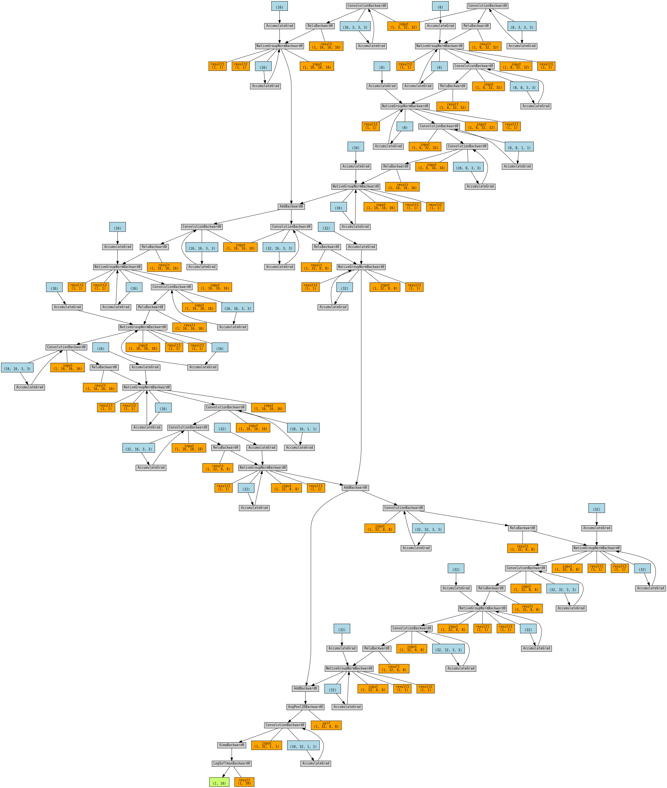
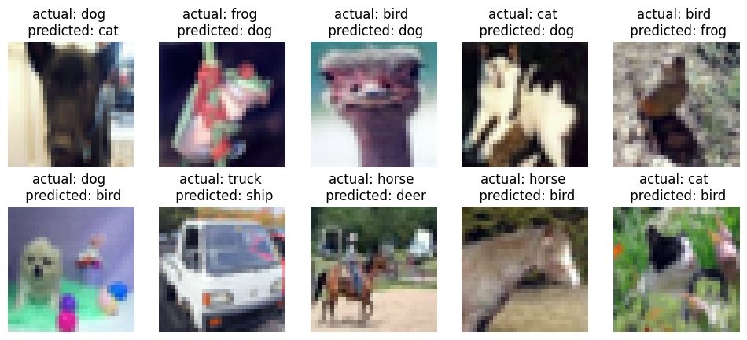
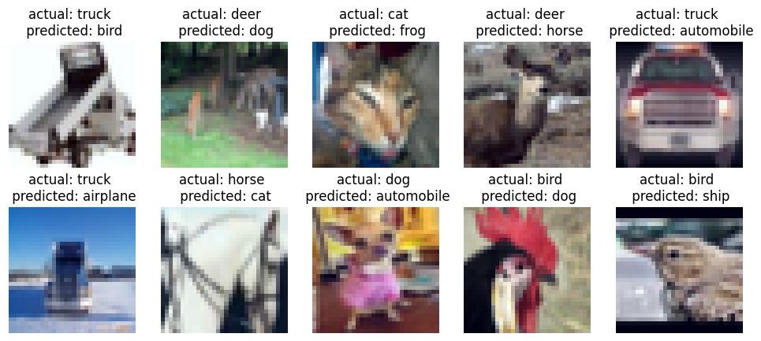
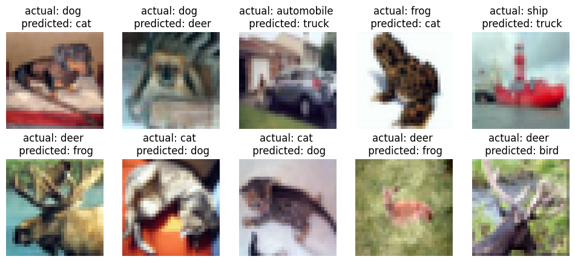
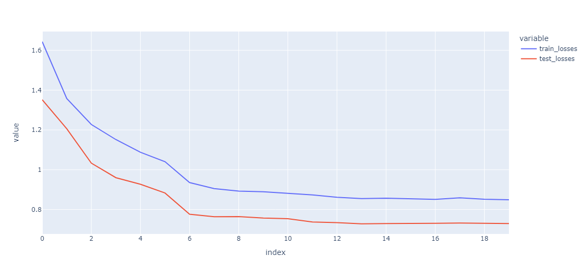
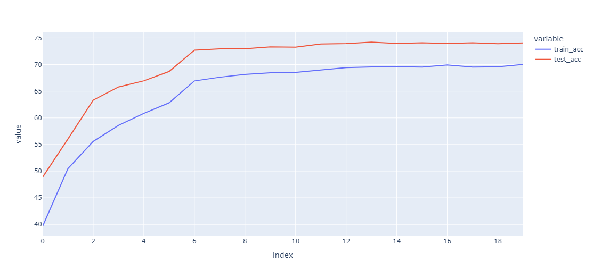

# Session 8

## <ins>Problem</ins>

- Attain 70% validation accuracy on CIFAR10 dataset with
    - Less than 50k parameters
    - Less than 20 epochs
- Collect results and prepare documentation for results.

### Navigating the source code
The code structure has no modifications from the last sessions and further details of the structure is available [here](../session_5_split_code_to_files/README.md)

### Added bit more modularization with
- `run.py` - To be used for local testing
- `datasets.py` - Wrapping pytorch dataset - RIght now only handles CIFAR10 dataset

### Key code snippets
> [Model Architecture](model.py)
```
class Net(nn.Module):

    '''
    This class implements the neural network model

    Usage:
    >>> device = ...
    >>> model = Net().to('cpu')
    '''

    #This defines the structure of the NN.
    def __init__(self):
        super(Net, self).__init__()
        self.conv1 = self.conv3x3_bn_dropout(3, 8, padding=1)
        self.conv2 = self.conv3x3_bn_dropout(8, 8, padding=1)
        self.conv3 = self.conv1x1(8, 8, padding=1)

        self.pool1 = self.conv3x3_bn_dropout(8, 8, stride=2)
        self.downsample1 = self.conv3x3_bn_dropout(3, 8, padding=1, stride=2)

        self.conv4 = self.conv3x3_bn_dropout(8, 8, padding=1)
        self.conv5 = self.conv3x3_bn_dropout(8, 8, padding=1)
        self.conv6 = self.conv3x3_bn_dropout(8, 8, padding=1)
        self.conv7 = self.conv1x1(8, 8, padding=1)

        self.pool2 = self.conv3x3_bn_dropout(8, 8, stride=2)
        self.downsample2 = self.conv3x3_bn_dropout(8, 8, padding=1, stride=2)

        self.conv8 = self.conv3x3_bn_dropout(8, 8, padding=1)
        self.conv9 = self.conv3x3_bn_dropout(8, 8, padding=1)
        self.conv10 = self.conv3x3_bn_dropout(8, 8, padding=1)

        self.gap = nn.AvgPool2d(8)
        self.mixer = nn.Sequential(
            self.conv1x1(8, 10),
        )


    def conv3x3_bn_dropout(self, in_channels, out_channels, kernel_size=3, stride=1, padding=0, bias=False, dropout=0.0):
          if dropout:
            return nn.Sequential(
                self.conv3x3(in_channels, out_channels, kernel_size, stride, padding, bias),
                nn.ReLU(),
                nn.BatchNorm2d(out_channels),
                nn.Dropout(dropout),
                )
          else:
            return nn.Sequential(
                self.conv3x3(in_channels, out_channels, kernel_size, stride, padding, bias),
                nn.ReLU(),
                nn.BatchNorm2d(out_channels),
                )

    def conv3x3(self, in_channels, out_channels, kernel_size=3, stride=1, padding=0, bias=False):
          return nn.Conv2d(in_channels,
                    out_channels,
                    kernel_size=kernel_size,
                    stride=stride,
                    padding=padding,
                    bias=bias)

    def conv1x1(self, in_channels, out_channels, kernel_size=1, stride=1, padding=0, bias=False):
          return nn.Conv2d(in_channels,
                    out_channels,
                    kernel_size=kernel_size,
                    stride=stride,
                    padding=padding,
                    bias=bias)


    def forward(self, x):

        # Block 1
        i1 = x

        x = self.conv1(x)
        x = self.conv2(x)
        x = self.conv3(x)
        # pooling
        x = self.pool1(x)

        # residual connection
        i1 = self.downsample1(i1)
        x = x + i1

        # Block 2
        i2 = x
        x = self.conv4(x)
        x = self.conv5(x)
        x = self.conv6(x)
        x = self.conv7(x)
        # pooling
        x = self.pool2(x)

        # residual connection
        i2 = self.downsample2(i2)
        x = x + i2

        # Block 3
        i3 = x
        x = self.conv8(x)
        x = self.conv9(x)
        x = self.conv10(x)
        # residual connection
        x = x + i3

        x = self.gap(x)
        x = self.mixer(x)
        x = x.view(-1, 10)

        return F.log_softmax(x, dim=1)
```

### Model summary

The final model has a total of 47,304 parameters. 
- This is well within the parameter limit of 50k parameters. 
- Has 3 residual connections

> Model summary
```
----------------------------------------------------------------
        Layer (type)               Output Shape         Param #
================================================================
            Conv2d-1           [128, 8, 32, 32]             216
              ReLU-2           [128, 8, 32, 32]               0
         GroupNorm-3           [128, 8, 32, 32]              16
           Dropout-4           [128, 8, 32, 32]               0
            Conv2d-5           [128, 8, 32, 32]             576
              ReLU-6           [128, 8, 32, 32]               0
         GroupNorm-7           [128, 8, 32, 32]              16
           Dropout-8           [128, 8, 32, 32]               0
            Conv2d-9           [128, 8, 34, 34]              64
           Conv2d-10          [128, 16, 16, 16]           1,152
             ReLU-11          [128, 16, 16, 16]               0
        GroupNorm-12          [128, 16, 16, 16]              32
          Dropout-13          [128, 16, 16, 16]               0
           Conv2d-14          [128, 16, 16, 16]             432
             ReLU-15          [128, 16, 16, 16]               0
        GroupNorm-16          [128, 16, 16, 16]              32
          Dropout-17          [128, 16, 16, 16]               0
           Conv2d-18          [128, 16, 16, 16]           2,304
             ReLU-19          [128, 16, 16, 16]               0
        GroupNorm-20          [128, 16, 16, 16]              32
          Dropout-21          [128, 16, 16, 16]               0
           Conv2d-22          [128, 16, 16, 16]           2,304
             ReLU-23          [128, 16, 16, 16]               0
        GroupNorm-24          [128, 16, 16, 16]              32
          Dropout-25          [128, 16, 16, 16]               0
           Conv2d-26          [128, 16, 16, 16]           2,304
             ReLU-27          [128, 16, 16, 16]               0
        GroupNorm-28          [128, 16, 16, 16]              32
          Dropout-29          [128, 16, 16, 16]               0
           Conv2d-30          [128, 16, 18, 18]             256
           Conv2d-31            [128, 32, 8, 8]           4,608
             ReLU-32            [128, 32, 8, 8]               0
        GroupNorm-33            [128, 32, 8, 8]              64
          Dropout-34            [128, 32, 8, 8]               0
           Conv2d-35            [128, 32, 8, 8]           4,608
             ReLU-36            [128, 32, 8, 8]               0
        GroupNorm-37            [128, 32, 8, 8]              64
          Dropout-38            [128, 32, 8, 8]               0
           Conv2d-39            [128, 32, 8, 8]           9,216
             ReLU-40            [128, 32, 8, 8]               0
        GroupNorm-41            [128, 32, 8, 8]              64
          Dropout-42            [128, 32, 8, 8]               0
           Conv2d-43            [128, 32, 8, 8]           9,216
             ReLU-44            [128, 32, 8, 8]               0
        GroupNorm-45            [128, 32, 8, 8]              64
          Dropout-46            [128, 32, 8, 8]               0
           Conv2d-47            [128, 32, 8, 8]           9,216
             ReLU-48            [128, 32, 8, 8]               0
        GroupNorm-49            [128, 32, 8, 8]              64
          Dropout-50            [128, 32, 8, 8]               0
        AvgPool2d-51            [128, 32, 1, 1]               0
           Conv2d-52            [128, 10, 1, 1]             320
================================================================
Total params: 47,304
Trainable params: 47,304
Non-trainable params: 0
----------------------------------------------------------------
Input size (MB): 1.50
Forward/backward pass size (MB): 198.13
Params size (MB): 0.18
Estimated Total Size (MB): 199.82
----------------------------------------------------------------
```

### Model architecture


### Changes in network for Group and Layer normalization


#### Group normalization

```
def conv3x3_bn_dropout(self, in_channels, out_channels, kernel_size=3, stride=1, padding=0, bias=False, dropout=0.1):
        if dropout:
        return nn.Sequential(
            self.conv3x3(in_channels, out_channels, kernel_size, stride, padding, bias),
            nn.ReLU(),
            nn.GroupNorm(4, out_channels),
            nn.Dropout(dropout),
            )
        else:
        return nn.Sequential(
            self.conv3x3(in_channels, out_channels, kernel_size, stride, padding, bias),
            nn.ReLU(),
            nn.GroupNorm(4, out_channels),
            )
```

#### Layer normalization

```
def conv3x3_bn_dropout(self, in_channels, out_channels, kernel_size=3, stride=1, padding=0, bias=False, dropout=0.0):
        if dropout:
        return nn.Sequential(
            self.conv3x3(in_channels, out_channels, kernel_size, stride, padding, bias),
            nn.ReLU(),
            nn.GroupNorm(1, out_channels),
            nn.Dropout(dropout),
            )
        else:
        return nn.Sequential(
            self.conv3x3(in_channels, out_channels, kernel_size, stride, padding, bias),
            nn.ReLU(),
                nn.GroupNorm(1, out_channels),
            )
```

> Miscalssified images for

- Batch normalization


- Group normalization


- Layer normalization



> Plots

Loss curve for batch normalization


Accuracy curve for batch normalization



> Training logs batch normalization

```
Adjusting learning rate of group 0 to 1.0000e-01.
Epoch 1
Train: Loss=1.4900 Batch_id=390 Accuracy=39.64: 100%|██████████| 391/391 [00:27<00:00, 14.44it/s]
              precision    recall  f1-score   support

    airplane       0.49      0.63      0.55      1000
  automobile       0.71      0.60      0.65      1000
        bird       0.29      0.54      0.38      1000
         cat       0.37      0.21      0.26      1000
        deer       0.34      0.33      0.33      1000
         dog       0.45      0.31      0.37      1000
        frog       0.62      0.50      0.55      1000
       horse       0.54      0.62      0.57      1000
        ship       0.63      0.52      0.57      1000
       truck       0.62      0.62      0.62      1000

    accuracy                           0.49     10000
   macro avg       0.51      0.49      0.49     10000
weighted avg       0.51      0.49      0.49     10000

Test set: Average loss: 1.3515, Accuracy: 4886/10000 (48.86%)

Adjusting learning rate of group 0 to 1.0000e-01.
Epoch 2
Train: Loss=1.2786 Batch_id=390 Accuracy=50.45: 100%|██████████| 391/391 [00:18<00:00, 21.35it/s]
              precision    recall  f1-score   support

    airplane       0.51      0.73      0.60      1000
  automobile       0.72      0.79      0.76      1000
        bird       0.40      0.56      0.46      1000
         cat       0.37      0.31      0.34      1000
        deer       0.61      0.24      0.34      1000
         dog       0.37      0.57      0.45      1000
        frog       0.73      0.60      0.66      1000
       horse       0.74      0.55      0.63      1000
        ship       0.68      0.62      0.65      1000
       truck       0.75      0.64      0.69      1000

    accuracy                           0.56     10000
   macro avg       0.59      0.56      0.56     10000
weighted avg       0.59      0.56      0.56     10000

Test set: Average loss: 1.2058, Accuracy: 5602/10000 (56.02%)

Adjusting learning rate of group 0 to 1.0000e-01.
Epoch 3
Train: Loss=1.2121 Batch_id=390 Accuracy=55.58: 100%|██████████| 391/391 [00:18<00:00, 20.97it/s]
              precision    recall  f1-score   support

    airplane       0.66      0.68      0.67      1000
  automobile       0.75      0.88      0.81      1000
        bird       0.55      0.44      0.49      1000
         cat       0.40      0.35      0.38      1000
        deer       0.59      0.51      0.55      1000
         dog       0.45      0.62      0.52      1000
        frog       0.70      0.66      0.68      1000
       horse       0.65      0.72      0.69      1000
        ship       0.76      0.76      0.76      1000
       truck       0.83      0.71      0.76      1000

    accuracy                           0.63     10000
   macro avg       0.64      0.63      0.63     10000
weighted avg       0.64      0.63      0.63     10000

Test set: Average loss: 1.0332, Accuracy: 6332/10000 (63.32%)

Adjusting learning rate of group 0 to 1.0000e-01.
Epoch 4
Train: Loss=1.2079 Batch_id=390 Accuracy=58.58: 100%|██████████| 391/391 [00:17<00:00, 22.09it/s]
              precision    recall  f1-score   support

    airplane       0.67      0.72      0.69      1000
  automobile       0.83      0.79      0.81      1000
        bird       0.61      0.40      0.48      1000
         cat       0.47      0.34      0.39      1000
        deer       0.56      0.69      0.62      1000
         dog       0.46      0.73      0.57      1000
        frog       0.75      0.67      0.71      1000
       horse       0.76      0.65      0.70      1000
        ship       0.79      0.78      0.79      1000
       truck       0.77      0.81      0.79      1000

    accuracy                           0.66     10000
   macro avg       0.67      0.66      0.65     10000
weighted avg       0.67      0.66      0.65     10000

Test set: Average loss: 0.9601, Accuracy: 6579/10000 (65.79%)

Adjusting learning rate of group 0 to 1.0000e-01.
Epoch 5
Train: Loss=1.0620 Batch_id=390 Accuracy=60.84: 100%|██████████| 391/391 [00:19<00:00, 20.55it/s]
              precision    recall  f1-score   support

    airplane       0.67      0.75      0.71      1000
  automobile       0.83      0.86      0.84      1000
        bird       0.52      0.56      0.54      1000
         cat       0.41      0.57      0.48      1000
        deer       0.72      0.46      0.56      1000
         dog       0.63      0.42      0.50      1000
        frog       0.62      0.81      0.70      1000
       horse       0.82      0.68      0.74      1000
        ship       0.84      0.75      0.79      1000
       truck       0.79      0.83      0.81      1000

    accuracy                           0.67     10000
   macro avg       0.69      0.67      0.67     10000
weighted avg       0.69      0.67      0.67     10000

Test set: Average loss: 0.9270, Accuracy: 6695/10000 (66.95%)

Adjusting learning rate of group 0 to 1.0000e-01.
Epoch 6
Train: Loss=1.0036 Batch_id=390 Accuracy=62.82: 100%|██████████| 391/391 [00:18<00:00, 21.01it/s]
              precision    recall  f1-score   support

    airplane       0.70      0.73      0.72      1000
  automobile       0.81      0.89      0.85      1000
        bird       0.50      0.65      0.56      1000
         cat       0.49      0.43      0.46      1000
        deer       0.61      0.71      0.65      1000
         dog       0.54      0.65      0.59      1000
        frog       0.75      0.73      0.74      1000
       horse       0.90      0.59      0.71      1000
        ship       0.86      0.78      0.82      1000
       truck       0.91      0.70      0.79      1000

    accuracy                           0.69     10000
   macro avg       0.71      0.69      0.69     10000
weighted avg       0.71      0.69      0.69     10000

Test set: Average loss: 0.8830, Accuracy: 6870/10000 (68.70%)

Adjusting learning rate of group 0 to 1.0000e-02.
Epoch 7
Train: Loss=0.8017 Batch_id=390 Accuracy=66.93: 100%|██████████| 391/391 [00:17<00:00, 22.09it/s]
              precision    recall  f1-score   support

    airplane       0.75      0.73      0.74      1000
  automobile       0.87      0.88      0.88      1000
        bird       0.59      0.63      0.61      1000
         cat       0.53      0.50      0.51      1000
        deer       0.72      0.66      0.69      1000
         dog       0.61      0.61      0.61      1000
        frog       0.72      0.82      0.77      1000
       horse       0.80      0.74      0.77      1000
        ship       0.82      0.87      0.85      1000
       truck       0.85      0.83      0.84      1000

    accuracy                           0.73     10000
   macro avg       0.73      0.73      0.73     10000
weighted avg       0.73      0.73      0.73     10000

Test set: Average loss: 0.7764, Accuracy: 7269/10000 (72.69%)

Adjusting learning rate of group 0 to 1.0000e-02.
Epoch 8
Train: Loss=0.9006 Batch_id=390 Accuracy=67.62: 100%|██████████| 391/391 [00:20<00:00, 18.99it/s]
              precision    recall  f1-score   support

    airplane       0.73      0.75      0.74      1000
  automobile       0.86      0.89      0.87      1000
        bird       0.60      0.63      0.61      1000
         cat       0.54      0.51      0.53      1000
        deer       0.70      0.67      0.69      1000
         dog       0.63      0.60      0.62      1000
        frog       0.72      0.82      0.77      1000
       horse       0.80      0.75      0.78      1000
        ship       0.86      0.84      0.85      1000
       truck       0.85      0.82      0.84      1000

    accuracy                           0.73     10000
   macro avg       0.73      0.73      0.73     10000
weighted avg       0.73      0.73      0.73     10000

Test set: Average loss: 0.7641, Accuracy: 7295/10000 (72.95%)

Adjusting learning rate of group 0 to 1.0000e-02.
Epoch 9
Train: Loss=0.8509 Batch_id=390 Accuracy=68.15: 100%|██████████| 391/391 [00:19<00:00, 19.85it/s]
              precision    recall  f1-score   support

    airplane       0.73      0.76      0.75      1000
  automobile       0.87      0.88      0.88      1000
        bird       0.60      0.63      0.61      1000
         cat       0.53      0.51      0.52      1000
        deer       0.69      0.67      0.68      1000
         dog       0.62      0.62      0.62      1000
        frog       0.70      0.84      0.76      1000
       horse       0.86      0.72      0.78      1000
        ship       0.85      0.86      0.85      1000
       truck       0.88      0.82      0.85      1000

    accuracy                           0.73     10000
   macro avg       0.73      0.73      0.73     10000
weighted avg       0.73      0.73      0.73     10000

Test set: Average loss: 0.7645, Accuracy: 7297/10000 (72.97%)

Adjusting learning rate of group 0 to 1.0000e-02.
Epoch 10
Train: Loss=0.9719 Batch_id=390 Accuracy=68.45: 100%|██████████| 391/391 [00:18<00:00, 21.71it/s]
              precision    recall  f1-score   support

    airplane       0.74      0.76      0.75      1000
  automobile       0.88      0.89      0.88      1000
        bird       0.60      0.63      0.61      1000
         cat       0.52      0.54      0.53      1000
        deer       0.71      0.67      0.69      1000
         dog       0.64      0.60      0.62      1000
        frog       0.71      0.83      0.76      1000
       horse       0.86      0.72      0.78      1000
        ship       0.85      0.86      0.86      1000
       truck       0.87      0.82      0.85      1000

    accuracy                           0.73     10000
   macro avg       0.74      0.73      0.73     10000
weighted avg       0.74      0.73      0.73     10000

Test set: Average loss: 0.7571, Accuracy: 7333/10000 (73.33%)

Adjusting learning rate of group 0 to 1.0000e-02.
Epoch 11
Train: Loss=1.0145 Batch_id=390 Accuracy=68.53: 100%|██████████| 391/391 [00:18<00:00, 21.08it/s]
              precision    recall  f1-score   support

    airplane       0.77      0.73      0.75      1000
  automobile       0.86      0.89      0.87      1000
        bird       0.58      0.66      0.61      1000
         cat       0.53      0.51      0.52      1000
        deer       0.74      0.63      0.68      1000
         dog       0.62      0.63      0.63      1000
        frog       0.71      0.83      0.77      1000
       horse       0.85      0.74      0.79      1000
        ship       0.83      0.88      0.85      1000
       truck       0.87      0.84      0.85      1000

    accuracy                           0.73     10000
   macro avg       0.74      0.73      0.73     10000
weighted avg       0.74      0.73      0.73     10000

Test set: Average loss: 0.7542, Accuracy: 7327/10000 (73.27%)

Adjusting learning rate of group 0 to 1.0000e-02.
Epoch 12
Train: Loss=0.9141 Batch_id=390 Accuracy=68.97: 100%|██████████| 391/391 [00:18<00:00, 20.77it/s]
              precision    recall  f1-score   support

    airplane       0.75      0.76      0.75      1000
  automobile       0.87      0.89      0.88      1000
        bird       0.60      0.65      0.62      1000
         cat       0.53      0.53      0.53      1000
        deer       0.73      0.69      0.71      1000
         dog       0.64      0.61      0.62      1000
        frog       0.76      0.81      0.78      1000
       horse       0.82      0.76      0.79      1000
        ship       0.84      0.85      0.85      1000
       truck       0.86      0.84      0.85      1000

    accuracy                           0.74     10000
   macro avg       0.74      0.74      0.74     10000
weighted avg       0.74      0.74      0.74     10000

Test set: Average loss: 0.7374, Accuracy: 7387/10000 (73.87%)

Adjusting learning rate of group 0 to 1.0000e-03.
Epoch 13
Train: Loss=0.7414 Batch_id=390 Accuracy=69.43: 100%|██████████| 391/391 [00:17<00:00, 21.78it/s]
              precision    recall  f1-score   support

    airplane       0.76      0.75      0.76      1000
  automobile       0.88      0.88      0.88      1000
        bird       0.60      0.64      0.62      1000
         cat       0.53      0.55      0.54      1000
        deer       0.72      0.68      0.70      1000
         dog       0.65      0.61      0.63      1000
        frog       0.73      0.83      0.78      1000
       horse       0.84      0.75      0.79      1000
        ship       0.84      0.87      0.86      1000
       truck       0.87      0.83      0.85      1000

    accuracy                           0.74     10000
   macro avg       0.74      0.74      0.74     10000
weighted avg       0.74      0.74      0.74     10000

Test set: Average loss: 0.7340, Accuracy: 7394/10000 (73.94%)

Adjusting learning rate of group 0 to 1.0000e-03.
Epoch 14
Train: Loss=0.9146 Batch_id=390 Accuracy=69.56: 100%|██████████| 391/391 [00:18<00:00, 20.68it/s]
              precision    recall  f1-score   support

    airplane       0.76      0.76      0.76      1000
  automobile       0.87      0.89      0.88      1000
        bird       0.61      0.64      0.63      1000
         cat       0.54      0.53      0.54      1000
        deer       0.71      0.70      0.71      1000
         dog       0.66      0.61      0.63      1000
        frog       0.74      0.83      0.78      1000
       horse       0.82      0.76      0.79      1000
        ship       0.85      0.86      0.86      1000
       truck       0.87      0.84      0.85      1000

    accuracy                           0.74     10000
   macro avg       0.74      0.74      0.74     10000
weighted avg       0.74      0.74      0.74     10000

Test set: Average loss: 0.7282, Accuracy: 7422/10000 (74.22%)

Adjusting learning rate of group 0 to 1.0000e-03.
Epoch 15
Train: Loss=0.7928 Batch_id=390 Accuracy=69.60: 100%|██████████| 391/391 [00:19<00:00, 20.56it/s]
              precision    recall  f1-score   support

    airplane       0.76      0.75      0.76      1000
  automobile       0.87      0.89      0.88      1000
        bird       0.60      0.65      0.62      1000
         cat       0.52      0.54      0.53      1000
        deer       0.73      0.67      0.70      1000
         dog       0.64      0.62      0.63      1000
        frog       0.74      0.82      0.78      1000
       horse       0.84      0.75      0.79      1000
        ship       0.85      0.87      0.86      1000
       truck       0.87      0.83      0.85      1000

    accuracy                           0.74     10000
   macro avg       0.74      0.74      0.74     10000
weighted avg       0.74      0.74      0.74     10000

Test set: Average loss: 0.7298, Accuracy: 7398/10000 (73.98%)

Adjusting learning rate of group 0 to 1.0000e-03.
Epoch 16
Train: Loss=0.8774 Batch_id=390 Accuracy=69.53: 100%|██████████| 391/391 [00:17<00:00, 21.93it/s]
              precision    recall  f1-score   support

    airplane       0.76      0.76      0.76      1000
  automobile       0.86      0.89      0.88      1000
        bird       0.62      0.64      0.63      1000
         cat       0.53      0.54      0.53      1000
        deer       0.72      0.70      0.71      1000
         dog       0.65      0.61      0.63      1000
        frog       0.73      0.83      0.78      1000
       horse       0.85      0.75      0.79      1000
        ship       0.84      0.87      0.86      1000
       truck       0.86      0.83      0.85      1000

    accuracy                           0.74     10000
   macro avg       0.74      0.74      0.74     10000
weighted avg       0.74      0.74      0.74     10000

Test set: Average loss: 0.7297, Accuracy: 7410/10000 (74.10%)

Adjusting learning rate of group 0 to 1.0000e-03.
Epoch 17
Train: Loss=0.7819 Batch_id=390 Accuracy=69.92: 100%|██████████| 391/391 [00:18<00:00, 21.43it/s]
              precision    recall  f1-score   support

    airplane       0.77      0.75      0.76      1000
  automobile       0.88      0.88      0.88      1000
        bird       0.61      0.63      0.62      1000
         cat       0.52      0.55      0.54      1000
        deer       0.73      0.67      0.70      1000
         dog       0.63      0.62      0.63      1000
        frog       0.72      0.83      0.78      1000
       horse       0.85      0.75      0.80      1000
        ship       0.85      0.87      0.86      1000
       truck       0.86      0.84      0.85      1000

    accuracy                           0.74     10000
   macro avg       0.74      0.74      0.74     10000
weighted avg       0.74      0.74      0.74     10000

Test set: Average loss: 0.7308, Accuracy: 7396/10000 (73.96%)

Adjusting learning rate of group 0 to 1.0000e-03.
Epoch 18
Train: Loss=0.9969 Batch_id=390 Accuracy=69.52: 100%|██████████| 391/391 [00:17<00:00, 22.22it/s]
              precision    recall  f1-score   support

    airplane       0.77      0.74      0.76      1000
  automobile       0.88      0.88      0.88      1000
        bird       0.61      0.66      0.63      1000
         cat       0.53      0.54      0.53      1000
        deer       0.73      0.69      0.71      1000
         dog       0.65      0.61      0.63      1000
        frog       0.73      0.83      0.78      1000
       horse       0.85      0.74      0.79      1000
        ship       0.84      0.87      0.86      1000
       truck       0.86      0.84      0.85      1000

    accuracy                           0.74     10000
   macro avg       0.74      0.74      0.74     10000
weighted avg       0.74      0.74      0.74     10000

Test set: Average loss: 0.7321, Accuracy: 7410/10000 (74.10%)

Adjusting learning rate of group 0 to 1.0000e-04.
Epoch 19
Train: Loss=0.8090 Batch_id=390 Accuracy=69.59: 100%|██████████| 391/391 [00:17<00:00, 22.45it/s]
              precision    recall  f1-score   support

    airplane       0.76      0.75      0.76      1000
  automobile       0.87      0.89      0.88      1000
        bird       0.60      0.65      0.62      1000
         cat       0.53      0.53      0.53      1000
        deer       0.72      0.68      0.70      1000
         dog       0.65      0.60      0.63      1000
        frog       0.72      0.83      0.77      1000
       horse       0.84      0.75      0.79      1000
        ship       0.84      0.88      0.86      1000
       truck       0.87      0.84      0.85      1000

    accuracy                           0.74     10000
   macro avg       0.74      0.74      0.74     10000
weighted avg       0.74      0.74      0.74     10000

Test set: Average loss: 0.7308, Accuracy: 7391/10000 (73.91%)

Adjusting learning rate of group 0 to 1.0000e-04.
Epoch 20
Train: Loss=1.1345 Batch_id=390 Accuracy=70.02: 100%|██████████| 391/391 [00:18<00:00, 21.38it/s]
              precision    recall  f1-score   support

    airplane       0.75      0.76      0.75      1000
  automobile       0.87      0.89      0.88      1000
        bird       0.60      0.66      0.63      1000
         cat       0.55      0.51      0.53      1000
        deer       0.72      0.69      0.71      1000
         dog       0.66      0.60      0.63      1000
        frog       0.73      0.83      0.78      1000
       horse       0.82      0.76      0.79      1000
        ship       0.84      0.87      0.86      1000
       truck       0.86      0.84      0.85      1000

    accuracy                           0.74     10000
   macro avg       0.74      0.74      0.74     10000
weighted avg       0.74      0.74      0.74     10000

Test set: Average loss: 0.7296, Accuracy: 7408/10000 (74.08%)

Adjusting learning rate of group 0 to 1.0000e-04.
```


### Conclusion
CIFAR10 dataset was sucessfully trained with the model architecture discussed upto 70% accuracy
