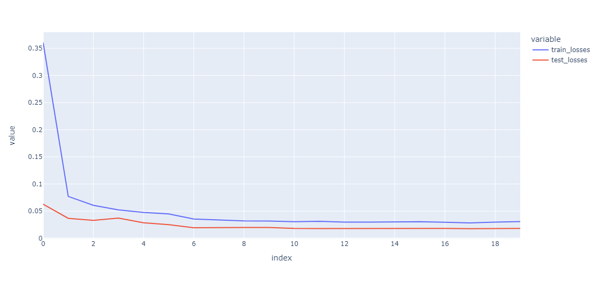
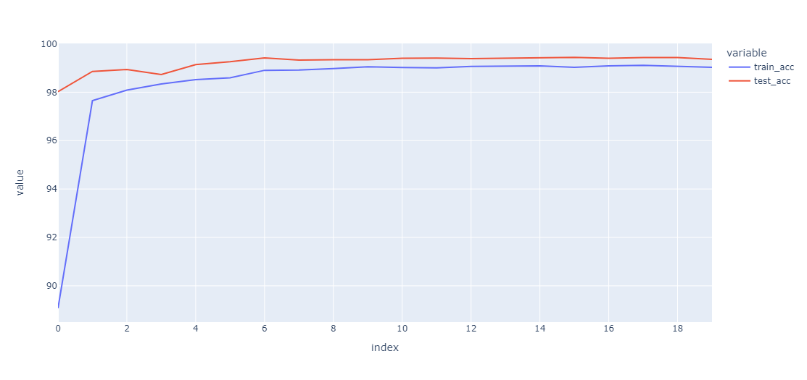

# Session 7

## <ins>Problem</ins>

- Attain 99.4% validation accuracy on MNIST dataset with
    - Less than 8k parameters
    - Less than 15 epochs
- Collect results and prepare documentation for results.

### Navigating the source code
The code structure has no modifications from the last sessions and further details of the structure is available [here](../session_5_split_code_to_files/README.md)


### Key code snippets
> [Model Architecture](model.py)
```
class Net(nn.Module):

    '''
    This class implements the neural network model

    Usage:
    >>> device = ...
    >>> model = Net().to('cpu')
    '''

    #This defines the structure of the NN.
    def __init__(self):
        super(Net, self).__init__()
        self.conv1 = self.conv3x3_bn_dropout(1, 8, padding=1)
        self.conv2 = self.conv3x3_bn_dropout(8, 8)

        # self.squeeze1 = self.conv1x1(4, 1)

        self.conv3 = self.conv3x3_bn_dropout(8, 8, padding=1)
        self.conv4 = self.conv3x3_bn_dropout(8, 8)
        self.conv5 = self.conv3x3_bn_dropout(8, 8)
        self.conv6 = self.conv3x3_bn_dropout(8, 8, stride=2)

        # self.squeeze2 = self.conv1x1(8, 1)

        self.conv7 = self.conv3x3_bn_dropout(8, 8, padding=1)
        self.conv8 = self.conv3x3_bn_dropout(8, 8)
        self.conv9 = self.conv3x3_bn_dropout(8, 16)
        self.conv10 = self.conv3x3_bn_dropout(16, 16)

        self.gap = nn.AvgPool2d(4)
        self.mixer = nn.Sequential(
            self.conv1x1(16, 10),
        )


    def conv3x3_bn_dropout(self, in_channels, out_channels, kernel_size=3, stride=1, padding=0, bias=False, dropout=0.1):
          if dropout:
            return nn.Sequential(
                self.conv3x3(in_channels, out_channels, kernel_size, stride, padding, bias),
                nn.ReLU(),
                nn.BatchNorm2d(out_channels),
                nn.Dropout(dropout),
                )
          else:
            return nn.Sequential(
                self.conv3x3(in_channels, out_channels, kernel_size, stride, padding, bias),
                nn.ReLU(),
                nn.BatchNorm2d(out_channels),
                )

    def conv3x3(self, in_channels, out_channels, kernel_size=3, stride=1, padding=0, bias=False):
          return nn.Conv2d(in_channels,
                    out_channels,
                    kernel_size=kernel_size,
                    stride=stride,
                    padding=padding,
                    bias=bias)

    def conv1x1(self, in_channels, out_channels, kernel_size=1, stride=1, padding=0, bias=False):
          return nn.Conv2d(in_channels,
                    out_channels,
                    kernel_size=kernel_size,
                    stride=stride,
                    padding=padding,
                    bias=bias)


    def forward(self, x):
        x = self.conv1(x)
        x = self.conv2(x)
        # x = self.squeeze1(x)

        x = self.conv3(x)
        x = self.conv4(x)
        x = self.conv5(x)
        x = self.conv6(x)
        # x = self.squeeze2(x)

        x = self.conv7(x)
        x = self.conv8(x)
        x = self.conv9(x)
        x = self.conv10(x)

        x = self.gap(x)
        x = self.mixer(x)
        x = x.view(-1, 10)
        return F.log_softmax(x, dim=1)
```

### Model summary

The final model has a total of 7,912 parameters. 
- This is well within the parameter limit of 20k parameters. 
- The parameters are uniformly distributed across multiple layers
- Stride used to reduce channel size rather than max pooling
- `conv1`, `conv3` and `conv7` has padding

> Model summary
```
----------------------------------------------------------------
        Layer (type)               Output Shape         Param #
================================================================
            Conv2d-1          [1024, 8, 28, 28]              72
              ReLU-2          [1024, 8, 28, 28]               0
       BatchNorm2d-3          [1024, 8, 28, 28]              16
           Dropout-4          [1024, 8, 28, 28]               0
            Conv2d-5          [1024, 8, 26, 26]             576
              ReLU-6          [1024, 8, 26, 26]               0
       BatchNorm2d-7          [1024, 8, 26, 26]              16
           Dropout-8          [1024, 8, 26, 26]               0
            Conv2d-9          [1024, 8, 26, 26]             576
             ReLU-10          [1024, 8, 26, 26]               0
      BatchNorm2d-11          [1024, 8, 26, 26]              16
          Dropout-12          [1024, 8, 26, 26]               0
           Conv2d-13          [1024, 8, 24, 24]             576
             ReLU-14          [1024, 8, 24, 24]               0
      BatchNorm2d-15          [1024, 8, 24, 24]              16
          Dropout-16          [1024, 8, 24, 24]               0
           Conv2d-17          [1024, 8, 22, 22]             576
             ReLU-18          [1024, 8, 22, 22]               0
      BatchNorm2d-19          [1024, 8, 22, 22]              16
          Dropout-20          [1024, 8, 22, 22]               0
           Conv2d-21          [1024, 8, 10, 10]             576
             ReLU-22          [1024, 8, 10, 10]               0
      BatchNorm2d-23          [1024, 8, 10, 10]              16
          Dropout-24          [1024, 8, 10, 10]               0
           Conv2d-25          [1024, 8, 10, 10]             576
             ReLU-26          [1024, 8, 10, 10]               0
      BatchNorm2d-27          [1024, 8, 10, 10]              16
          Dropout-28          [1024, 8, 10, 10]               0
           Conv2d-29            [1024, 8, 8, 8]             576
             ReLU-30            [1024, 8, 8, 8]               0
      BatchNorm2d-31            [1024, 8, 8, 8]              16
          Dropout-32            [1024, 8, 8, 8]               0
           Conv2d-33           [1024, 16, 6, 6]           1,152
             ReLU-34           [1024, 16, 6, 6]               0
      BatchNorm2d-35           [1024, 16, 6, 6]              32
          Dropout-36           [1024, 16, 6, 6]               0
           Conv2d-37           [1024, 16, 4, 4]           2,304
             ReLU-38           [1024, 16, 4, 4]               0
      BatchNorm2d-39           [1024, 16, 4, 4]              32
          Dropout-40           [1024, 16, 4, 4]               0
        AvgPool2d-41           [1024, 16, 1, 1]               0
           Conv2d-42           [1024, 10, 1, 1]             160
================================================================
Total params: 7,912
Trainable params: 7,912
Non-trainable params: 0
----------------------------------------------------------------
Input size (MB): 3.06
Forward/backward pass size (MB): 891.20
Params size (MB): 0.03
Estimated Total Size (MB): 894.30
----------------------------------------------------------------
```
> Training logs
```
Adjusting learning rate of group 0 to 1.0000e-01.
Epoch 1
Train: Loss=0.0343 Batch_id=468 Accuracy=92.34: 100%|██████████| 469/469 [00:25<00:00, 18.43it/s]
              precision    recall  f1-score   support

           0       0.99      0.99      0.99       978
           1       0.99      0.99      0.99      1133
           2       0.98      0.98      0.98      1029
           3       0.98      0.99      0.98       999
           4       0.98      0.99      0.98       977
           5       0.99      0.98      0.98       903
           6       0.99      0.98      0.98       970
           7       0.98      0.97      0.98      1039
           8       0.98      0.99      0.99       962
           9       0.98      0.98      0.98      1010

    accuracy                           0.98     10000
   macro avg       0.98      0.98      0.98     10000
weighted avg       0.98      0.98      0.98     10000

Test set: Average loss: 0.0498, Accuracy: 9839/10000 (98.39%)

Adjusting learning rate of group 0 to 1.0000e-01.
Epoch 2
Train: Loss=0.0337 Batch_id=468 Accuracy=97.46: 100%|██████████| 469/469 [00:24<00:00, 18.95it/s]
              precision    recall  f1-score   support

           0       0.99      0.99      0.99       980
           1       1.00      1.00      1.00      1135
           2       1.00      0.98      0.99      1043
           3       0.99      0.99      0.99      1010
           4       0.95      1.00      0.98       937
           5       0.99      0.98      0.99       899
           6       0.99      0.99      0.99       950
           7       0.99      0.99      0.99      1030
           8       0.99      0.99      0.99       970
           9       0.99      0.96      0.97      1046

    accuracy                           0.99     10000
   macro avg       0.99      0.99      0.99     10000
weighted avg       0.99      0.99      0.99     10000

Test set: Average loss: 0.0383, Accuracy: 9877/10000 (98.77%)

Adjusting learning rate of group 0 to 1.0000e-01.
Epoch 3
Train: Loss=0.0485 Batch_id=468 Accuracy=97.86: 100%|██████████| 469/469 [00:24<00:00, 18.78it/s]
              precision    recall  f1-score   support

           0       0.99      0.99      0.99       979
           1       0.99      0.99      0.99      1134
           2       0.99      0.99      0.99      1030
           3       0.99      1.00      0.99      1006
           4       0.99      0.99      0.99       984
           5       0.99      0.99      0.99       893
           6       0.99      0.98      0.99       969
           7       0.98      0.99      0.99      1017
           8       0.99      0.99      0.99       967
           9       0.99      0.98      0.98      1021

    accuracy                           0.99     10000
   macro avg       0.99      0.99      0.99     10000
weighted avg       0.99      0.99      0.99     10000

Test set: Average loss: 0.0331, Accuracy: 9897/10000 (98.97%)

Adjusting learning rate of group 0 to 1.0000e-01.
Epoch 4
Train: Loss=0.0202 Batch_id=468 Accuracy=98.13: 100%|██████████| 469/469 [00:24<00:00, 19.04it/s]
              precision    recall  f1-score   support

           0       1.00      0.99      0.99       986
           1       0.99      0.99      0.99      1133
           2       0.99      0.99      0.99      1033
           3       0.99      0.99      0.99      1007
           4       0.99      0.99      0.99       989
           5       0.99      0.98      0.99       897
           6       0.99      0.98      0.99       965
           7       0.98      1.00      0.99      1014
           8       0.99      0.99      0.99       978
           9       0.98      0.99      0.98       998

    accuracy                           0.99     10000
   macro avg       0.99      0.99      0.99     10000
weighted avg       0.99      0.99      0.99     10000

Test set: Average loss: 0.0349, Accuracy: 9892/10000 (98.92%)

Adjusting learning rate of group 0 to 1.0000e-01.
Epoch 5
Train: Loss=0.0343 Batch_id=468 Accuracy=98.16: 100%|██████████| 469/469 [00:24<00:00, 19.06it/s]
              precision    recall  f1-score   support

           0       0.99      1.00      1.00       978
           1       1.00      0.99      1.00      1146
           2       0.99      0.98      0.99      1043
           3       0.99      1.00      0.99      1003
           4       0.99      1.00      0.99       973
           5       0.99      0.99      0.99       891
           6       1.00      0.99      0.99       970
           7       0.98      0.99      0.99      1013
           8       0.99      0.99      0.99       977
           9       0.99      0.99      0.99      1006

    accuracy                           0.99     10000
   macro avg       0.99      0.99      0.99     10000
weighted avg       0.99      0.99      0.99     10000

Test set: Average loss: 0.0291, Accuracy: 9908/10000 (99.08%)

Adjusting learning rate of group 0 to 1.0000e-01.
Epoch 6
Train: Loss=0.0431 Batch_id=468 Accuracy=98.36: 100%|██████████| 469/469 [00:24<00:00, 18.84it/s]
              precision    recall  f1-score   support

           0       1.00      0.98      0.99       996
           1       1.00      0.99      0.99      1143
           2       1.00      0.99      0.99      1040
           3       0.99      0.99      0.99      1007
           4       0.99      1.00      0.99       975
           5       0.99      0.99      0.99       892
           6       0.98      1.00      0.99       944
           7       0.98      0.99      0.99      1018
           8       0.99      1.00      0.99       967
           9       0.99      0.98      0.99      1018

    accuracy                           0.99     10000
   macro avg       0.99      0.99      0.99     10000
weighted avg       0.99      0.99      0.99     10000

Test set: Average loss: 0.0285, Accuracy: 9905/10000 (99.05%)

Adjusting learning rate of group 0 to 1.0000e-02.
Epoch 7
Train: Loss=0.0356 Batch_id=468 Accuracy=98.72: 100%|██████████| 469/469 [00:25<00:00, 18.18it/s]
              precision    recall  f1-score   support

           0       1.00      0.99      1.00       982
           1       1.00      0.99      1.00      1141
           2       1.00      0.99      0.99      1037
           3       0.99      0.99      0.99      1008
           4       0.99      1.00      0.99       974
           5       0.99      0.99      0.99       894
           6       0.99      1.00      1.00       957
           7       0.99      0.99      0.99      1023
           8       0.99      1.00      0.99       968
           9       0.99      0.99      0.99      1016

    accuracy                           0.99     10000
   macro avg       0.99      0.99      0.99     10000
weighted avg       0.99      0.99      0.99     10000

Test set: Average loss: 0.0212, Accuracy: 9934/10000 (99.34%)

Adjusting learning rate of group 0 to 1.0000e-02.
Epoch 8
Train: Loss=0.0625 Batch_id=468 Accuracy=98.80: 100%|██████████| 469/469 [00:23<00:00, 19.60it/s]
              precision    recall  f1-score   support

           0       1.00      1.00      1.00       981
           1       1.00      0.99      1.00      1140
           2       1.00      0.99      1.00      1034
           3       0.99      0.99      0.99      1009
           4       0.99      1.00      0.99       980
           5       0.99      0.99      0.99       894
           6       0.99      1.00      0.99       956
           7       0.99      0.99      0.99      1028
           8       0.99      1.00      0.99       968
           9       0.99      0.99      0.99      1010

    accuracy                           0.99     10000
   macro avg       0.99      0.99      0.99     10000
weighted avg       0.99      0.99      0.99     10000

Test set: Average loss: 0.0198, Accuracy: 9940/10000 (99.40%)

Adjusting learning rate of group 0 to 1.0000e-02.
Epoch 9
Train: Loss=0.0180 Batch_id=468 Accuracy=98.85: 100%|██████████| 469/469 [00:23<00:00, 19.55it/s]
              precision    recall  f1-score   support

           0       1.00      0.99      1.00       983
           1       1.00      0.99      1.00      1141
           2       1.00      0.99      0.99      1033
           3       0.99      0.99      0.99      1010
           4       1.00      0.99      1.00       983
           5       0.99      0.99      0.99       894
           6       1.00      1.00      1.00       957
           7       0.99      0.99      0.99      1025
           8       0.99      1.00      0.99       971
           9       0.99      0.99      0.99      1003

    accuracy                           0.99     10000
   macro avg       0.99      0.99      0.99     10000
weighted avg       0.99      0.99      0.99     10000

Test set: Average loss: 0.0197, Accuracy: 9942/10000 (99.42%)

Adjusting learning rate of group 0 to 1.0000e-02.
Epoch 10
Train: Loss=0.0307 Batch_id=468 Accuracy=98.85: 100%|██████████| 469/469 [00:24<00:00, 19.18it/s]
              precision    recall  f1-score   support

           0       1.00      1.00      1.00       981
           1       1.00      0.99      0.99      1143
           2       1.00      1.00      1.00      1032
           3       0.99      1.00      0.99      1008
           4       0.99      1.00      1.00       980
           5       0.99      0.99      0.99       894
           6       0.99      1.00      0.99       954
           7       0.99      0.99      0.99      1029
           8       0.99      1.00      0.99       969
           9       0.99      0.99      0.99      1010

    accuracy                           0.99     10000
   macro avg       0.99      0.99      0.99     10000
weighted avg       0.99      0.99      0.99     10000

Test set: Average loss: 0.0197, Accuracy: 9942/10000 (99.42%)

Adjusting learning rate of group 0 to 1.0000e-02.
Epoch 11
Train: Loss=0.0369 Batch_id=468 Accuracy=98.88: 100%|██████████| 469/469 [00:24<00:00, 18.94it/s]
              precision    recall  f1-score   support

           0       1.00      1.00      1.00       980
           1       1.00      0.99      1.00      1141
           2       0.99      1.00      0.99      1028
           3       0.99      0.99      0.99      1009
           4       0.99      1.00      1.00       979
           5       0.99      0.99      0.99       893
           6       1.00      0.99      1.00       959
           7       0.99      0.99      0.99      1031
           8       0.99      1.00      0.99       970
           9       0.99      0.99      0.99      1010

    accuracy                           0.99     10000
   macro avg       0.99      0.99      0.99     10000
weighted avg       0.99      0.99      0.99     10000

Test set: Average loss: 0.0192, Accuracy: 9940/10000 (99.40%)

Adjusting learning rate of group 0 to 1.0000e-02.
Epoch 12
Train: Loss=0.0223 Batch_id=468 Accuracy=98.87: 100%|██████████| 469/469 [00:25<00:00, 18.75it/s]
              precision    recall  f1-score   support

           0       1.00      1.00      1.00       980
           1       1.00      0.99      1.00      1142
           2       0.99      1.00      0.99      1031
           3       1.00      0.99      0.99      1011
           4       1.00      1.00      1.00       982
           5       0.99      0.99      0.99       892
           6       1.00      0.99      1.00       959
           7       0.99      0.99      0.99      1025
           8       0.99      1.00      1.00       967
           9       0.99      0.99      0.99      1011

    accuracy                           0.99     10000
   macro avg       0.99      0.99      0.99     10000
weighted avg       0.99      0.99      0.99     10000

Test set: Average loss: 0.0192, Accuracy: 9944/10000 (99.44%)

Adjusting learning rate of group 0 to 1.0000e-03.
Epoch 13
Train: Loss=0.0242 Batch_id=468 Accuracy=98.93: 100%|██████████| 469/469 [00:24<00:00, 19.05it/s]
              precision    recall  f1-score   support

           0       1.00      1.00      1.00       980
           1       1.00      0.99      0.99      1143
           2       0.99      1.00      0.99      1030
           3       1.00      0.99      0.99      1011
           4       0.99      1.00      1.00       979
           5       0.99      0.99      0.99       894
           6       0.99      1.00      1.00       957
           7       0.99      0.99      0.99      1026
           8       0.99      1.00      0.99       969
           9       0.99      0.99      0.99      1011

    accuracy                           0.99     10000
   macro avg       0.99      0.99      0.99     10000
weighted avg       0.99      0.99      0.99     10000

Test set: Average loss: 0.0189, Accuracy: 9942/10000 (99.42%)

Adjusting learning rate of group 0 to 1.0000e-03.
Epoch 14
Train: Loss=0.0426 Batch_id=468 Accuracy=98.96: 100%|██████████| 469/469 [00:24<00:00, 18.94it/s]
              precision    recall  f1-score   support

           0       1.00      1.00      1.00       980
           1       1.00      0.99      1.00      1141
           2       0.99      1.00      0.99      1031
           3       0.99      0.99      0.99      1009
           4       0.99      1.00      1.00       980
           5       0.99      0.99      0.99       893
           6       1.00      1.00      1.00       958
           7       0.99      0.99      0.99      1028
           8       0.99      1.00      0.99       968
           9       0.99      0.99      0.99      1012

    accuracy                           0.99     10000
   macro avg       0.99      0.99      0.99     10000
weighted avg       0.99      0.99      0.99     10000

Test set: Average loss: 0.0188, Accuracy: 9943/10000 (99.43%)

Adjusting learning rate of group 0 to 1.0000e-03.
Epoch 15
Train: Loss=0.0674 Batch_id=468 Accuracy=98.89: 100%|██████████| 469/469 [00:24<00:00, 18.84it/s]
              precision    recall  f1-score   support

           0       1.00      1.00      1.00       980
           1       1.00      0.99      1.00      1142
           2       0.99      1.00      0.99      1031
           3       0.99      0.99      0.99      1009
           4       1.00      1.00      1.00       981
           5       0.99      0.99      0.99       893
           6       1.00      1.00      1.00       958
           7       0.99      0.99      0.99      1027
           8       0.99      1.00      1.00       967
           9       0.99      0.99      0.99      1012

    accuracy                           0.99     10000
   macro avg       0.99      0.99      0.99     10000
weighted avg       0.99      0.99      0.99     10000

Test set: Average loss: 0.0188, Accuracy: 9944/10000 (99.44%)

Adjusting learning rate of group 0 to 1.0000e-03.
Epoch 16
Train: Loss=0.0074 Batch_id=468 Accuracy=98.94: 100%|██████████| 469/469 [00:26<00:00, 18.00it/s]
              precision    recall  f1-score   support

           0       1.00      1.00      1.00       980
           1       1.00      0.99      1.00      1142
           2       0.99      1.00      0.99      1031
           3       0.99      0.99      0.99      1009
           4       0.99      1.00      1.00       980
           5       0.99      0.99      0.99       893
           6       1.00      1.00      1.00       958
           7       0.99      0.99      0.99      1027
           8       0.99      1.00      0.99       969
           9       0.99      0.99      0.99      1011

    accuracy                           0.99     10000
   macro avg       0.99      0.99      0.99     10000
weighted avg       0.99      0.99      0.99     10000

Test set: Average loss: 0.0188, Accuracy: 9942/10000 (99.42%)

Adjusting learning rate of group 0 to 1.0000e-03.
Epoch 17
Train: Loss=0.0352 Batch_id=468 Accuracy=98.92: 100%|██████████| 469/469 [00:24<00:00, 18.93it/s]
              precision    recall  f1-score   support

           0       1.00      1.00      1.00       980
           1       1.00      0.99      1.00      1142
           2       1.00      1.00      1.00      1032
           3       1.00      0.99      0.99      1011
           4       0.99      1.00      1.00       980
           5       0.99      0.99      0.99       894
           6       1.00      1.00      1.00       958
           7       0.99      0.99      0.99      1024
           8       0.99      1.00      0.99       971
           9       0.99      0.99      0.99      1008

    accuracy                           0.99     10000
   macro avg       0.99      0.99      0.99     10000
weighted avg       0.99      0.99      0.99     10000

Test set: Average loss: 0.0189, Accuracy: 9944/10000 (99.44%)

Adjusting learning rate of group 0 to 1.0000e-03.
Epoch 18
Train: Loss=0.0029 Batch_id=468 Accuracy=98.92: 100%|██████████| 469/469 [00:24<00:00, 18.84it/s]
              precision    recall  f1-score   support

           0       1.00      1.00      1.00       981
           1       1.00      0.99      1.00      1142
           2       1.00      1.00      1.00      1032
           3       0.99      0.99      0.99      1009
           4       1.00      0.99      1.00       983
           5       0.99      0.99      0.99       892
           6       1.00      0.99      1.00       959
           7       0.99      0.99      0.99      1026
           8       0.99      1.00      0.99       968
           9       0.99      0.99      0.99      1008

    accuracy                           0.99     10000
   macro avg       0.99      0.99      0.99     10000
weighted avg       0.99      0.99      0.99     10000

Test set: Average loss: 0.0189, Accuracy: 9940/10000 (99.40%)

Adjusting learning rate of group 0 to 1.0000e-04.
Epoch 19
Train: Loss=0.0036 Batch_id=468 Accuracy=98.96: 100%|██████████| 469/469 [00:24<00:00, 19.15it/s]
              precision    recall  f1-score   support

           0       1.00      1.00      1.00       981
           1       1.00      0.99      1.00      1142
           2       1.00      1.00      1.00      1032
           3       0.99      0.99      0.99      1009
           4       0.99      1.00      1.00       979
           5       0.99      0.99      0.99       893
           6       1.00      0.99      1.00       959
           7       0.99      0.99      0.99      1026
           8       0.99      1.00      0.99       971
           9       0.99      0.99      0.99      1008

    accuracy                           0.99     10000
   macro avg       0.99      0.99      0.99     10000
weighted avg       0.99      0.99      0.99     10000

Test set: Average loss: 0.0189, Accuracy: 9941/10000 (99.41%)

Adjusting learning rate of group 0 to 1.0000e-04.
Epoch 20
Train: Loss=0.0022 Batch_id=468 Accuracy=98.95: 100%|██████████| 469/469 [00:24<00:00, 19.47it/s]
              precision    recall  f1-score   support

           0       1.00      1.00      1.00       980
           1       1.00      0.99      1.00      1141
           2       0.99      1.00      0.99      1030
           3       0.99      0.99      0.99      1010
           4       0.99      1.00      1.00       979
           5       0.99      0.99      0.99       893
           6       1.00      1.00      1.00       958
           7       0.99      0.99      0.99      1029
           8       0.99      1.00      0.99       968
           9       0.99      0.99      0.99      1012

    accuracy                           0.99     10000
   macro avg       0.99      0.99      0.99     10000
weighted avg       0.99      0.99      0.99     10000

Test set: Average loss: 0.0190, Accuracy: 9945/10000 (99.45%)

Adjusting learning rate of group 0 to 1.0000e-04.
```

> Plots

Loss curve


Accuracy curve

### Conclusion
MNIST dataset was sucessfully trained with the model architecture discussed upto 99.4% accuracy
