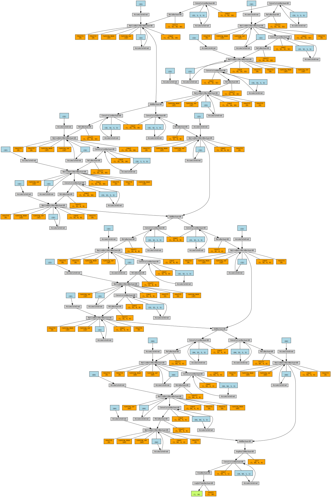

# Session 9

## <ins>Problem</ins>

- Attain 85% validation accuracy on CIFAR10 dataset with
    - Less than 200k parameters
    - No epoch constraint
    - Architecture constraint __C1C2C3C40__
- Collect results and prepare documentation for results.

### Navigating the source code
The code structure has no modifications from the last sessions and further details of the structure is available [here](../session_5_split_code_to_files/README.md)

### Added bit more modularization with
- `datasets.py` - Modified to accomodate Albumentations

### Key code snippets
> [Model Architecture](model_mnist_50k_params_CIFAR10_bn.py)
```
class Net(nn.Module):

    '''
    This class implements the neural network model

    Usage:
    >>> device = ...
    >>> model = Net().to('cpu')
    '''

    #This defines the structure of the NN.
    def __init__(self):
        super(Net, self).__init__()

        # C1
        self.conv1 = self.conv_block_3x3(3, 32)
        self.downsample1 = self.conv3x3_bn_dropout(3, 32, padding=1, stride=2)

        # C2
        self.conv2 = self.conv_block_3x3(32, 32, depthwise_seperable=True)
        self.downsample2 = self.conv3x3_bn_dropout(32, 32, padding=1, stride=2)

        #C3
        self.conv3 = self.conv_block_3x3(32, 32)
        self.downsample3 = self.conv3x3_bn_dropout(32, 32, padding=1, stride=2)

        #C4
        self.conv4 = self.conv_block_3x3(32, 64, pool=False)
        self.downsample4 = self.conv3x3_bn_dropout(32, 64, padding=1)

        self.gap = nn.AvgPool2d(4)
        self.mixer = nn.Sequential(
            self.conv1x1(64, 10),
        )

    def conv_block_3x3(self, in_channels, out_channels, pool=True, depthwise_seperable=False):
        if pool:
            return nn.Sequential(
                self.conv3x3_bn_dropout(in_channels, out_channels, padding=1),
                self.conv3x3_bn_dropout(out_channels, out_channels, padding=1, groups=(out_channels if depthwise_seperable else 1)), # Depthwise seperable convolution
                self.conv3x3_bn_dropout(out_channels, out_channels, dilation=2, padding=2, stride=2) # Dilated convlution
            )
        else:
            return nn.Sequential(
                self.conv3x3_bn_dropout(in_channels, out_channels, padding=1),
                self.conv3x3_bn_dropout(out_channels, out_channels, padding=1),
                self.conv3x3_bn_dropout(out_channels, out_channels, padding=1)
        )
    
    def conv3x3_bn_dropout(self, in_channels, out_channels, kernel_size=3, stride=1, padding=0, dilation=1, groups=1, bias=False, dropout=0.0):
          if dropout:
            return nn.Sequential(
                self.conv3x3(in_channels, out_channels, kernel_size, stride, padding, dilation, groups, bias),
                nn.ReLU(),
                nn.BatchNorm2d(out_channels),
                nn.Dropout(dropout),
                )
          else:
            return nn.Sequential(
                self.conv3x3(in_channels, out_channels, kernel_size, stride, padding, dilation, groups, bias),
                nn.ReLU(),
                 nn.BatchNorm2d(out_channels),
                )

    def conv3x3(self, in_channels, out_channels, kernel_size=3, stride=1, padding=0, dilation=1, groups=1, bias=False):
          return nn.Conv2d(in_channels,
                    out_channels,
                    kernel_size=kernel_size,
                    stride=stride,
                    padding=padding,
                    dilation=dilation,
                    groups=groups,
                    bias=bias)

    def conv1x1(self, in_channels, out_channels, kernel_size=1, stride=1, padding=0, bias=False):
          return nn.Conv2d(in_channels,
                    out_channels,
                    kernel_size=kernel_size,
                    stride=stride,
                    padding=padding,
                    bias=bias)


    def forward(self, x):

        # Block 1
        i1 = x
        x = self.conv1(x)
        i1 = self.downsample1(i1)
        x = x + i1

        # Block 2
        i2 = x
        x = self.conv2(x)
        i2 = self.downsample2(i2)
        x = x + i2

        # Block 3
        i3 = x
        x = self.conv3(x)
        i3 = self.downsample3(i3)
        x = x + i3

        # Block 4
        i4 = x
        x = self.conv4(x)
        i4 = self.downsample4(i4)
        x = x + i4

        x = self.gap(x)
        x = self.mixer(x)
        x = x.view(-1, 10)

        return F.log_softmax(x, dim=1)

        # return x
```

### Model summary

The final model has a total of 197,472 parameters. 
- This is well within the parameter limit of 200k parameters. 
- Has 4 residual connections
- `Dilated convolutions` were used in the downsampling step
- `Depthwise seperable convolution` used in the __C2__ block

> Model summary
```
----------------------------------------------------------------
        Layer (type)               Output Shape         Param #
================================================================
            Conv2d-1           [64, 32, 32, 32]             864
              ReLU-2           [64, 32, 32, 32]               0
       BatchNorm2d-3           [64, 32, 32, 32]              64
            Conv2d-4           [64, 32, 32, 32]           9,216
              ReLU-5           [64, 32, 32, 32]               0
       BatchNorm2d-6           [64, 32, 32, 32]              64
            Conv2d-7           [64, 32, 16, 16]           9,216
              ReLU-8           [64, 32, 16, 16]               0
       BatchNorm2d-9           [64, 32, 16, 16]              64
           Conv2d-10           [64, 32, 16, 16]             864
             ReLU-11           [64, 32, 16, 16]               0
      BatchNorm2d-12           [64, 32, 16, 16]              64
           Conv2d-13           [64, 32, 16, 16]           9,216
             ReLU-14           [64, 32, 16, 16]               0
      BatchNorm2d-15           [64, 32, 16, 16]              64
           Conv2d-16           [64, 32, 16, 16]             288
             ReLU-17           [64, 32, 16, 16]               0
      BatchNorm2d-18           [64, 32, 16, 16]              64
           Conv2d-19             [64, 32, 8, 8]           9,216
             ReLU-20             [64, 32, 8, 8]               0
      BatchNorm2d-21             [64, 32, 8, 8]              64
           Conv2d-22             [64, 32, 8, 8]           9,216
             ReLU-23             [64, 32, 8, 8]               0
      BatchNorm2d-24             [64, 32, 8, 8]              64
           Conv2d-25             [64, 32, 8, 8]           9,216
             ReLU-26             [64, 32, 8, 8]               0
      BatchNorm2d-27             [64, 32, 8, 8]              64
           Conv2d-28             [64, 32, 8, 8]           9,216
             ReLU-29             [64, 32, 8, 8]               0
      BatchNorm2d-30             [64, 32, 8, 8]              64
           Conv2d-31             [64, 32, 4, 4]           9,216
             ReLU-32             [64, 32, 4, 4]               0
      BatchNorm2d-33             [64, 32, 4, 4]              64
           Conv2d-34             [64, 32, 4, 4]           9,216
             ReLU-35             [64, 32, 4, 4]               0
      BatchNorm2d-36             [64, 32, 4, 4]              64
           Conv2d-37             [64, 64, 4, 4]          18,432
             ReLU-38             [64, 64, 4, 4]               0
      BatchNorm2d-39             [64, 64, 4, 4]             128
           Conv2d-40             [64, 64, 4, 4]          36,864
             ReLU-41             [64, 64, 4, 4]               0
      BatchNorm2d-42             [64, 64, 4, 4]             128
           Conv2d-43             [64, 64, 4, 4]          36,864
             ReLU-44             [64, 64, 4, 4]               0
      BatchNorm2d-45             [64, 64, 4, 4]             128
           Conv2d-46             [64, 64, 4, 4]          18,432
             ReLU-47             [64, 64, 4, 4]               0
      BatchNorm2d-48             [64, 64, 4, 4]             128
        AvgPool2d-49             [64, 64, 1, 1]               0
           Conv2d-50             [64, 10, 1, 1]             640
================================================================
Total params: 197,472
Trainable params: 197,472
Non-trainable params: 0
----------------------------------------------------------------
Input size (MB): 0.75
Forward/backward pass size (MB): 163.54
Params size (MB): 0.75
Estimated Total Size (MB): 165.04
----------------------------------------------------------------
```

### Model architecture



> Training logs

```
Epoch 1
Train: Loss=1.4691 Batch_id=781 Accuracy=36.10: 100%|██████████| 782/782 [00:17<00:00, 44.83it/s]
              precision    recall  f1-score   support

    airplane       0.59      0.37      0.45      1000
  automobile       0.48      0.72      0.58      1000
        bird       0.50      0.20      0.28      1000
         cat       0.36      0.23      0.28      1000
        deer       0.49      0.30      0.37      1000
         dog       0.44      0.40      0.42      1000
        frog       0.52      0.61      0.56      1000
       horse       0.42      0.68      0.52      1000
        ship       0.51      0.60      0.55      1000
       truck       0.46      0.63      0.53      1000

    accuracy                           0.47     10000
   macro avg       0.48      0.47      0.45     10000
weighted avg       0.48      0.47      0.45     10000

Test set: Average loss: 1.5279, Accuracy: 4726/10000 (47.26%)

Epoch 2
Train: Loss=1.3390 Batch_id=781 Accuracy=49.36: 100%|██████████| 782/782 [00:16<00:00, 46.93it/s]
              precision    recall  f1-score   support

    airplane       0.68      0.56      0.61      1000
  automobile       0.75      0.74      0.75      1000
        bird       0.46      0.48      0.47      1000
         cat       0.42      0.29      0.34      1000
        deer       0.64      0.38      0.48      1000
         dog       0.45      0.61      0.52      1000
        frog       0.64      0.74      0.69      1000
       horse       0.70      0.63      0.66      1000
        ship       0.59      0.83      0.69      1000
       truck       0.66      0.69      0.68      1000

    accuracy                           0.60     10000
   macro avg       0.60      0.60      0.59     10000
weighted avg       0.60      0.60      0.59     10000

Test set: Average loss: 1.1265, Accuracy: 5960/10000 (59.60%)

Epoch 3
Train: Loss=1.2015 Batch_id=781 Accuracy=56.29: 100%|██████████| 782/782 [00:17<00:00, 45.84it/s]
              precision    recall  f1-score   support

    airplane       0.75      0.61      0.67      1000
  automobile       0.75      0.82      0.78      1000
        bird       0.58      0.51      0.55      1000
         cat       0.50      0.43      0.47      1000
        deer       0.59      0.58      0.59      1000
         dog       0.61      0.45      0.52      1000
        frog       0.75      0.71      0.73      1000
       horse       0.64      0.77      0.70      1000
        ship       0.65      0.87      0.75      1000
       truck       0.69      0.77      0.73      1000

    accuracy                           0.65     10000
   macro avg       0.65      0.65      0.65     10000
weighted avg       0.65      0.65      0.65     10000

Test set: Average loss: 0.9954, Accuracy: 6536/10000 (65.36%)

Epoch 4
Train: Loss=1.0561 Batch_id=781 Accuracy=60.23: 100%|██████████| 782/782 [00:17<00:00, 45.78it/s]
              precision    recall  f1-score   support

    airplane       0.72      0.73      0.72      1000
  automobile       0.79      0.85      0.82      1000
        bird       0.59      0.58      0.58      1000
         cat       0.51      0.46      0.48      1000
        deer       0.71      0.56      0.62      1000
         dog       0.60      0.58      0.59      1000
        frog       0.69      0.80      0.74      1000
       horse       0.74      0.75      0.75      1000
        ship       0.70      0.89      0.78      1000
       truck       0.85      0.70      0.76      1000

    accuracy                           0.69     10000
   macro avg       0.69      0.69      0.69     10000
weighted avg       0.69      0.69      0.69     10000

Test set: Average loss: 0.8947, Accuracy: 6889/10000 (68.89%)

Epoch 5
Train: Loss=1.1307 Batch_id=781 Accuracy=63.27: 100%|██████████| 782/782 [00:17<00:00, 45.42it/s]
              precision    recall  f1-score   support

    airplane       0.75      0.78      0.77      1000
  automobile       0.82      0.81      0.81      1000
        bird       0.69      0.54      0.60      1000
         cat       0.49      0.59      0.54      1000
        deer       0.74      0.59      0.65      1000
         dog       0.67      0.56      0.61      1000
        frog       0.75      0.77      0.76      1000
       horse       0.78      0.77      0.77      1000
        ship       0.87      0.78      0.82      1000
       truck       0.62      0.90      0.73      1000

    accuracy                           0.71     10000
   macro avg       0.72      0.71      0.71     10000
weighted avg       0.72      0.71      0.71     10000

Test set: Average loss: 0.8298, Accuracy: 7082/10000 (70.82%)

Epoch 6
Train: Loss=0.6230 Batch_id=781 Accuracy=65.16: 100%|██████████| 782/782 [00:18<00:00, 43.19it/s]
              precision    recall  f1-score   support

    airplane       0.75      0.76      0.75      1000
  automobile       0.79      0.90      0.84      1000
        bird       0.56      0.62      0.59      1000
         cat       0.61      0.45      0.52      1000
        deer       0.77      0.60      0.68      1000
         dog       0.71      0.52      0.60      1000
        frog       0.62      0.91      0.74      1000
       horse       0.86      0.71      0.78      1000
        ship       0.76      0.90      0.82      1000
       truck       0.79      0.77      0.78      1000

    accuracy                           0.72     10000
   macro avg       0.72      0.72      0.71     10000
weighted avg       0.72      0.72      0.71     10000

Test set: Average loss: 0.8204, Accuracy: 7157/10000 (71.57%)

Epoch 7
Train: Loss=1.0345 Batch_id=781 Accuracy=66.74: 100%|██████████| 782/782 [00:16<00:00, 46.34it/s]
              precision    recall  f1-score   support

    airplane       0.77      0.79      0.78      1000
  automobile       0.81      0.89      0.85      1000
        bird       0.73      0.60      0.66      1000
         cat       0.54      0.60      0.57      1000
        deer       0.63      0.77      0.70      1000
         dog       0.67      0.58      0.62      1000
        frog       0.79      0.82      0.81      1000
       horse       0.85      0.75      0.79      1000
        ship       0.85      0.82      0.84      1000
       truck       0.83      0.80      0.81      1000

    accuracy                           0.74     10000
   macro avg       0.75      0.74      0.74     10000
weighted avg       0.75      0.74      0.74     10000

Test set: Average loss: 0.7382, Accuracy: 7426/10000 (74.26%)

Epoch 8
Train: Loss=1.0829 Batch_id=781 Accuracy=68.36: 100%|██████████| 782/782 [00:17<00:00, 43.94it/s]
              precision    recall  f1-score   support

    airplane       0.82      0.74      0.78      1000
  automobile       0.87      0.91      0.89      1000
        bird       0.61      0.74      0.67      1000
         cat       0.65      0.49      0.56      1000
        deer       0.71      0.71      0.71      1000
         dog       0.72      0.62      0.67      1000
        frog       0.77      0.86      0.81      1000
       horse       0.79      0.82      0.80      1000
        ship       0.85      0.88      0.86      1000
       truck       0.85      0.85      0.85      1000

    accuracy                           0.76     10000
   macro avg       0.76      0.76      0.76     10000
weighted avg       0.76      0.76      0.76     10000

Test set: Average loss: 0.6875, Accuracy: 7631/10000 (76.31%)

Epoch 9
Train: Loss=1.0399 Batch_id=781 Accuracy=69.77: 100%|██████████| 782/782 [00:16<00:00, 46.54it/s]
              precision    recall  f1-score   support

    airplane       0.78      0.76      0.77      1000
  automobile       0.88      0.90      0.89      1000
        bird       0.66      0.75      0.71      1000
         cat       0.66      0.57      0.61      1000
        deer       0.73      0.78      0.76      1000
         dog       0.78      0.56      0.66      1000
        frog       0.78      0.85      0.82      1000
       horse       0.81      0.82      0.82      1000
        ship       0.82      0.90      0.86      1000
       truck       0.84      0.87      0.86      1000

    accuracy                           0.78     10000
   macro avg       0.78      0.78      0.77     10000
weighted avg       0.78      0.78      0.77     10000

Test set: Average loss: 0.6445, Accuracy: 7771/10000 (77.71%)

Epoch 10
Train: Loss=0.8126 Batch_id=781 Accuracy=71.18: 100%|██████████| 782/782 [00:17<00:00, 44.64it/s]
              precision    recall  f1-score   support

    airplane       0.76      0.87      0.81      1000
  automobile       0.92      0.84      0.88      1000
        bird       0.77      0.65      0.71      1000
         cat       0.64      0.58      0.61      1000
        deer       0.77      0.77      0.77      1000
         dog       0.74      0.63      0.68      1000
        frog       0.71      0.91      0.80      1000
       horse       0.84      0.85      0.84      1000
        ship       0.88      0.87      0.88      1000
       truck       0.83      0.89      0.86      1000

    accuracy                           0.79     10000
   macro avg       0.79      0.79      0.78     10000
weighted avg       0.79      0.79      0.78     10000

Test set: Average loss: 0.6301, Accuracy: 7859/10000 (78.59%)

Epoch 11
Train: Loss=0.5716 Batch_id=781 Accuracy=71.82: 100%|██████████| 782/782 [00:16<00:00, 46.50it/s]
              precision    recall  f1-score   support

    airplane       0.79      0.82      0.80      1000
  automobile       0.89      0.91      0.90      1000
        bird       0.84      0.59      0.69      1000
         cat       0.66      0.54      0.59      1000
        deer       0.78      0.78      0.78      1000
         dog       0.65      0.76      0.70      1000
        frog       0.83      0.86      0.85      1000
       horse       0.85      0.83      0.84      1000
        ship       0.80      0.93      0.86      1000
       truck       0.81      0.88      0.84      1000

    accuracy                           0.79     10000
   macro avg       0.79      0.79      0.79     10000
weighted avg       0.79      0.79      0.79     10000

Test set: Average loss: 0.6265, Accuracy: 7886/10000 (78.86%)

Epoch 12
Train: Loss=0.8462 Batch_id=781 Accuracy=72.69: 100%|██████████| 782/782 [00:17<00:00, 45.90it/s]
              precision    recall  f1-score   support

    airplane       0.78      0.85      0.81      1000
  automobile       0.89      0.89      0.89      1000
        bird       0.76      0.69      0.72      1000
         cat       0.69      0.56      0.62      1000
        deer       0.75      0.81      0.78      1000
         dog       0.75      0.66      0.70      1000
        frog       0.80      0.90      0.84      1000
       horse       0.81      0.85      0.83      1000
        ship       0.90      0.86      0.88      1000
       truck       0.81      0.90      0.85      1000

    accuracy                           0.80     10000
   macro avg       0.79      0.80      0.79     10000
weighted avg       0.79      0.80      0.79     10000

Test set: Average loss: 0.5898, Accuracy: 7967/10000 (79.67%)

Epoch 13
Train: Loss=1.5475 Batch_id=781 Accuracy=73.39: 100%|██████████| 782/782 [00:17<00:00, 45.30it/s]
              precision    recall  f1-score   support

    airplane       0.79      0.86      0.82      1000
  automobile       0.90      0.88      0.89      1000
        bird       0.84      0.64      0.73      1000
         cat       0.70      0.54      0.61      1000
        deer       0.76      0.82      0.79      1000
         dog       0.68      0.76      0.72      1000
        frog       0.82      0.87      0.85      1000
       horse       0.81      0.87      0.84      1000
        ship       0.91      0.86      0.88      1000
       truck       0.81      0.91      0.86      1000

    accuracy                           0.80     10000
   macro avg       0.80      0.80      0.80     10000
weighted avg       0.80      0.80      0.80     10000

Test set: Average loss: 0.5815, Accuracy: 8016/10000 (80.16%)

Epoch 14
Train: Loss=0.6619 Batch_id=781 Accuracy=74.38: 100%|██████████| 782/782 [00:16<00:00, 46.37it/s]
              precision    recall  f1-score   support

    airplane       0.79      0.83      0.81      1000
  automobile       0.91      0.91      0.91      1000
        bird       0.83      0.65      0.73      1000
         cat       0.67      0.63      0.65      1000
        deer       0.81      0.77      0.79      1000
         dog       0.71      0.74      0.72      1000
        frog       0.85      0.86      0.86      1000
       horse       0.80      0.89      0.84      1000
        ship       0.89      0.90      0.89      1000
       truck       0.81      0.91      0.86      1000

    accuracy                           0.81     10000
   macro avg       0.81      0.81      0.81     10000
weighted avg       0.81      0.81      0.81     10000

Test set: Average loss: 0.5641, Accuracy: 8075/10000 (80.75%)

Epoch 15
Train: Loss=0.9672 Batch_id=781 Accuracy=74.84: 100%|██████████| 782/782 [00:18<00:00, 41.27it/s]
              precision    recall  f1-score   support

    airplane       0.83      0.84      0.84      1000
  automobile       0.91      0.90      0.91      1000
        bird       0.78      0.73      0.76      1000
         cat       0.70      0.60      0.64      1000
        deer       0.76      0.82      0.79      1000
         dog       0.77      0.67      0.72      1000
        frog       0.87      0.85      0.86      1000
       horse       0.75      0.93      0.83      1000
        ship       0.90      0.91      0.90      1000
       truck       0.85      0.90      0.88      1000

    accuracy                           0.81     10000
   macro avg       0.81      0.81      0.81     10000
weighted avg       0.81      0.81      0.81     10000

Test set: Average loss: 0.5474, Accuracy: 8138/10000 (81.38%)

Epoch 16
Train: Loss=0.8491 Batch_id=781 Accuracy=75.46: 100%|██████████| 782/782 [00:16<00:00, 46.45it/s]
              precision    recall  f1-score   support

    airplane       0.79      0.89      0.84      1000
  automobile       0.91      0.91      0.91      1000
        bird       0.79      0.71      0.75      1000
         cat       0.71      0.59      0.64      1000
        deer       0.77      0.85      0.81      1000
         dog       0.76      0.69      0.72      1000
        frog       0.81      0.89      0.85      1000
       horse       0.83      0.88      0.85      1000
        ship       0.90      0.89      0.90      1000
       truck       0.90      0.86      0.88      1000

    accuracy                           0.82     10000
   macro avg       0.82      0.82      0.82     10000
weighted avg       0.82      0.82      0.82     10000

Test set: Average loss: 0.5340, Accuracy: 8183/10000 (81.83%)

Epoch 17
Train: Loss=0.5507 Batch_id=781 Accuracy=76.13: 100%|██████████| 782/782 [00:18<00:00, 43.29it/s]
              precision    recall  f1-score   support

    airplane       0.81      0.83      0.82      1000
  automobile       0.92      0.90      0.91      1000
        bird       0.81      0.67      0.73      1000
         cat       0.67      0.62      0.64      1000
        deer       0.76      0.83      0.80      1000
         dog       0.69      0.73      0.71      1000
        frog       0.82      0.89      0.86      1000
       horse       0.87      0.84      0.86      1000
        ship       0.92      0.86      0.89      1000
       truck       0.83      0.91      0.87      1000

    accuracy                           0.81     10000
   macro avg       0.81      0.81      0.81     10000
weighted avg       0.81      0.81      0.81     10000

Test set: Average loss: 0.5441, Accuracy: 8093/10000 (80.93%)

Epoch 18
Train: Loss=0.5131 Batch_id=781 Accuracy=76.60: 100%|██████████| 782/782 [00:16<00:00, 46.71it/s]
              precision    recall  f1-score   support

    airplane       0.84      0.83      0.83      1000
  automobile       0.89      0.93      0.91      1000
        bird       0.68      0.83      0.75      1000
         cat       0.65      0.68      0.66      1000
        deer       0.83      0.80      0.81      1000
         dog       0.80      0.64      0.71      1000
        frog       0.85      0.88      0.86      1000
       horse       0.90      0.84      0.86      1000
        ship       0.92      0.90      0.91      1000
       truck       0.89      0.89      0.89      1000

    accuracy                           0.82     10000
   macro avg       0.82      0.82      0.82     10000
weighted avg       0.82      0.82      0.82     10000

Test set: Average loss: 0.5264, Accuracy: 8203/10000 (82.03%)

Epoch 19
Train: Loss=0.4672 Batch_id=781 Accuracy=77.03: 100%|██████████| 782/782 [00:17<00:00, 45.47it/s]
              precision    recall  f1-score   support

    airplane       0.82      0.86      0.84      1000
  automobile       0.94      0.90      0.92      1000
        bird       0.76      0.79      0.77      1000
         cat       0.68      0.66      0.67      1000
        deer       0.84      0.79      0.81      1000
         dog       0.80      0.69      0.74      1000
        frog       0.83      0.88      0.86      1000
       horse       0.87      0.86      0.87      1000
        ship       0.88      0.93      0.90      1000
       truck       0.86      0.91      0.88      1000

    accuracy                           0.83     10000
   macro avg       0.83      0.83      0.83     10000
weighted avg       0.83      0.83      0.83     10000

Test set: Average loss: 0.4999, Accuracy: 8268/10000 (82.68%)

Epoch 20
Train: Loss=0.6740 Batch_id=781 Accuracy=77.36: 100%|██████████| 782/782 [00:17<00:00, 45.82it/s]
              precision    recall  f1-score   support

    airplane       0.87      0.81      0.84      1000
  automobile       0.85      0.96      0.90      1000
        bird       0.79      0.76      0.77      1000
         cat       0.70      0.62      0.66      1000
        deer       0.80      0.80      0.80      1000
         dog       0.76      0.72      0.74      1000
        frog       0.81      0.90      0.85      1000
       horse       0.87      0.88      0.87      1000
        ship       0.86      0.94      0.90      1000
       truck       0.90      0.84      0.87      1000

    accuracy                           0.82     10000
   macro avg       0.82      0.82      0.82     10000
weighted avg       0.82      0.82      0.82     10000

Test set: Average loss: 0.5181, Accuracy: 8234/10000 (82.34%)

Epoch 21
Train: Loss=0.4518 Batch_id=781 Accuracy=77.90: 100%|██████████| 782/782 [00:16<00:00, 46.11it/s]
              precision    recall  f1-score   support

    airplane       0.84      0.85      0.84      1000
  automobile       0.91      0.94      0.92      1000
        bird       0.83      0.70      0.76      1000
         cat       0.71      0.62      0.66      1000
        deer       0.84      0.79      0.81      1000
         dog       0.74      0.74      0.74      1000
        frog       0.86      0.88      0.87      1000
       horse       0.77      0.92      0.84      1000
        ship       0.91      0.91      0.91      1000
       truck       0.86      0.92      0.89      1000

    accuracy                           0.83     10000
   macro avg       0.83      0.83      0.83     10000
weighted avg       0.83      0.83      0.83     10000

Test set: Average loss: 0.5107, Accuracy: 8271/10000 (82.71%)

Epoch 22
Train: Loss=0.5182 Batch_id=781 Accuracy=78.37: 100%|██████████| 782/782 [00:17<00:00, 44.09it/s]
              precision    recall  f1-score   support

    airplane       0.77      0.90      0.83      1000
  automobile       0.93      0.92      0.92      1000
        bird       0.82      0.73      0.77      1000
         cat       0.70      0.65      0.67      1000
        deer       0.86      0.78      0.82      1000
         dog       0.73      0.75      0.74      1000
        frog       0.88      0.87      0.88      1000
       horse       0.84      0.90      0.87      1000
        ship       0.91      0.90      0.90      1000
       truck       0.89      0.91      0.90      1000

    accuracy                           0.83     10000
   macro avg       0.83      0.83      0.83     10000
weighted avg       0.83      0.83      0.83     10000

Test set: Average loss: 0.4976, Accuracy: 8308/10000 (83.08%)

Epoch 23
Train: Loss=0.9123 Batch_id=781 Accuracy=78.66: 100%|██████████| 782/782 [00:16<00:00, 46.18it/s]
              precision    recall  f1-score   support

    airplane       0.81      0.90      0.85      1000
  automobile       0.91      0.94      0.92      1000
        bird       0.85      0.70      0.77      1000
         cat       0.67      0.70      0.68      1000
        deer       0.81      0.84      0.82      1000
         dog       0.79      0.71      0.75      1000
        frog       0.83      0.90      0.86      1000
       horse       0.90      0.87      0.88      1000
        ship       0.92      0.91      0.91      1000
       truck       0.88      0.90      0.89      1000

    accuracy                           0.84     10000
   macro avg       0.84      0.84      0.83     10000
weighted avg       0.84      0.84      0.83     10000

Test set: Average loss: 0.4868, Accuracy: 8352/10000 (83.52%)

Epoch 24
Train: Loss=0.6807 Batch_id=781 Accuracy=79.23: 100%|██████████| 782/782 [00:18<00:00, 42.58it/s]
              precision    recall  f1-score   support

    airplane       0.85      0.87      0.86      1000
  automobile       0.91      0.94      0.92      1000
        bird       0.82      0.71      0.76      1000
         cat       0.70      0.66      0.68      1000
        deer       0.80      0.84      0.82      1000
         dog       0.77      0.73      0.75      1000
        frog       0.82      0.90      0.86      1000
       horse       0.87      0.88      0.87      1000
        ship       0.88      0.93      0.90      1000
       truck       0.90      0.89      0.89      1000

    accuracy                           0.83     10000
   macro avg       0.83      0.83      0.83     10000
weighted avg       0.83      0.83      0.83     10000

Test set: Average loss: 0.4876, Accuracy: 8343/10000 (83.43%)

Epoch 25
Train: Loss=1.1794 Batch_id=781 Accuracy=79.43: 100%|██████████| 782/782 [00:18<00:00, 42.66it/s]
              precision    recall  f1-score   support

    airplane       0.83      0.86      0.85      1000
  automobile       0.90      0.95      0.92      1000
        bird       0.75      0.80      0.78      1000
         cat       0.78      0.57      0.66      1000
        deer       0.85      0.82      0.83      1000
         dog       0.74      0.79      0.76      1000
        frog       0.86      0.90      0.88      1000
       horse       0.88      0.88      0.88      1000
        ship       0.93      0.90      0.91      1000
       truck       0.86      0.91      0.88      1000

    accuracy                           0.84     10000
   macro avg       0.84      0.84      0.84     10000
weighted avg       0.84      0.84      0.84     10000

Test set: Average loss: 0.4742, Accuracy: 8373/10000 (83.73%)

Epoch 26
Train: Loss=0.4955 Batch_id=781 Accuracy=79.98: 100%|██████████| 782/782 [00:17<00:00, 44.35it/s]
              precision    recall  f1-score   support

    airplane       0.83      0.87      0.85      1000
  automobile       0.93      0.92      0.93      1000
        bird       0.82      0.76      0.79      1000
         cat       0.69      0.67      0.68      1000
        deer       0.81      0.86      0.83      1000
         dog       0.79      0.73      0.76      1000
        frog       0.85      0.90      0.88      1000
       horse       0.88      0.89      0.89      1000
        ship       0.90      0.91      0.91      1000
       truck       0.90      0.91      0.90      1000

    accuracy                           0.84     10000
   macro avg       0.84      0.84      0.84     10000
weighted avg       0.84      0.84      0.84     10000

Test set: Average loss: 0.4562, Accuracy: 8425/10000 (84.25%)

Epoch 27
Train: Loss=0.7707 Batch_id=781 Accuracy=80.31: 100%|██████████| 782/782 [00:17<00:00, 45.82it/s]
              precision    recall  f1-score   support

    airplane       0.83      0.88      0.85      1000
  automobile       0.94      0.92      0.93      1000
        bird       0.79      0.78      0.79      1000
         cat       0.79      0.56      0.66      1000
        deer       0.81      0.85      0.83      1000
         dog       0.74      0.77      0.76      1000
        frog       0.83      0.92      0.87      1000
       horse       0.88      0.87      0.88      1000
        ship       0.91      0.92      0.91      1000
       truck       0.86      0.92      0.89      1000

    accuracy                           0.84     10000
   macro avg       0.84      0.84      0.84     10000
weighted avg       0.84      0.84      0.84     10000

Test set: Average loss: 0.4686, Accuracy: 8382/10000 (83.82%)

Epoch 28
Train: Loss=0.2993 Batch_id=781 Accuracy=80.64: 100%|██████████| 782/782 [00:17<00:00, 45.97it/s]
              precision    recall  f1-score   support

    airplane       0.81      0.90      0.85      1000
  automobile       0.93      0.94      0.93      1000
        bird       0.82      0.76      0.79      1000
         cat       0.71      0.66      0.69      1000
        deer       0.82      0.85      0.84      1000
         dog       0.79      0.75      0.77      1000
        frog       0.87      0.89      0.88      1000
       horse       0.90      0.87      0.89      1000
        ship       0.92      0.90      0.91      1000
       truck       0.86      0.91      0.89      1000

    accuracy                           0.84     10000
   macro avg       0.84      0.84      0.84     10000
weighted avg       0.84      0.84      0.84     10000

Test set: Average loss: 0.4574, Accuracy: 8440/10000 (84.40%)

Epoch 29
Train: Loss=0.7644 Batch_id=781 Accuracy=81.38: 100%|██████████| 782/782 [00:17<00:00, 45.21it/s]
              precision    recall  f1-score   support

    airplane       0.86      0.85      0.86      1000
  automobile       0.92      0.93      0.93      1000
        bird       0.81      0.77      0.79      1000
         cat       0.72      0.65      0.69      1000
        deer       0.84      0.82      0.83      1000
         dog       0.79      0.75      0.77      1000
        frog       0.81      0.92      0.86      1000
       horse       0.89      0.88      0.89      1000
        ship       0.89      0.93      0.91      1000
       truck       0.87      0.92      0.89      1000

    accuracy                           0.84     10000
   macro avg       0.84      0.84      0.84     10000
weighted avg       0.84      0.84      0.84     10000

Test set: Average loss: 0.4557, Accuracy: 8429/10000 (84.29%)

Epoch 30
Train: Loss=0.8071 Batch_id=781 Accuracy=81.72: 100%|██████████| 782/782 [00:17<00:00, 45.08it/s]
              precision    recall  f1-score   support

    airplane       0.86      0.88      0.87      1000
  automobile       0.92      0.94      0.93      1000
        bird       0.80      0.80      0.80      1000
         cat       0.74      0.67      0.70      1000
        deer       0.83      0.84      0.84      1000
         dog       0.80      0.76      0.78      1000
        frog       0.87      0.90      0.88      1000
       horse       0.88      0.89      0.88      1000
        ship       0.91      0.92      0.92      1000
       truck       0.89      0.91      0.90      1000

    accuracy                           0.85     10000
   macro avg       0.85      0.85      0.85     10000
weighted avg       0.85      0.85      0.85     10000

Test set: Average loss: 0.4459, Accuracy: 8513/10000 (85.13%)

Epoch 31
Train: Loss=0.6057 Batch_id=781 Accuracy=81.93: 100%|██████████| 782/782 [00:17<00:00, 44.37it/s]
              precision    recall  f1-score   support

    airplane       0.86      0.88      0.87      1000
  automobile       0.92      0.94      0.93      1000
        bird       0.81      0.78      0.80      1000
         cat       0.69      0.69      0.69      1000
        deer       0.85      0.82      0.83      1000
         dog       0.82      0.73      0.77      1000
        frog       0.85      0.90      0.88      1000
       horse       0.89      0.89      0.89      1000
        ship       0.90      0.93      0.91      1000
       truck       0.88      0.92      0.90      1000

    accuracy                           0.85     10000
   macro avg       0.85      0.85      0.85     10000
weighted avg       0.85      0.85      0.85     10000

Test set: Average loss: 0.4456, Accuracy: 8485/10000 (84.85%)

Epoch 32
Train: Loss=0.6870 Batch_id=781 Accuracy=82.37: 100%|██████████| 782/782 [00:17<00:00, 46.00it/s]
              precision    recall  f1-score   support

    airplane       0.85      0.89      0.87      1000
  automobile       0.94      0.92      0.93      1000
        bird       0.83      0.76      0.79      1000
         cat       0.71      0.70      0.70      1000
        deer       0.83      0.84      0.83      1000
         dog       0.79      0.75      0.77      1000
        frog       0.87      0.90      0.88      1000
       horse       0.87      0.89      0.88      1000
        ship       0.91      0.92      0.92      1000
       truck       0.88      0.93      0.90      1000

    accuracy                           0.85     10000
   macro avg       0.85      0.85      0.85     10000
weighted avg       0.85      0.85      0.85     10000

Test set: Average loss: 0.4395, Accuracy: 8492/10000 (84.92%)

Epoch 33
Train: Loss=0.6690 Batch_id=781 Accuracy=82.73: 100%|██████████| 782/782 [00:18<00:00, 42.29it/s]
              precision    recall  f1-score   support

    airplane       0.86      0.89      0.87      1000
  automobile       0.92      0.95      0.93      1000
        bird       0.81      0.78      0.80      1000
         cat       0.76      0.64      0.69      1000
        deer       0.85      0.84      0.84      1000
         dog       0.77      0.77      0.77      1000
        frog       0.86      0.91      0.88      1000
       horse       0.88      0.90      0.89      1000
        ship       0.91      0.93      0.92      1000
       truck       0.88      0.92      0.90      1000

    accuracy                           0.85     10000
   macro avg       0.85      0.85      0.85     10000
weighted avg       0.85      0.85      0.85     10000

Test set: Average loss: 0.4412, Accuracy: 8509/10000 (85.09%)

Epoch 34
Train: Loss=0.5991 Batch_id=781 Accuracy=83.10: 100%|██████████| 782/782 [00:17<00:00, 45.87it/s]
              precision    recall  f1-score   support

    airplane       0.86      0.88      0.87      1000
  automobile       0.93      0.94      0.94      1000
        bird       0.82      0.78      0.80      1000
         cat       0.76      0.67      0.71      1000
        deer       0.84      0.85      0.85      1000
         dog       0.79      0.78      0.78      1000
        frog       0.87      0.90      0.88      1000
       horse       0.88      0.91      0.89      1000
        ship       0.91      0.93      0.92      1000
       truck       0.88      0.92      0.90      1000

    accuracy                           0.86     10000
   macro avg       0.85      0.86      0.85     10000
weighted avg       0.85      0.86      0.85     10000

Test set: Average loss: 0.4276, Accuracy: 8551/10000 (85.51%)

Epoch 35
Train: Loss=0.8475 Batch_id=781 Accuracy=83.18: 100%|██████████| 782/782 [00:19<00:00, 40.51it/s]
              precision    recall  f1-score   support

    airplane       0.87      0.88      0.87      1000
  automobile       0.93      0.94      0.94      1000
        bird       0.82      0.78      0.80      1000
         cat       0.74      0.69      0.71      1000
        deer       0.84      0.84      0.84      1000
         dog       0.80      0.77      0.78      1000
        frog       0.85      0.91      0.88      1000
       horse       0.89      0.90      0.89      1000
        ship       0.92      0.92      0.92      1000
       truck       0.89      0.92      0.91      1000

    accuracy                           0.86     10000
   macro avg       0.85      0.86      0.85     10000
weighted avg       0.85      0.86      0.85     10000

Test set: Average loss: 0.4253, Accuracy: 8560/10000 (85.60%)
```


### Conclusion
CIFAR10 dataset was sucessfully trained with the model architecture discussed upto 85% accuracy
